# 群体梯度下降与模拟退火的结合。

发布时间：2024年04月27日

`分类：Agent` `优化算法` `计算科学`

> Swarm-based gradient descent meets simulated annealing

# 摘要

> 本文提出了一种创新的非凸优化技术，它融合了群体梯度下降（SBGD）与模拟退火（SA）的精髓。在这种方法中，一群具有特定位置和质量的代理在空间中探索，它们顺着梯度下降的方向移动，并受到与其质量相关的退火率影响的布朗运动。不同于 SA 中随时间递减的温度规则，这里我们让群体根据代理随时间累积的质量来自主决定“降温”策略。代理的质量变化与位置变化相互关联：位于能量较高位置的代理会将其部分质量转移给能量较低位置的代理。这样的机制使得群体自动分化为“领导者”和“探索者”两种角色，前者质量较大、温度较低，后者则相反。通过平均场收敛分析和一系列基准优化测试，我们证实了这种基于群体的优化方法在多维全局优化问题上的强大性能。

> We introduce a novel method for non-convex optimization which is at the interface between the swarm-based gradient-descent (SBGD) [J. Lu et. al., ArXiv:2211.17157; E.Tadmor and A. Zenginoglu, Acta Applicandae Math., 190, 2024] and Simulated Annealing (SA) [V. Cerny, J. optimization theory and appl., 45:41-51, 1985; S.Kirkpatrick et. al., Science, 220(4598):671-680, 1983; S. Geman and C.-R. Hwang, SIAM J. Control and Optimization, 24(5):1031-1043, 1986]. We follow the methodology of SBGD in which a swarm of agents, each identified with a position, ${\mathbf x}$ and mass $m$, explores the ambient space. The agents proceed in gradient descent direction, and are subject to Brownian motion with annealing-rate dictated by a decreasing function of their mass. Thus, instead of the SA protocol for time-decreasing temperature, we let the swarm decide how to `cool down' agents, depending on their accumulated mass over time. The dynamics of masses is coupled with the dynamics of positions: agents at higher ground transfer (part of) their mass to those at lower ground. Consequently, the swarm is dynamically divided between heavier, cooler agents viewed as `leaders' and lighter, warmer agents viewed as `explorers'. Mean-field convergence analysis and benchmark optimizations demonstrate the effectiveness of the swarm-based method as a multi-dimensional global optimizer.

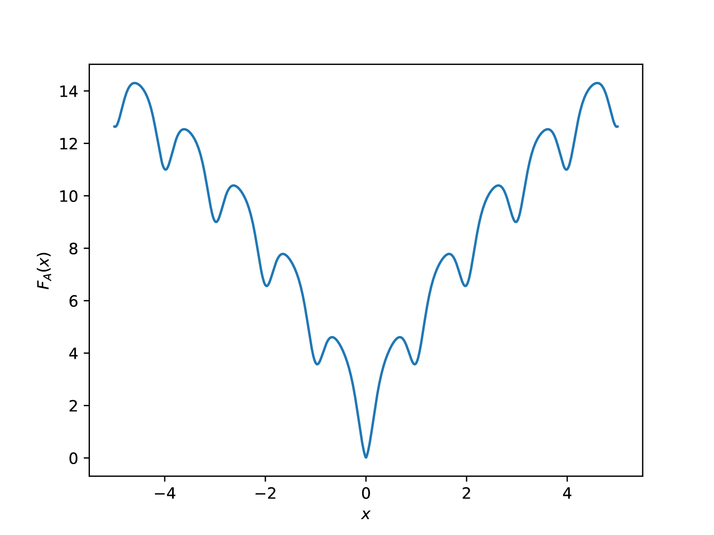

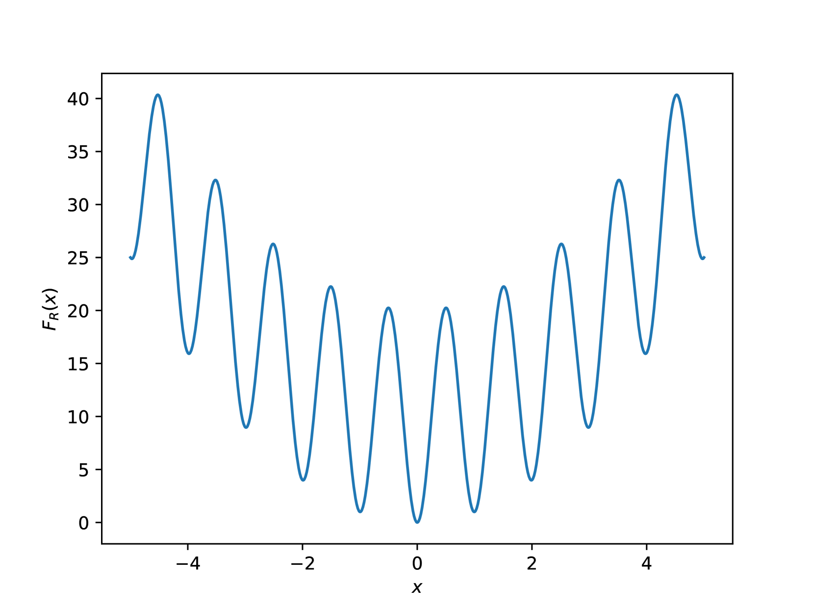

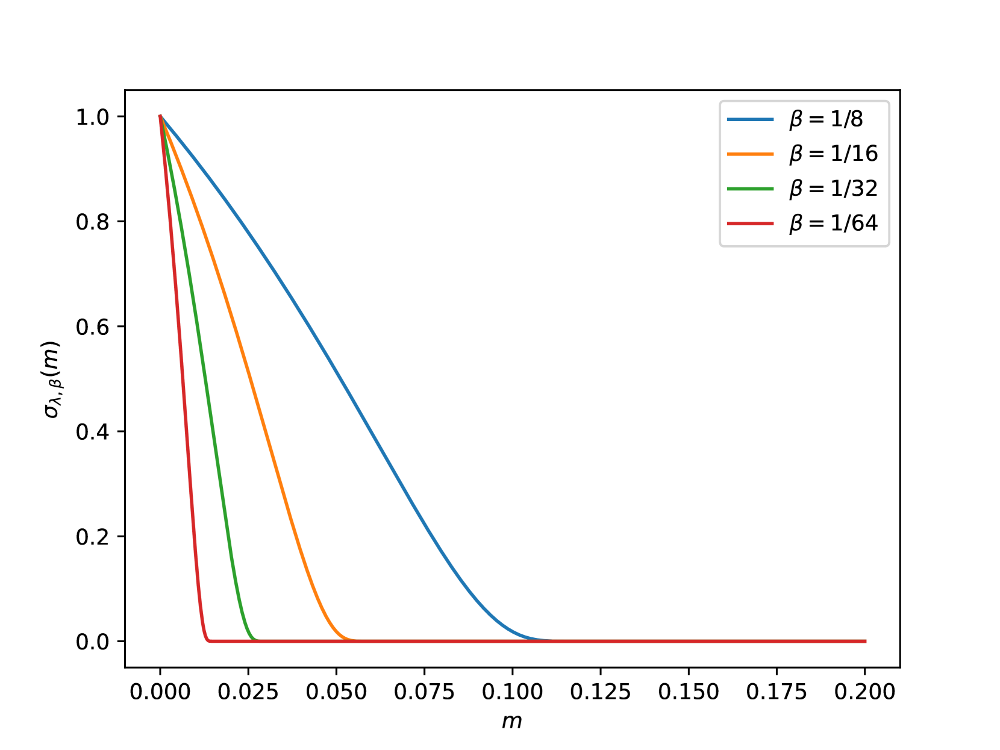

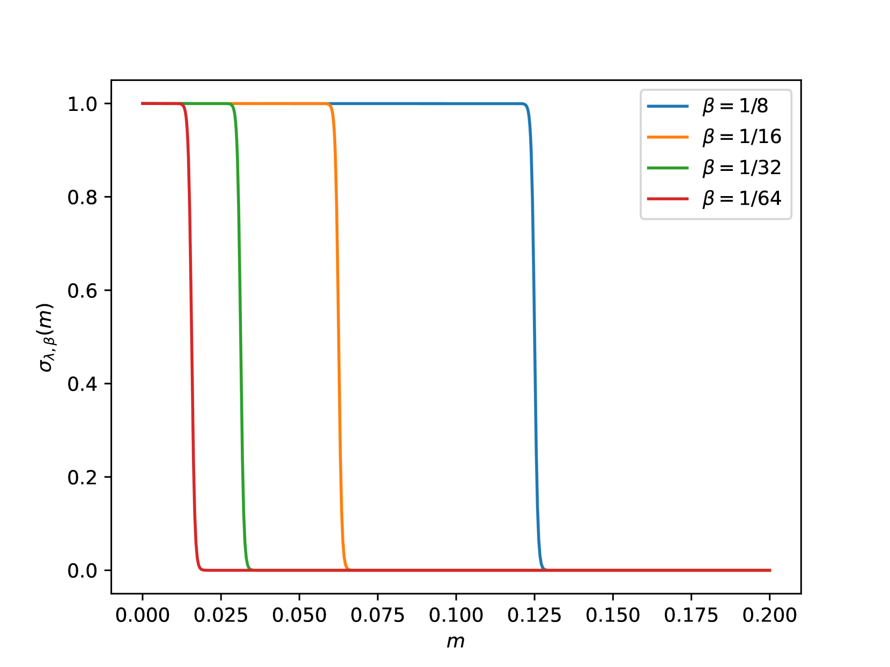

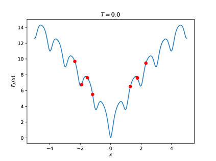

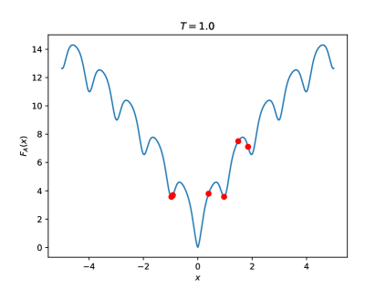

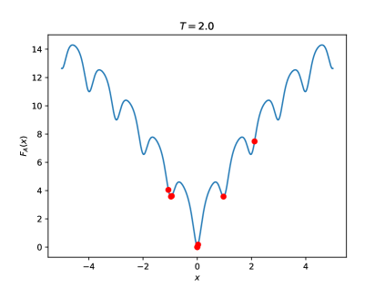

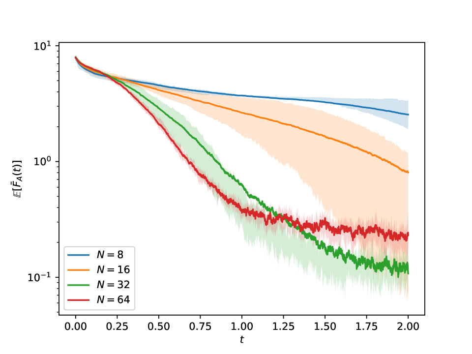

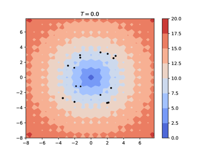

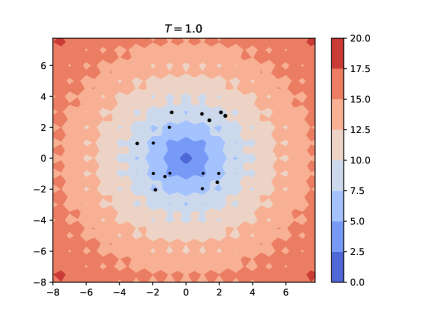

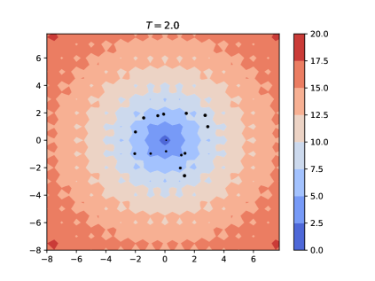

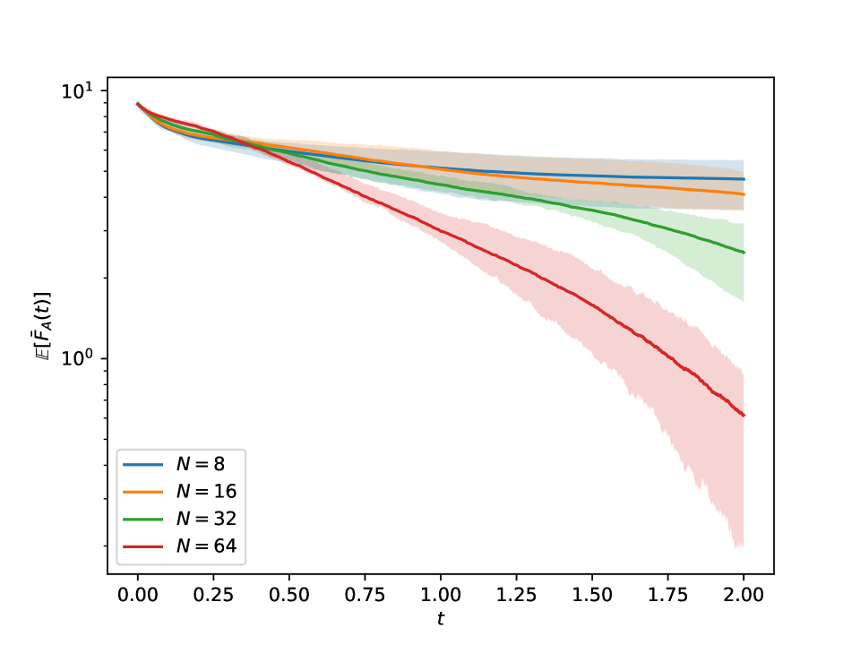

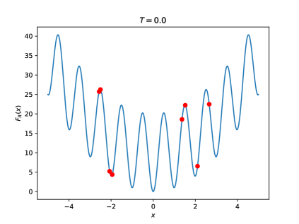

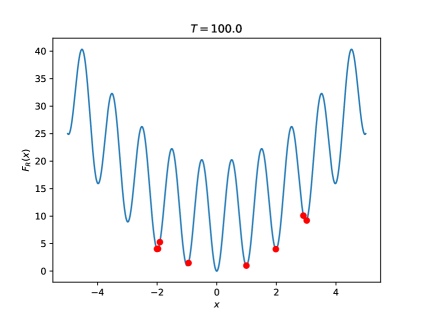

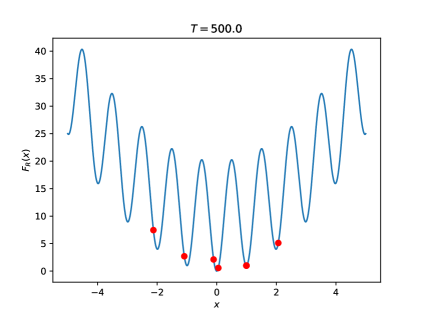

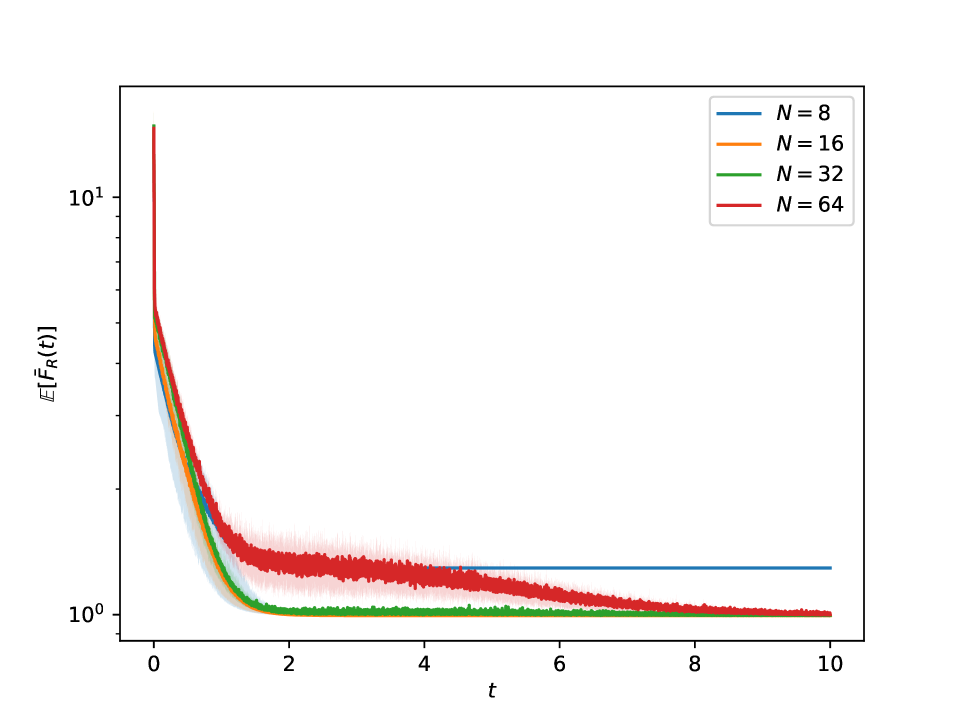

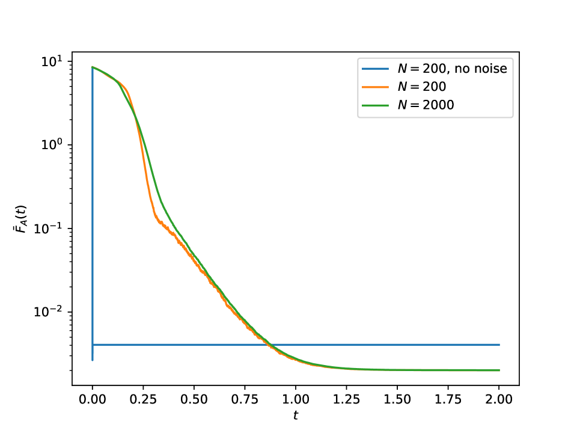

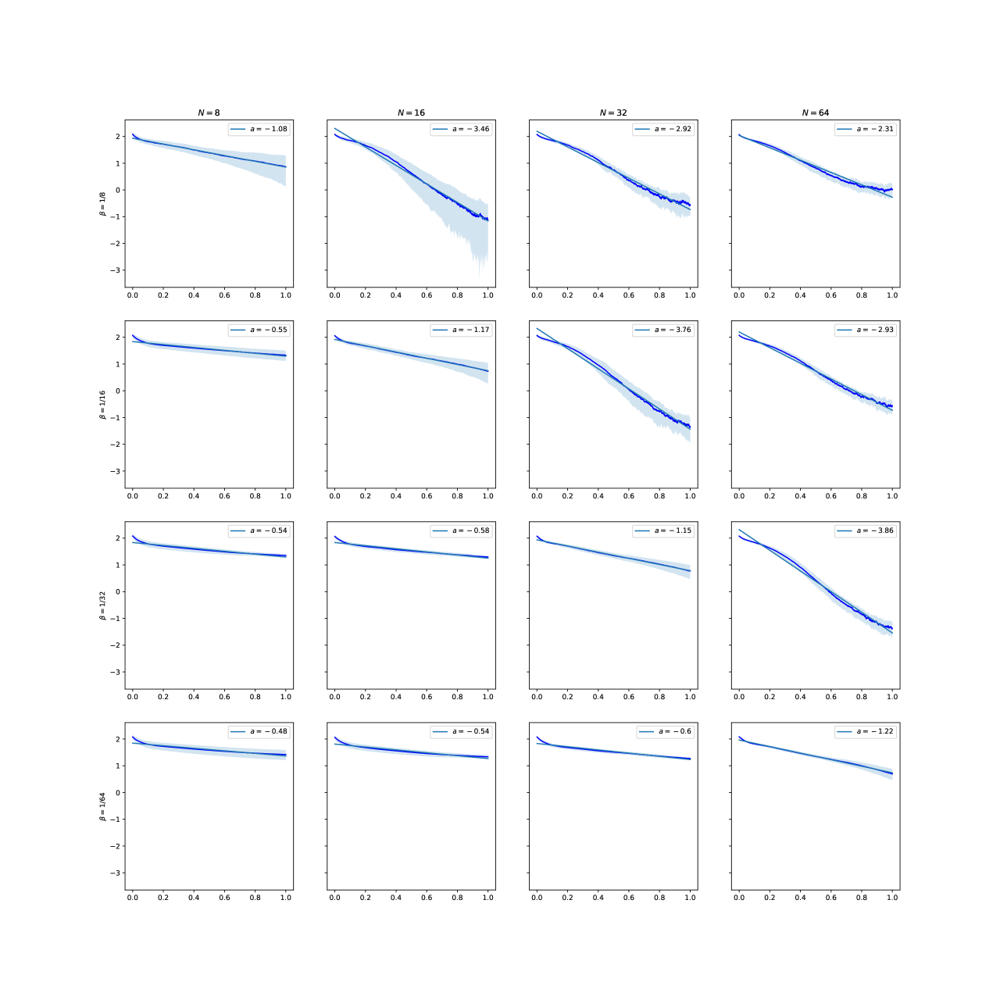

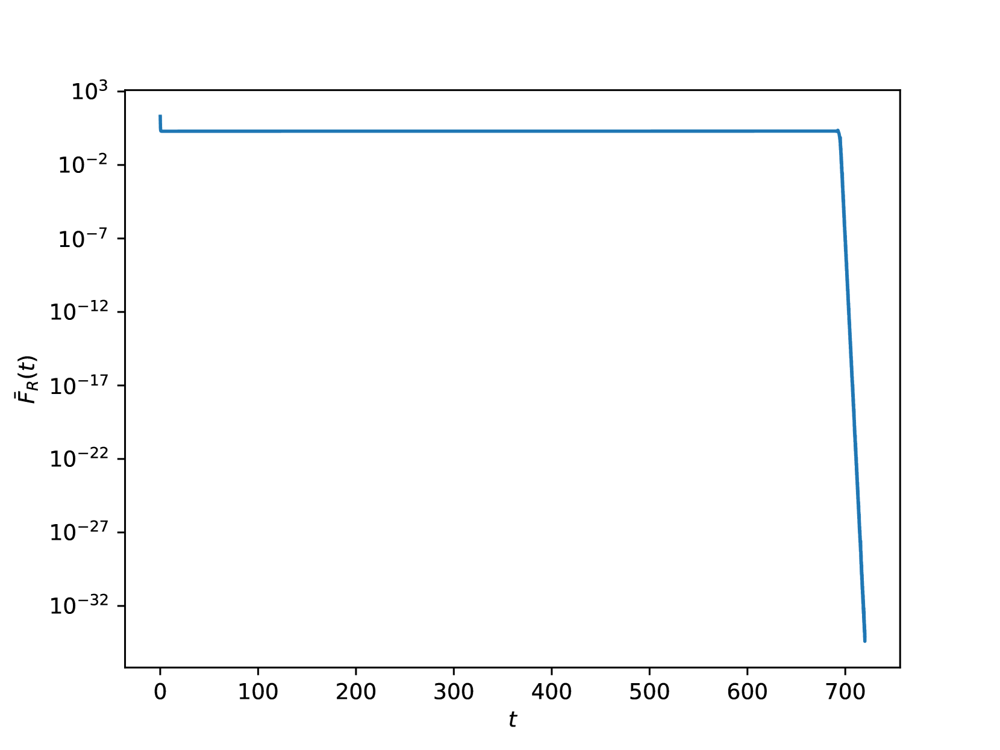

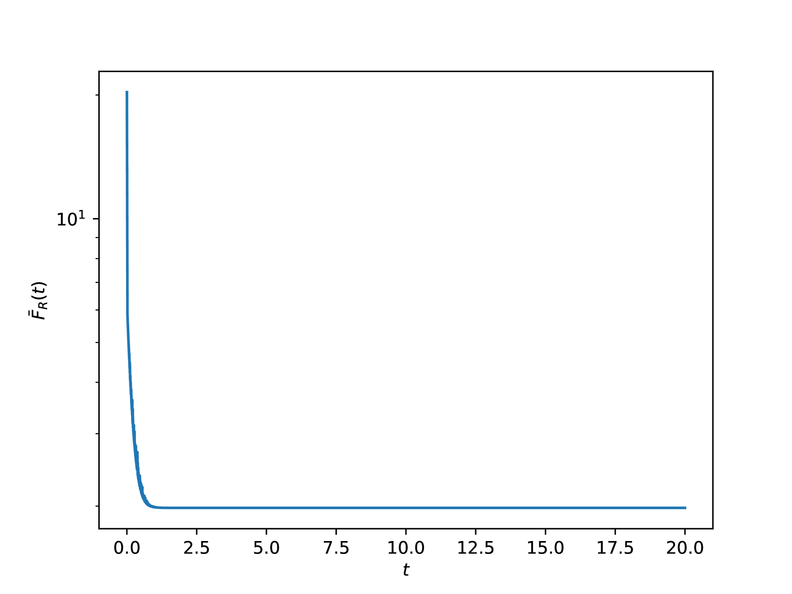

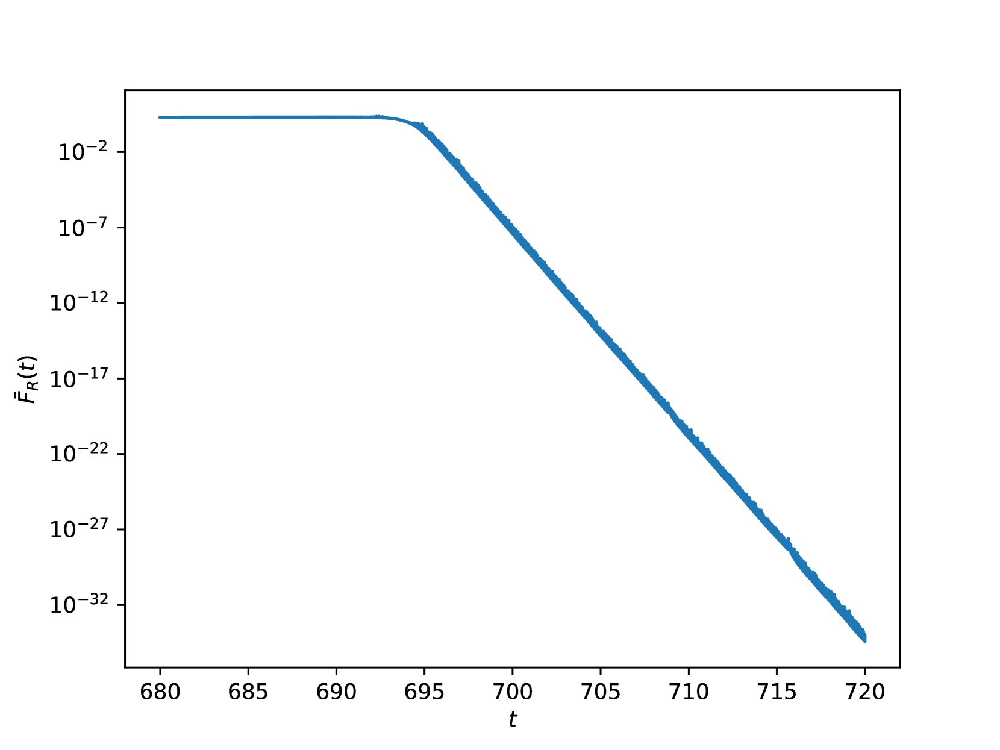

[Arxiv](https://arxiv.org/abs/2404.18015)