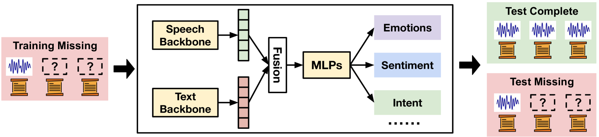
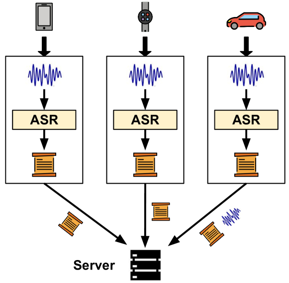
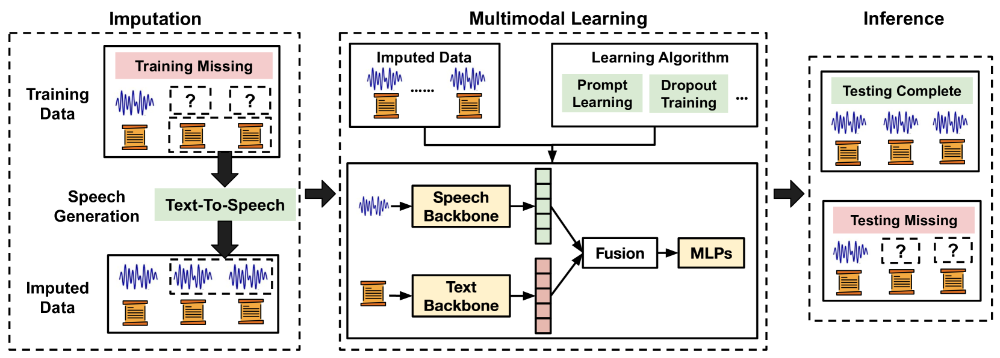
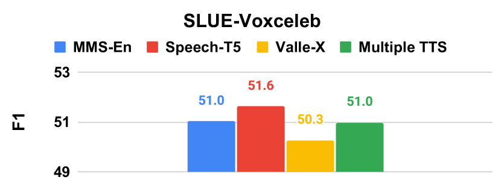
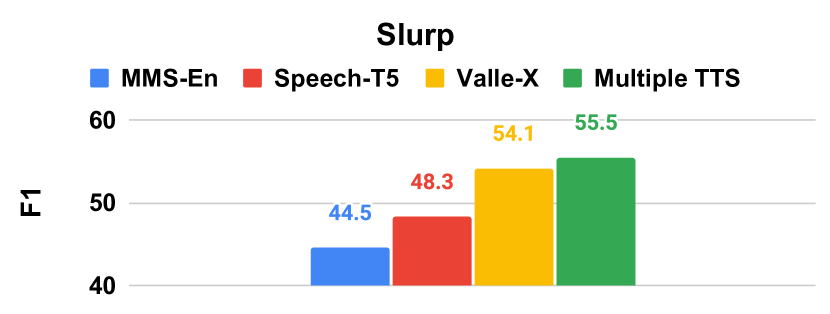
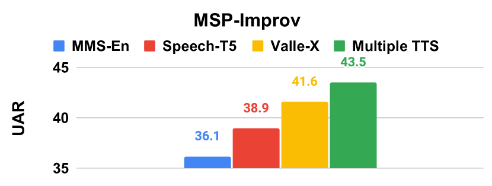
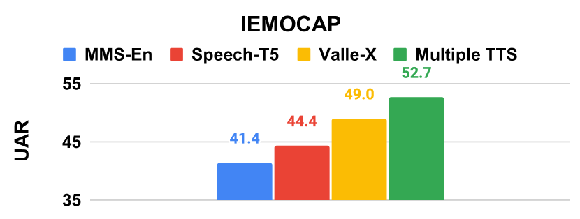
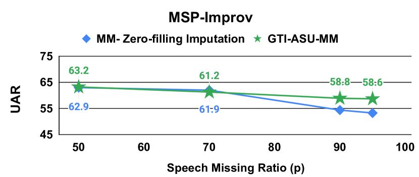
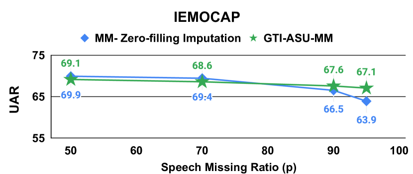

# TI-ASU：通过文本到语音的转换技术，针对缺失的语音模式进行补偿，以提升自动语音理解的鲁棒性。

发布时间：2024年04月27日

`LLM应用` `语音识别` `自动语音理解`

> TI-ASU: Toward Robust Automatic Speech Understanding through Text-to-speech Imputation Against Missing Speech Modality

# 摘要

> 自动语音理解（ASU）致力于模拟人类的语音解析能力，能够从语音和文本内容中精准捕捉意图、情感、情绪和内容。尽管构建一个高效的 ASU 系统通常需要大量的高质量语音数据及其转录，但出于隐私保护的考虑，收集或利用这些数据往往面临诸多挑战。为此，我们提出了一种新颖的方法——TI-ASU，它利用预训练的文本到语音模型来弥补训练过程中缺失的语音信息。我们对 TI-ASU 在不同数据缺失比例、多模态与单模态环境以及大型语言模型（LLMs）中的应用进行了深入的实验测试。实验结果证明，TI-ASU 在训练语音数据缺失高达95%的情况下，仍能显著提升 ASU 的性能。此外，TI-ASU 还能适应于 dropout 训练，增强了模型在推理阶段处理缺失语音的鲁棒性。

> Automatic Speech Understanding (ASU) aims at human-like speech interpretation, providing nuanced intent, emotion, sentiment, and content understanding from speech and language (text) content conveyed in speech. Typically, training a robust ASU model relies heavily on acquiring large-scale, high-quality speech and associated transcriptions. However, it is often challenging to collect or use speech data for training ASU due to concerns such as privacy. To approach this setting of enabling ASU when speech (audio) modality is missing, we propose TI-ASU, using a pre-trained text-to-speech model to impute the missing speech. We report extensive experiments evaluating TI-ASU on various missing scales, both multi- and single-modality settings, and the use of LLMs. Our findings show that TI-ASU yields substantial benefits to improve ASU in scenarios where even up to 95% of training speech is missing. Moreover, we show that TI-ASU is adaptive to dropout training, improving model robustness in addressing missing speech during inference.

[Arxiv](https://arxiv.org/abs/2404.17983)