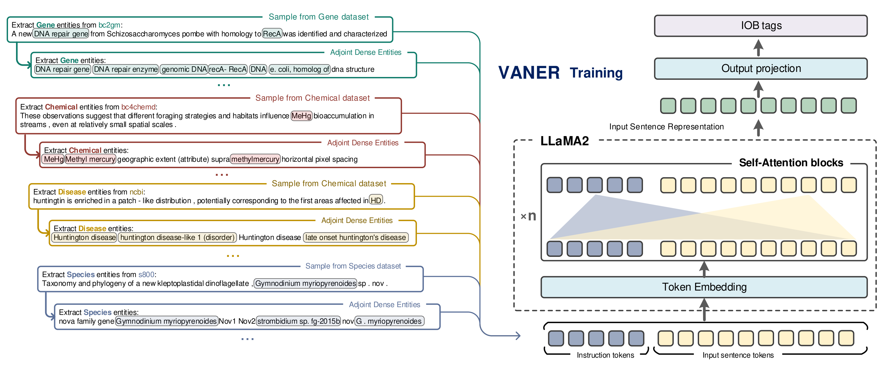
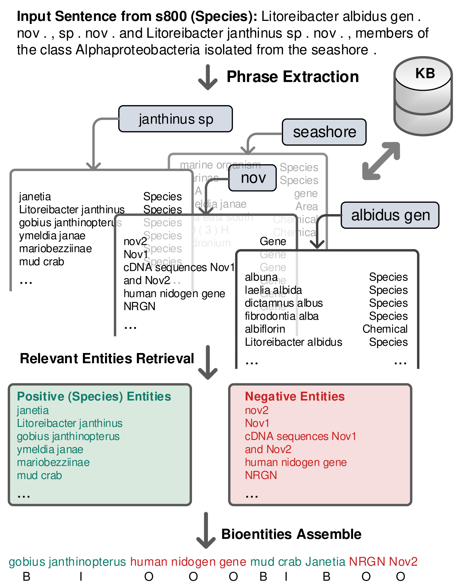
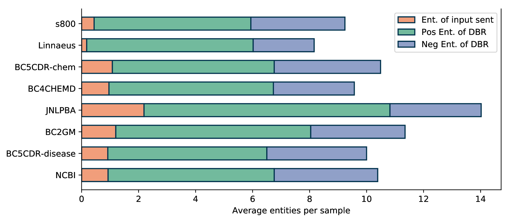
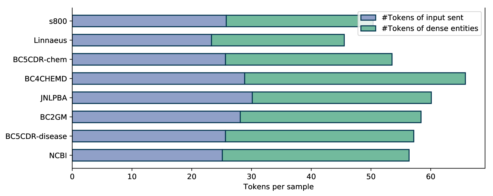
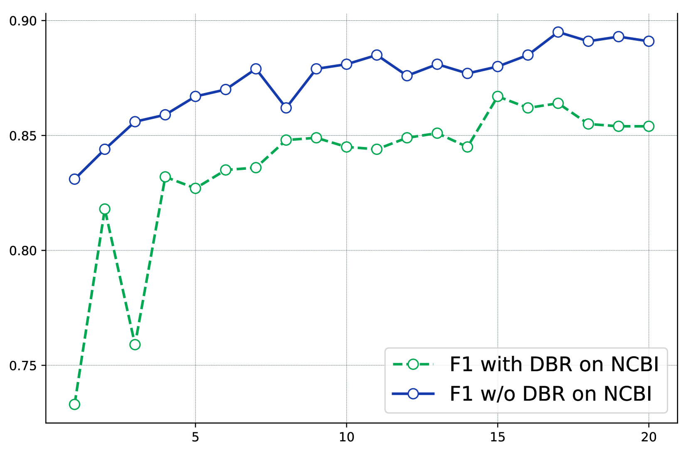
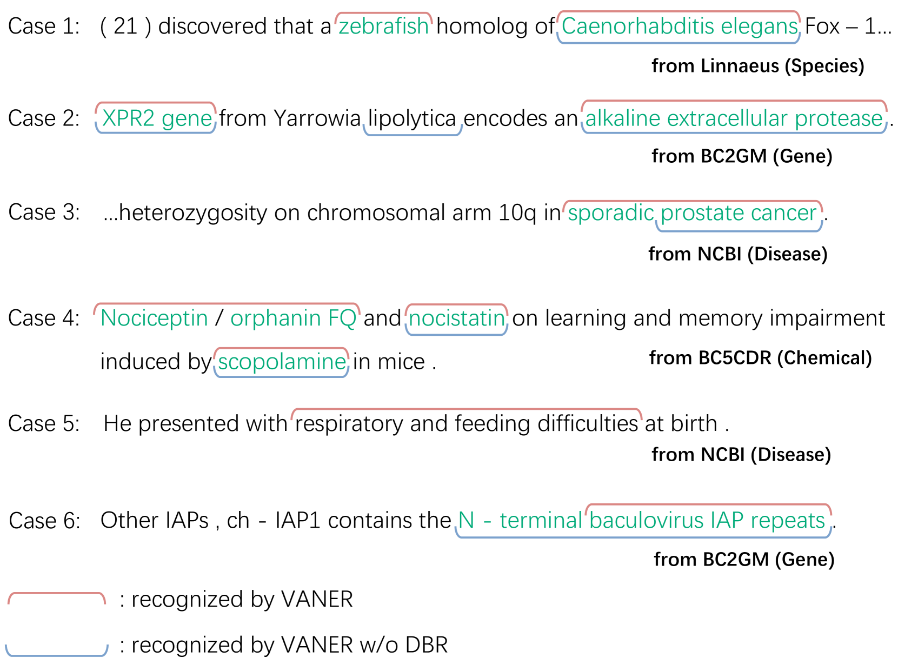

# VANER：借助大型语言模型，实现生物医学领域的多用途和自适应命名实体识别。

发布时间：2024年04月27日

`LLM应用` `生物医学`

> VANER: Leveraging Large Language Model for Versatile and Adaptive Biomedical Named Entity Recognition

# 摘要

> 在生物医学命名实体识别（BioNER）领域，常见的方法是结合表示学习和序列标注技术。但这些方法往往局限于特定任务，泛化能力不佳，且通常需要为每个数据集定制模型。为了发挥大型语言模型（LLMs）的潜力，已有研究尝试采用生成式方法进行实体提取，但这些方法的有效性通常不及传统的序列标注技术。本文中，我们采用开源的LLM LLaMA2作为基础模型，并设计了特定的指令来识别不同类型和数据集的实体。我们将LLM对指令的理解与序列标注技术相结合，利用多样化的数据集训练出一个能够抽取多种实体的模型。考虑到基础LLM缺乏专业的医学知识，我们还引入了外部实体知识库，并实施了指令调优，以提高模型对精心挑选实体的识别能力。我们的VANER模型，仅用少量参数训练，便显著超越了以往的LLM模型，并首次作为基于LLM的模型，超越了大多数传统BioNER系统，实现了三个数据集上的最高F1得分。

> Prevalent solution for BioNER involves using representation learning techniques coupled with sequence labeling. However, such methods are inherently task-specific, demonstrate poor generalizability, and often require dedicated model for each dataset. To leverage the versatile capabilities of recently remarkable large language models (LLMs), several endeavors have explored generative approaches to entity extraction. Yet, these approaches often fall short of the effectiveness of previouly sequence labeling approaches. In this paper, we utilize the open-sourced LLM LLaMA2 as the backbone model, and design specific instructions to distinguish between different types of entities and datasets. By combining the LLM's understanding of instructions with sequence labeling techniques, we use mix of datasets to train a model capable of extracting various types of entities. Given that the backbone LLMs lacks specialized medical knowledge, we also integrate external entity knowledge bases and employ instruction tuning to compel the model to densely recognize carefully curated entities. Our model VANER, trained with a small partition of parameters, significantly outperforms previous LLMs-based models and, for the first time, as a model based on LLM, surpasses the majority of conventional state-of-the-art BioNER systems, achieving the highest F1 scores across three datasets.

[Arxiv](https://arxiv.org/abs/2404.17835)