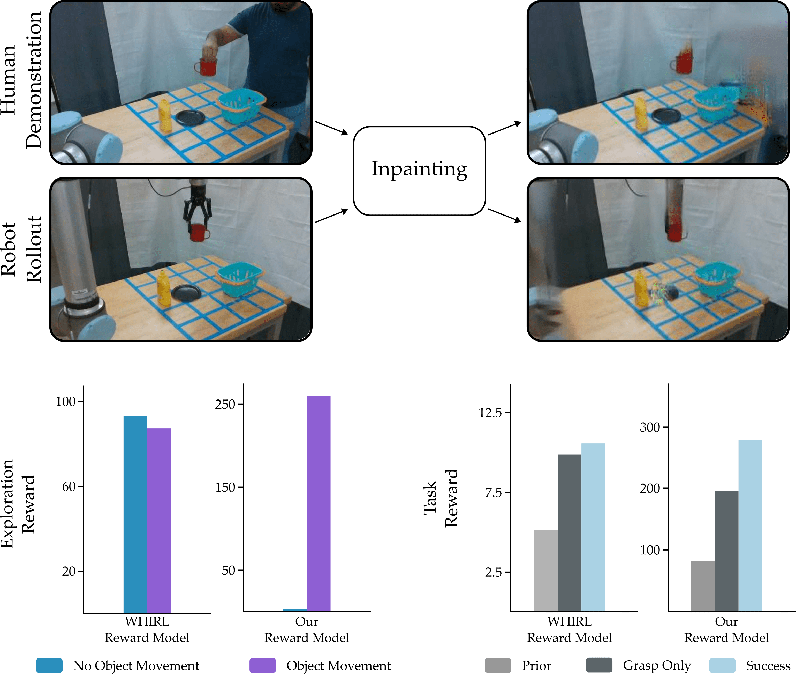

# VIEW：一种基于关键节点的视觉模仿学习方法

发布时间：2024年04月27日

`Agent` `机器人技术` `视觉模仿学习`

> VIEW: Visual Imitation Learning with Waypoints

# 摘要

> 机器人利用视觉模仿学习（VIL）能通过视频示范掌握日常任务。但将视觉信息转化为机器人可执行策略面临挑战，尤其是当涉及人类与机器人形态差异时。为应对这些难题，我们推出了一种名为“带有关键点的视觉模仿学习（VIEW）”的算法，它显著提升了从人类到机器人的VIL样本效率。VIEW通过精炼的先验轨迹捕捉示范意图、采用通用奖励函数对机器人行为进行反馈，以及利用探索算法在轨迹关键点周围高效采样，实现了这一效率。此外，VIEW将人类示范划分为抓取和执行阶段，以加快学习进程。经过广泛的模拟和现实世界测试，VIEW在性能上超越了现有的VIL技术。它使得机器人能够从任意长度的视频示范中学习多样化的操控任务。而且，VIEW还能在30分钟内，通过不到20次实际操作，学会如推或移动物体等标准操控任务。相关代码和视频在此链接：https://collab.me.vt.edu/view/

> Robots can use Visual Imitation Learning (VIL) to learn everyday tasks from video demonstrations. However, translating visual observations into actionable robot policies is challenging due to the high-dimensional nature of video data. This challenge is further exacerbated by the morphological differences between humans and robots, especially when the video demonstrations feature humans performing tasks. To address these problems we introduce Visual Imitation lEarning with Waypoints (VIEW), an algorithm that significantly enhances the sample efficiency of human-to-robot VIL. VIEW achieves this efficiency using a multi-pronged approach: extracting a condensed prior trajectory that captures the demonstrator's intent, employing an agent-agnostic reward function for feedback on the robot's actions, and utilizing an exploration algorithm that efficiently samples around waypoints in the extracted trajectory. VIEW also segments the human trajectory into grasp and task phases to further accelerate learning efficiency. Through comprehensive simulations and real-world experiments, VIEW demonstrates improved performance compared to current state-of-the-art VIL methods. VIEW enables robots to learn a diverse range of manipulation tasks involving multiple objects from arbitrarily long video demonstrations. Additionally, it can learn standard manipulation tasks such as pushing or moving objects from a single video demonstration in under 30 minutes, with fewer than 20 real-world rollouts. Code and videos here: https://collab.me.vt.edu/view/

[Arxiv](https://arxiv.org/abs/2404.17906)