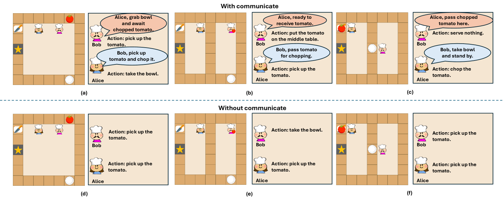

# Verco：探索多智能体强化学习中的协同口头沟通技巧

发布时间：2024年04月27日

`Agent` `人工智能`

> Verco: Learning Coordinated Verbal Communication for Multi-agent Reinforcement Learning

# 摘要

> 近期，多智能体强化学习在各类游戏场景中实现了重大突破，激发了将其应用于更广泛领域的热情。面对部分可观测性的难题，通过智能体间数值嵌入的共享，通信驱动的算法显著提升了协作效果。尽管如此，我们对于如何形成协作机制的理解尚浅，设计出易于人类理解的通信机制成为了一个亟待解决的问题。本文提出了一种创新的多智能体强化学习算法，该算法将大型语言模型集成到智能体中，使其能够产生易于人类理解的语言交流。框架包含消息生成模块和动作选择模块。消息模块负责生成并向同伴发送口头信息，以促进信息的有效共享。为了提升消息模块的性能，我们引入了一个教师模型来从全局视角生成消息标签，并通过监督式微调（SFT）来训练学生模型。动作模块则根据接收到的信息和局部观察来决策行动。在Overcooked游戏中的实验结果证明，我们的方法不仅显著提升了学习效率和表现，还为人类理解多智能体协作过程提供了一种直观的工具。

> In recent years, multi-agent reinforcement learning algorithms have made significant advancements in diverse gaming environments, leading to increased interest in the broader application of such techniques. To address the prevalent challenge of partial observability, communication-based algorithms have improved cooperative performance through the sharing of numerical embedding between agents. However, the understanding of the formation of collaborative mechanisms is still very limited, making designing a human-understandable communication mechanism a valuable problem to address. In this paper, we propose a novel multi-agent reinforcement learning algorithm that embeds large language models into agents, endowing them with the ability to generate human-understandable verbal communication. The entire framework has a message module and an action module. The message module is responsible for generating and sending verbal messages to other agents, effectively enhancing information sharing among agents. To further enhance the message module, we employ a teacher model to generate message labels from the global view and update the student model through Supervised Fine-Tuning (SFT). The action module receives messages from other agents and selects actions based on current local observations and received messages. Experiments conducted on the Overcooked game demonstrate our method significantly enhances the learning efficiency and performance of existing methods, while also providing an interpretable tool for humans to understand the process of multi-agent cooperation.

[Arxiv](https://arxiv.org/abs/2404.17780)