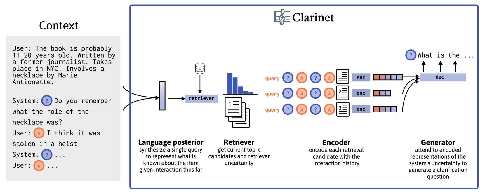
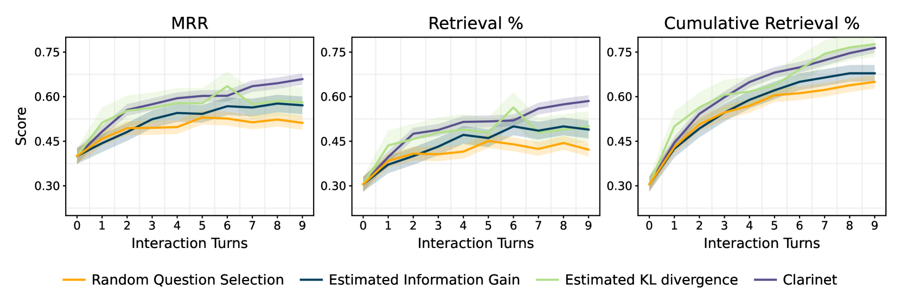
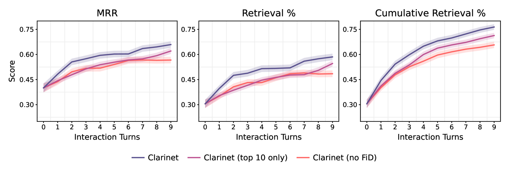
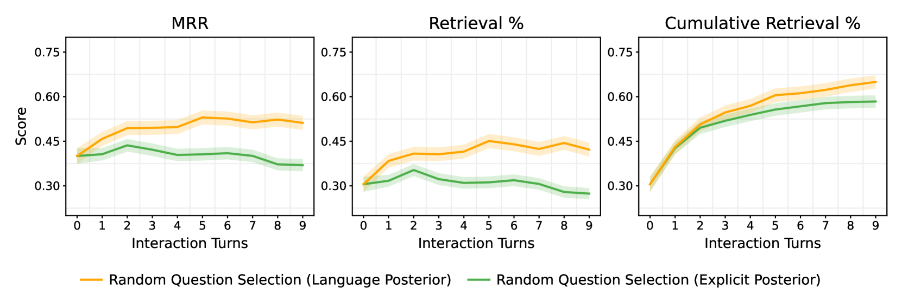
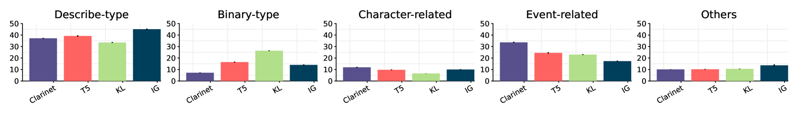

# CLARINET：赋能语言模型，通过提问澄清问题来优化信息检索

发布时间：2024年04月28日

`RAG

理由：这篇论文主要探讨了在信息检索场景中如何通过提出澄清问题来处理模糊的搜索查询。论文中提到的CLARINET系统是基于大型语言模型（LLM）的增强，通过端到端微调使其能够生成有助于提升检索准确性的问题。这种方法与RAG（Retrieval-Augmented Generation）框架的理念相似，即通过结合检索和生成来提高信息检索的性能。因此，这篇论文更适合归类于RAG。` `信息检索`

> CLARINET: Augmenting Language Models to Ask Clarification Questions for Retrieval

# 摘要

> 用户常提出模糊不清的请求，需要进一步澄清。我们探讨了在信息检索场景中如何提出澄清问题，面对模糊的搜索查询，系统需将模型中的不确定性转化为自然语言问题，这颇具挑战。为此，我们开发了CLARINET系统，它能提出那些答案能显著提升正确候选者确定性的问题。通过增强大型语言模型（LLM），使其基于检索分布进行条件化，并进行端到端微调，我们的系统能生成在每个阶段都能提升真实候选者排名的问题。在实际的书籍搜索数据集上评估时，CLARINET系统在检索成功率上比传统启发式方法高出17%，比未经特别提示的LLM高出39%。

> Users often make ambiguous requests that require clarification. We study the problem of asking clarification questions in an information retrieval setting, where systems often face ambiguous search queries and it is challenging to turn the uncertainty in the retrieval model into a natural language question. We present CLARINET, a system that asks informative clarification questions by choosing questions whose answers would maximize certainty in the correct candidate. Our approach works by augmenting a large language model (LLM) to condition on a retrieval distribution, finetuning end-to-end to generate the question that would have maximized the rank of the true candidate at each turn. When evaluated on a real-world retrieval dataset of users searching for books, our system outperforms traditional heuristics such as information gain on retrieval success by 17% and vanilla-prompted LLMs by 39% relative.

[Arxiv](https://arxiv.org/abs/2405.15784)