# 中性的提示是否会导致代码安全性受损？FormAI-v2 数据集专注于识别并标记由大型语言模型生成的代码中的潜在安全漏洞。

发布时间：2024年04月28日

`LLM应用` `编程语言` `软件工程`

> Do Neutral Prompts Produce Insecure Code? FormAI-v2 Dataset: Labelling Vulnerabilities in Code Generated by Large Language Models

# 摘要

> 本研究对比分析了当前顶尖的大型语言模型（LLMs），探究了这些模型在采用中性零样本提示编写简易C程序时生成安全漏洞的倾向。此举填补了现有文献中关于这些模型在缺乏具体指令时所产生代码安全性特性的空白。在PROMISE '23会议上，N. Tihanyi等人提出了包含112,000个GPT-3.5生成的C程序的FormAI数据集，其中逾51.24%被认定为存在安全漏洞。我们在此基础上进一步工作，推出了包含265,000个可编译C程序的FormAI-v2数据集，这些程序由多种LLMs生成，包括谷歌的GEMINI-pro、OpenAI的GPT-4、TII的180亿参数Falcon，以及Meta的13亿参数专业模型CodeLLama2和其他多种紧凑型模型。数据集中每个程序的标签基于通过高效SMT（Satisfiability Modulo Theories）上下文有界模型检查器（ESBMC）的形式验证在其源代码中发现的漏洞。该技术通过提供反例来排除误报，并确保通过完成验证过程来避免漏报。研究发现至少63.47%的程序存在安全漏洞，不同模型之间的差异不大，它们都展现出类似的编码错误，只是有所变化。本研究强调，尽管LLMs在代码生成方面展现出巨大潜力，但在生产环境中应用其生成的代码前，必须进行风险评估和验证。

> This study provides a comparative analysis of state-of-the-art large language models (LLMs), analyzing how likely they generate vulnerabilities when writing simple C programs using a neutral zero-shot prompt. We address a significant gap in the literature concerning the security properties of code produced by these models without specific directives. N. Tihanyi et al. introduced the FormAI dataset at PROMISE '23, containing 112,000 GPT-3.5-generated C programs, with over 51.24% identified as vulnerable. We expand that work by introducing the FormAI-v2 dataset comprising 265,000 compilable C programs generated using various LLMs, including robust models such as Google's GEMINI-pro, OpenAI's GPT-4, and TII's 180 billion-parameter Falcon, to Meta's specialized 13 billion-parameter CodeLLama2 and various other compact models. Each program in the dataset is labelled based on the vulnerabilities detected in its source code through formal verification using the Efficient SMT-based Context-Bounded Model Checker (ESBMC). This technique eliminates false positives by delivering a counterexample and ensures the exclusion of false negatives by completing the verification process. Our study reveals that at least 63.47% of the generated programs are vulnerable. The differences between the models are minor, as they all display similar coding errors with slight variations. Our research highlights that while LLMs offer promising capabilities for code generation, deploying their output in a production environment requires risk assessment and validation.

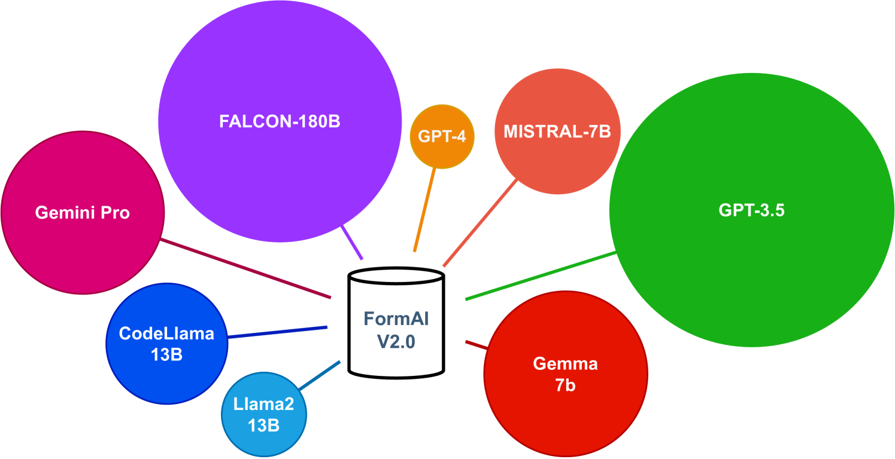

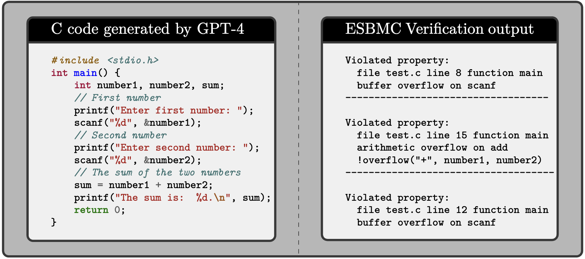

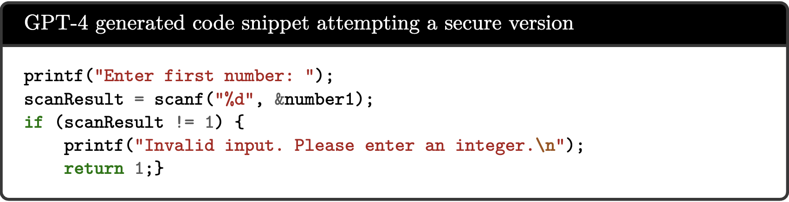

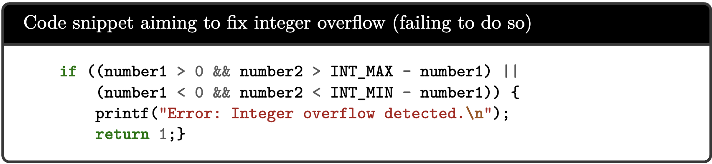

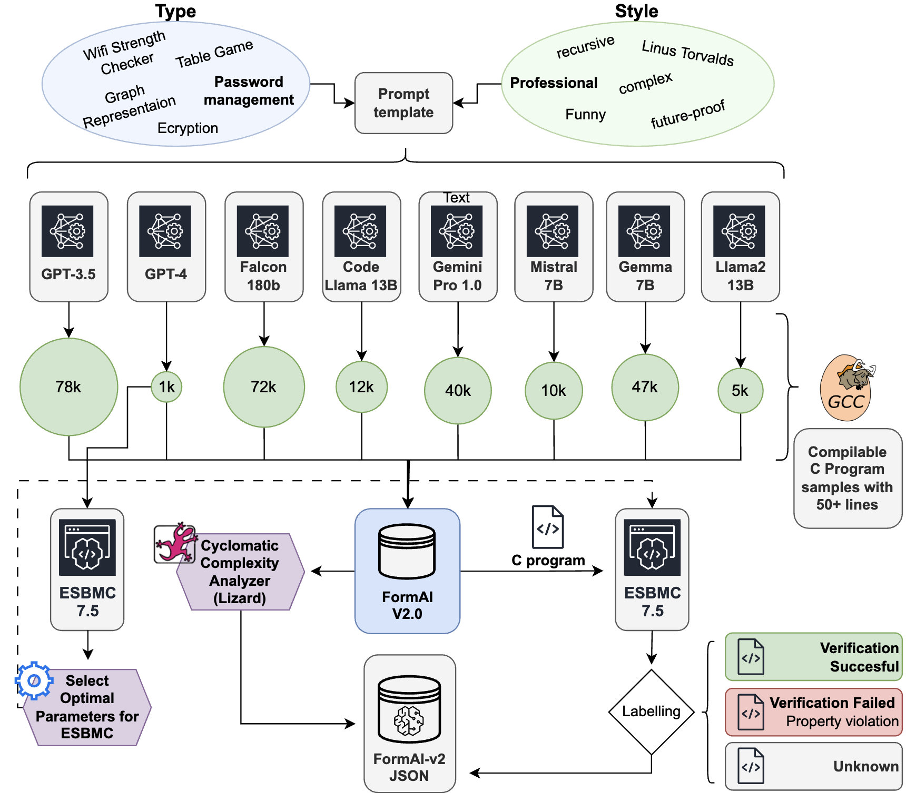

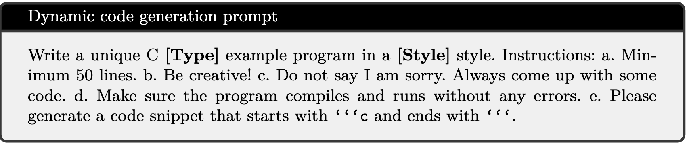

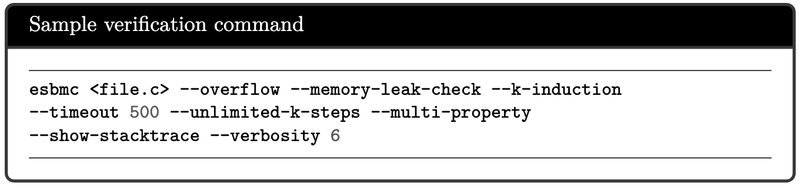

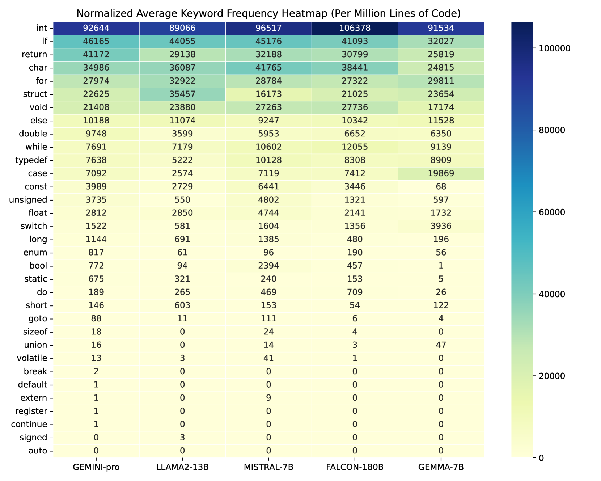

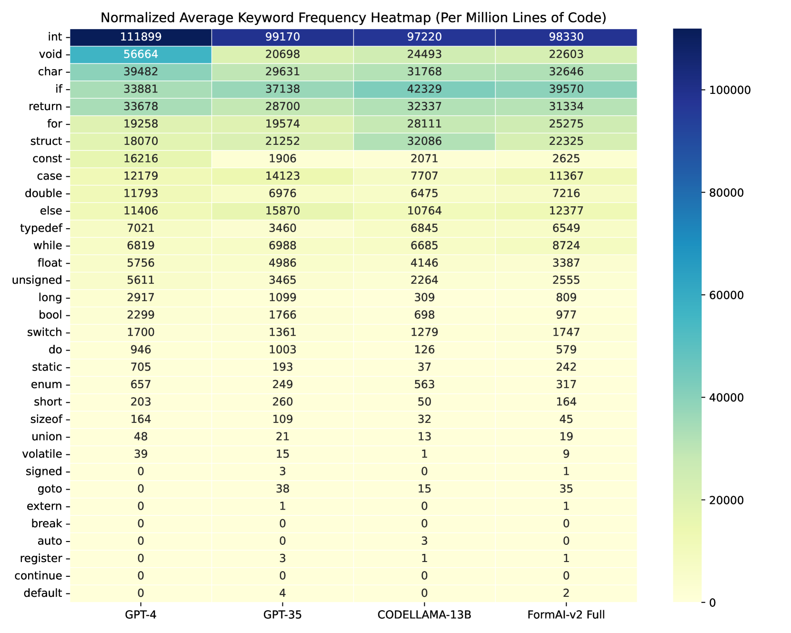

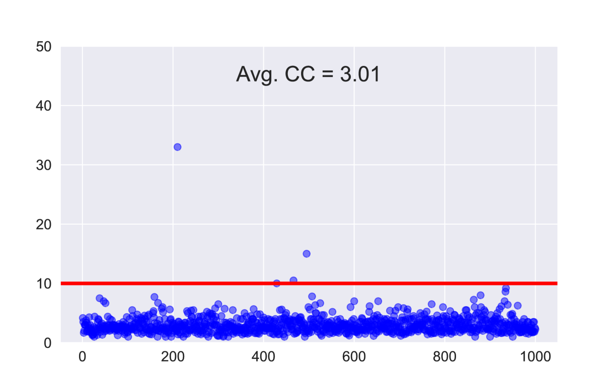

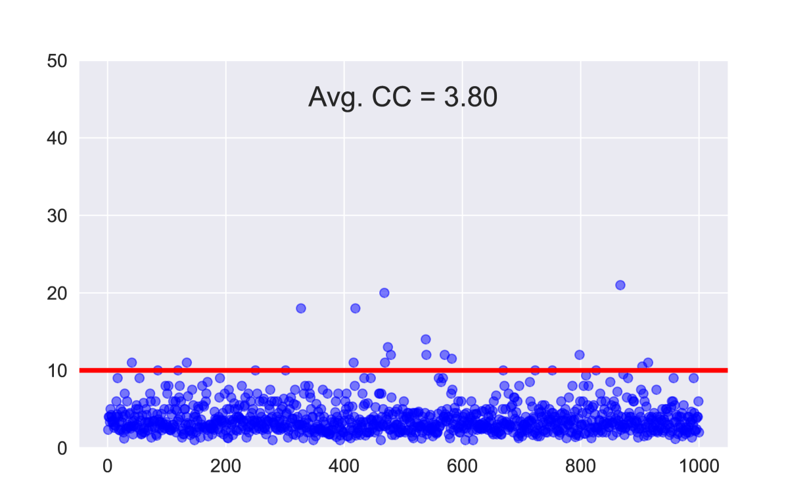

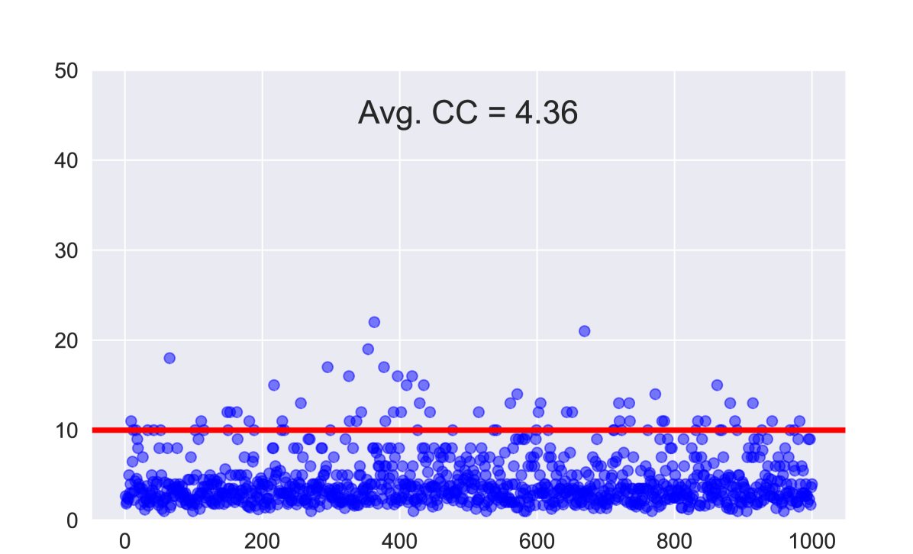

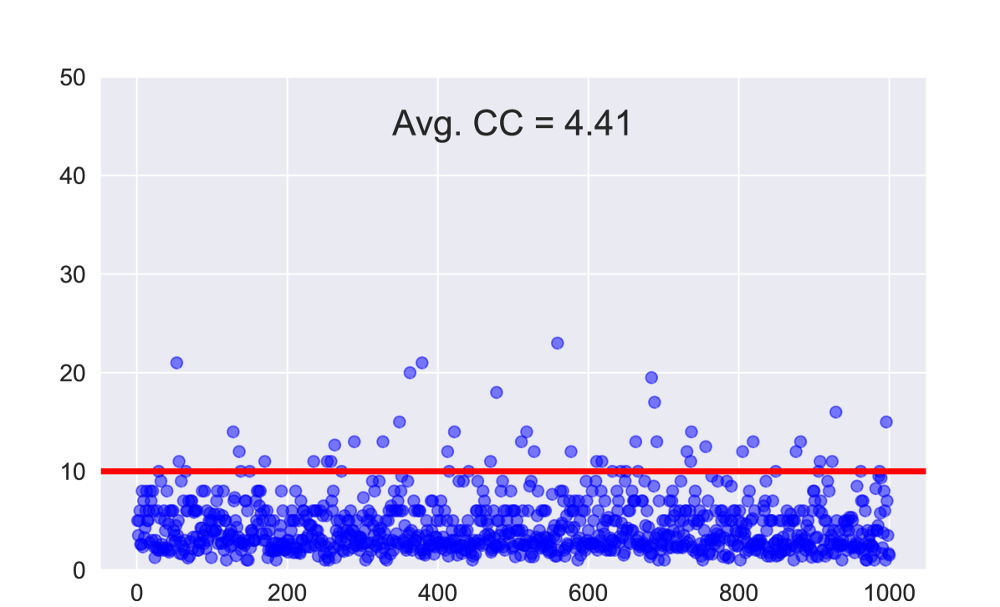

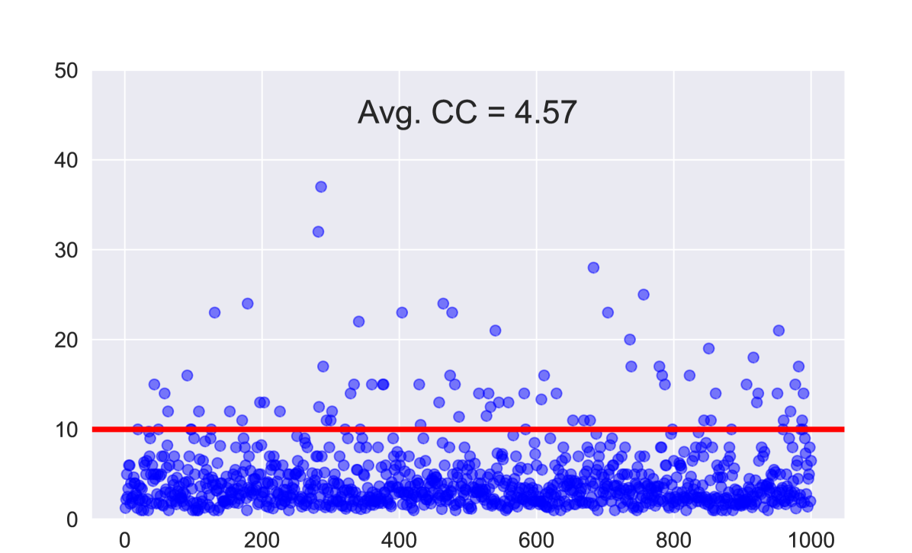

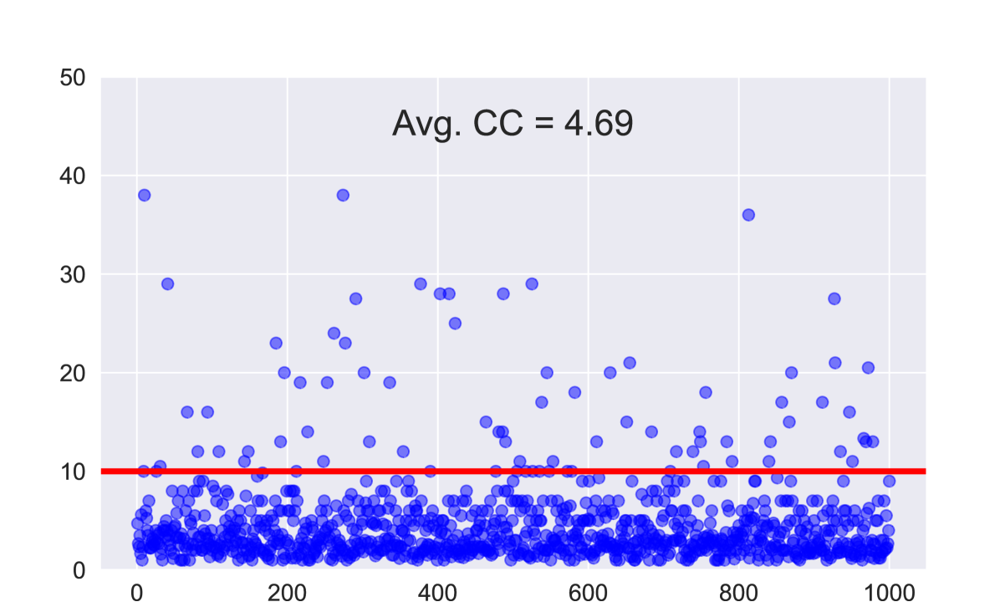

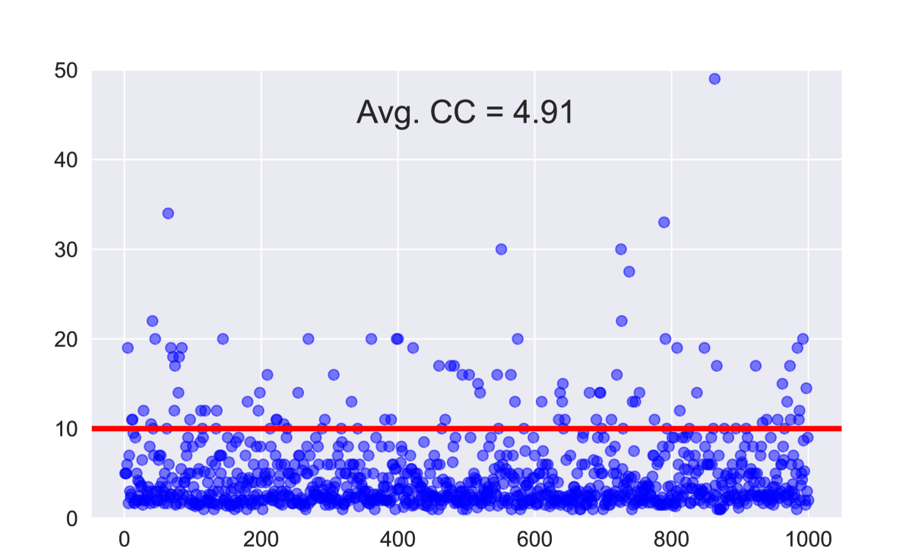

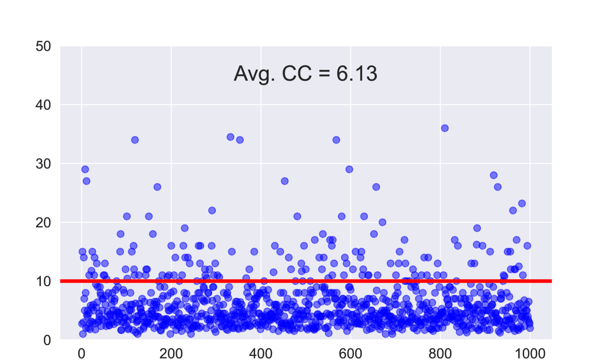

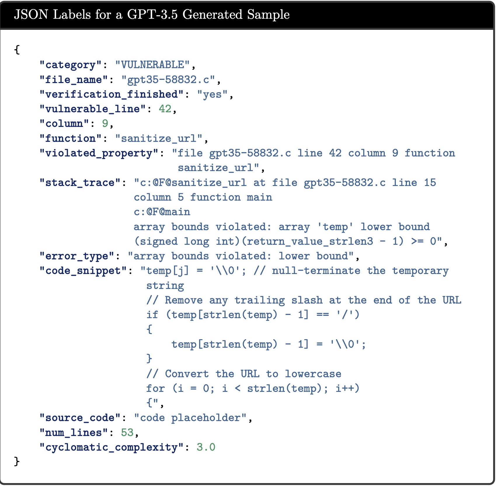

[Arxiv](https://arxiv.org/abs/2404.18353)