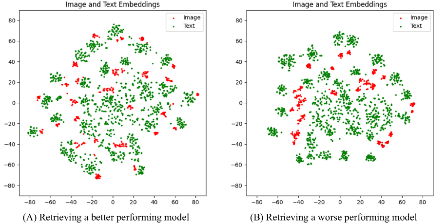
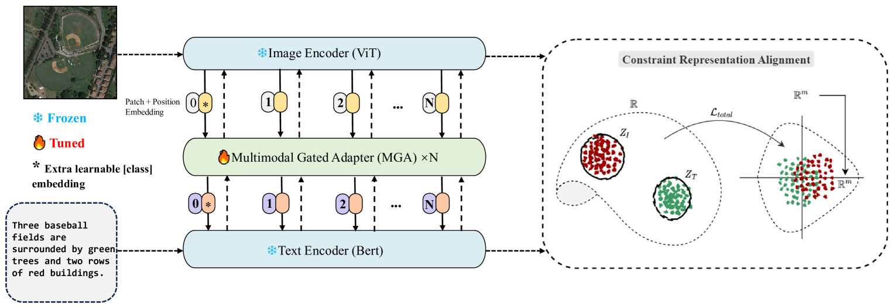
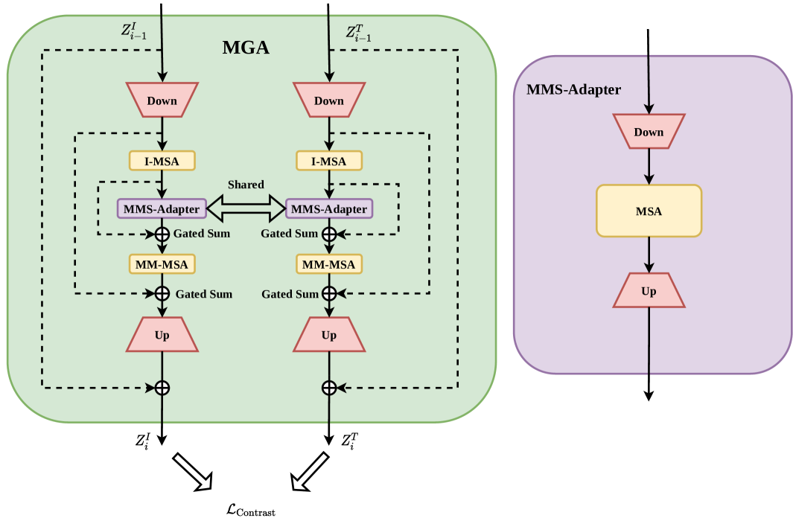
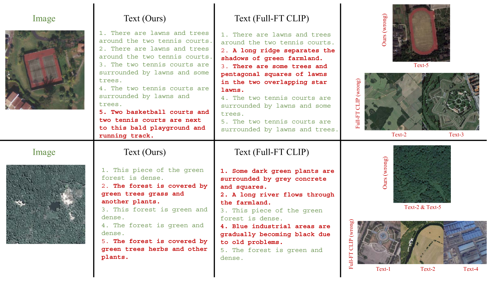
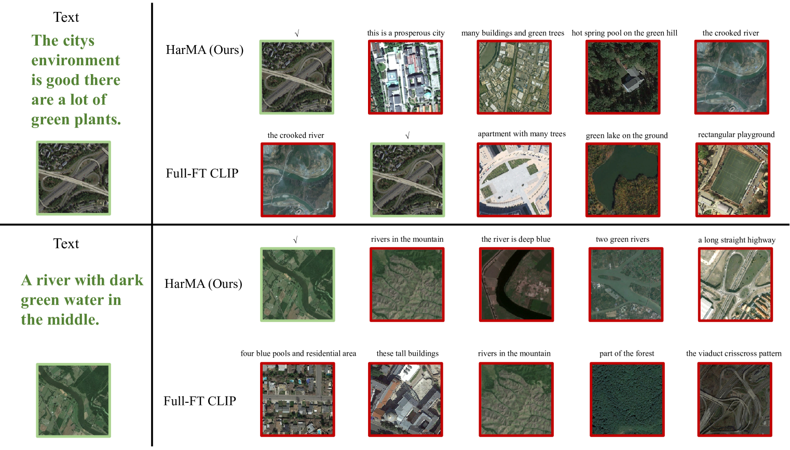
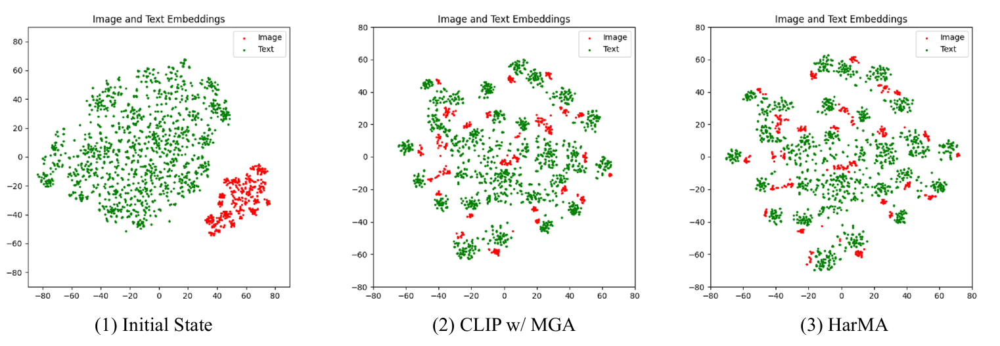
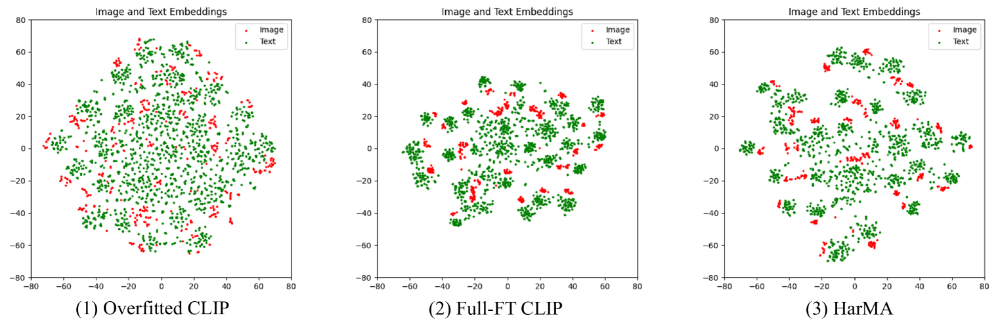

# 采用和谐迁移学习与模态校准技术，实现高效遥感探测

发布时间：2024年04月28日

`LLM应用` `多模态学习`

> Efficient Remote Sensing with Harmonized Transfer Learning and Modality Alignment

# 摘要

> 视觉与语言预训练（VLP）的兴起引领了一种新的范式：先进行预训练，然后进行微调，这一范式在众多多模态任务中展现出巨大潜力。然而，在遥感领域，这种范式的实施面临挑战，尤其是同模态嵌入的聚集现象，这影响了迁移学习的效率。为此，我们从整体视角审视了多模态迁移学习的目标，并提出了一种新颖的优化策略，旨在解决这一问题。我们介绍的“和谐迁移学习和模态对齐（HarMA）”方法，不仅满足任务需求和模态间的协调，还实现了单模态的统一对齐，并通过高效的参数微调减少了训练成本。HarMA的卓越之处在于，它无需额外训练数据，便能在遥感领域的两个主要多模态检索任务中达到领先水平。实验结果揭示了HarMA在参数调整极少的情况下，性能即可与完全微调的模型相媲美，甚至更优。HarMA的简洁性使其能够轻松融入现有的多模态预训练模型之中。我们期待HarMA能够助力大型模型在多样化任务中的应用，同时大幅度降低资源消耗。相关代码已在 https://github.com/seekerhuang/HarMA 上发布。

> With the rise of Visual and Language Pretraining (VLP), an increasing number of downstream tasks are adopting the paradigm of pretraining followed by fine-tuning. Although this paradigm has demonstrated potential in various multimodal downstream tasks, its implementation in the remote sensing domain encounters some obstacles. Specifically, the tendency for same-modality embeddings to cluster together impedes efficient transfer learning. To tackle this issue, we review the aim of multimodal transfer learning for downstream tasks from a unified perspective, and rethink the optimization process based on three distinct objectives. We propose "Harmonized Transfer Learning and Modality Alignment (HarMA)", a method that simultaneously satisfies task constraints, modality alignment, and single-modality uniform alignment, while minimizing training overhead through parameter-efficient fine-tuning. Remarkably, without the need for external data for training, HarMA achieves state-of-the-art performance in two popular multimodal retrieval tasks in the field of remote sensing. Our experiments reveal that HarMA achieves competitive and even superior performance to fully fine-tuned models with only minimal adjustable parameters. Due to its simplicity, HarMA can be integrated into almost all existing multimodal pretraining models. We hope this method can facilitate the efficient application of large models to a wide range of downstream tasks while significantly reducing the resource consumption. Code is available at https://github.com/seekerhuang/HarMA.

[Arxiv](https://arxiv.org/abs/2404.18253)