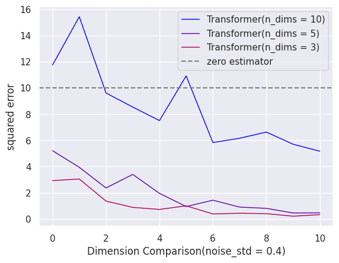

# 探究含噪声标签情境下ICL的稳健性

发布时间：2024年04月28日

`LLM理论` `机器学习`

> Exploring the Robustness of In-Context Learning with Noisy Labels

# 摘要

> 近期，变换器架构所展现的神秘上下文学习能力（ICL），尤其在大型语言模型（LLMs）中，引起了广泛的研究关注。尽管如此，变换器在面对充满噪声样本的上下文学习中的鲁棒性，这一问题在训练语料和提示演示中普遍存在，却鲜有深入探讨。本文受到先前研究的启发，那些研究通过简单的函数类别来探究ICL能力，我们通过深入探讨变换器对噪声标签的鲁棒性，来更细致地审视这一问题。具体而言，我们首先对变换器在上下文学习过程中对噪声标签的鲁棒性进行了详尽的评估与分析，发现变换器对示范标签中多样化的噪声类型具有显著的抵抗力。进一步地，我们探究了在训练集中引入噪声，类似于数据增强手段，是否能够增强推理过程中的这种鲁棒性，并发现这样的噪声确实能够提升ICL的鲁棒性。总体而言，我们深入的分析和发现为理解变换器模型在ICL过程中对抗标签噪声的鲁棒性提供了全面的视角，为自然语言处理领域中变换器的研究提供了宝贵的洞见。我们的代码已在 https://github.com/InezYu0928/in-context-learning 上公开。

> Recently, the mysterious In-Context Learning (ICL) ability exhibited by Transformer architectures, especially in large language models (LLMs), has sparked significant research interest. However, the resilience of Transformers' in-context learning capabilities in the presence of noisy samples, prevalent in both training corpora and prompt demonstrations, remains underexplored. In this paper, inspired by prior research that studies ICL ability using simple function classes, we take a closer look at this problem by investigating the robustness of Transformers against noisy labels. Specifically, we first conduct a thorough evaluation and analysis of the robustness of Transformers against noisy labels during in-context learning and show that they exhibit notable resilience against diverse types of noise in demonstration labels. Furthermore, we delve deeper into this problem by exploring whether introducing noise into the training set, akin to a form of data augmentation, enhances such robustness during inference, and find that such noise can indeed improve the robustness of ICL. Overall, our fruitful analysis and findings provide a comprehensive understanding of the resilience of Transformer models against label noises during ICL and provide valuable insights into the research on Transformers in natural language processing. Our code is available at https://github.com/InezYu0928/in-context-learning.

[Arxiv](https://arxiv.org/abs/2404.18191)