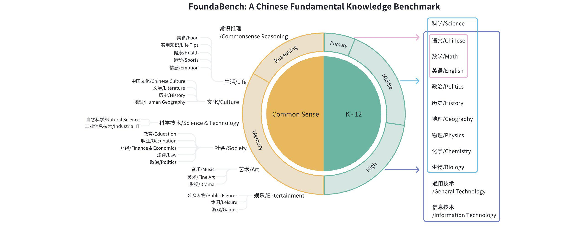
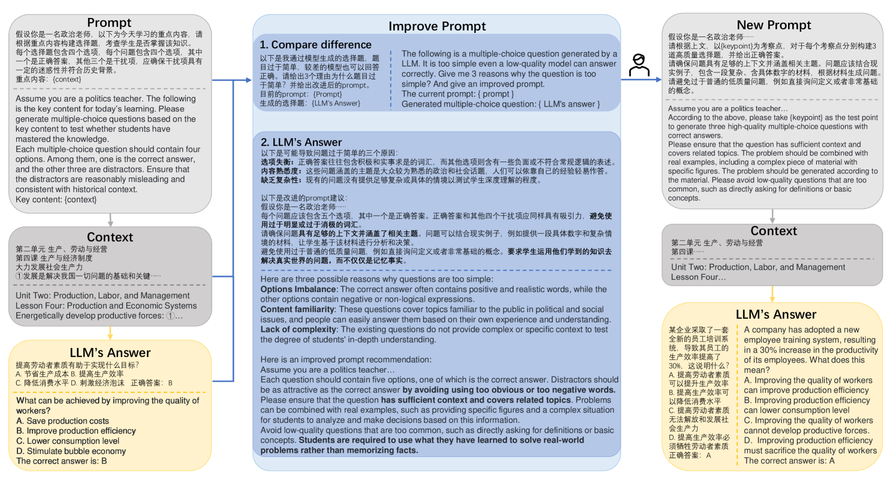
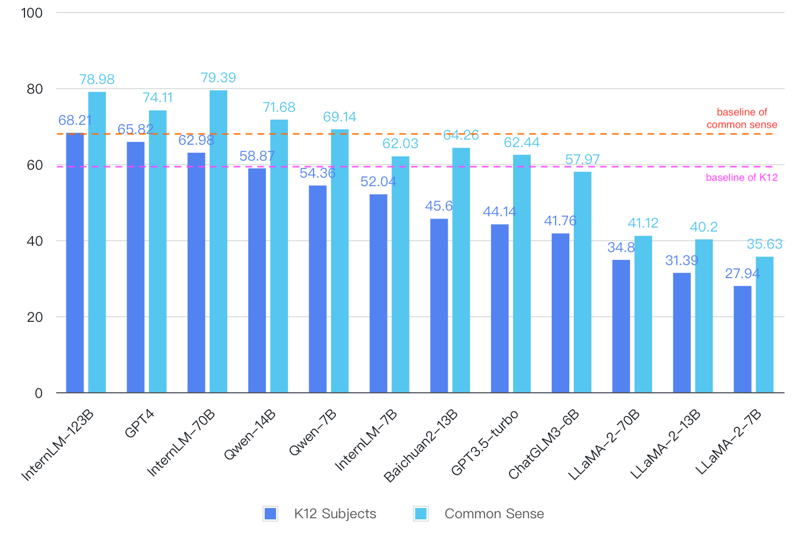
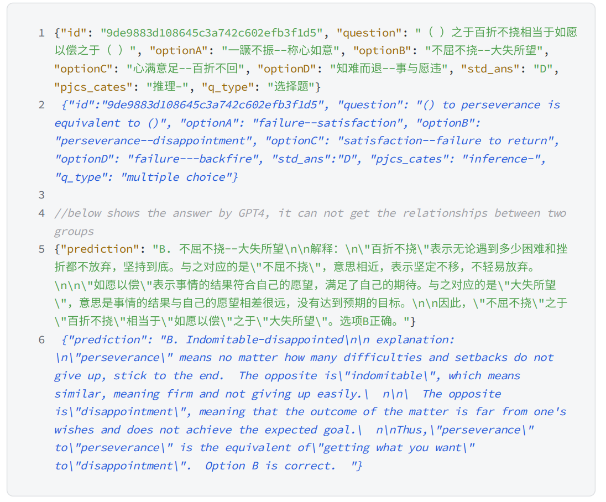
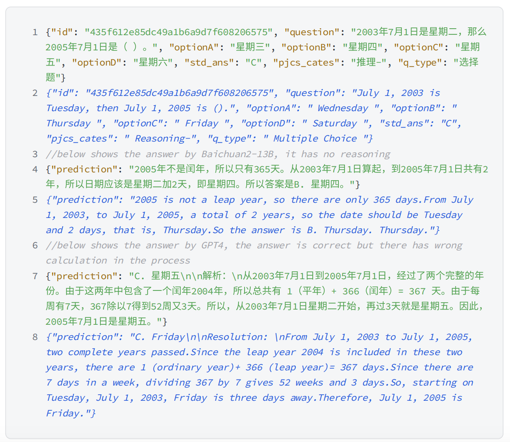
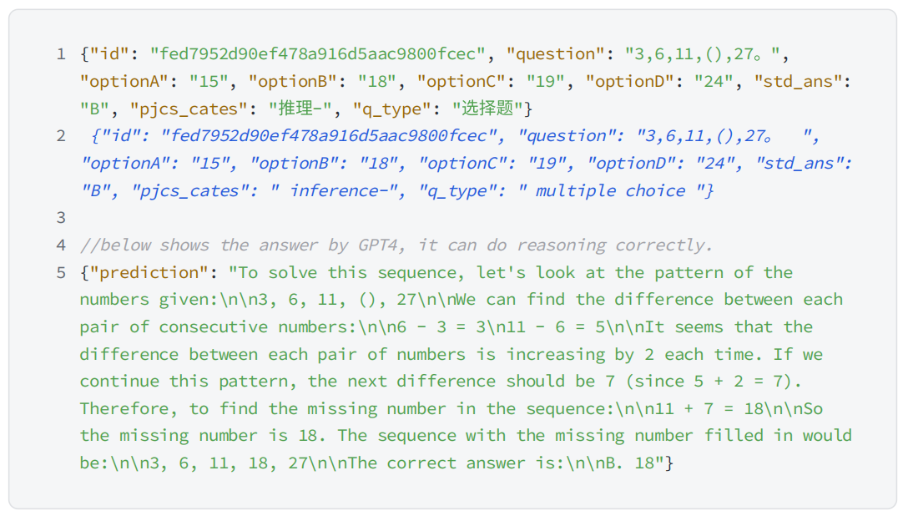
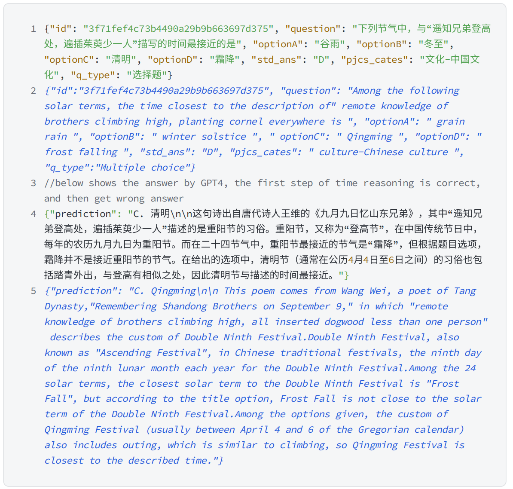

# FoundaBench：探究大型语言模型在中文基础知识掌握上的评估

发布时间：2024年04月28日

`LLM理论`

> FoundaBench: Evaluating Chinese Fundamental Knowledge Capabilities of Large Language Models

# 摘要

> 在蓬勃发展的大型语言模型（LLMs）领域，准确评估模型的基础知识水平尤为关键，尤其是那些专为中文语言和文化量身定制的模型。本文提出了FoundaBench，这是一个创新的基准测试工具，用以严格检验中文LLMs的基础知识掌握程度。FoundaBench精心设计了3354道多项选择题，覆盖常识和K-12教育主题，全面反映了日常生活和学术领域的知识。我们对12个顶尖的LLMs进行了深入评估，不仅采用了传统评估方法，还引入了CircularEval协议，以减少模型回答中的潜在偏差。评估结果显示，基于中文语料库预训练的模型性能更为出色，并指出了模型在推理和记忆回忆能力上存在显著差异。FoundaBench的评估结果不仅为理解LLMs的基础知识提供了新的视角，也为未来该领域的研究进步奠定了坚实的基础。

> In the burgeoning field of large language models (LLMs), the assessment of fundamental knowledge remains a critical challenge, particularly for models tailored to Chinese language and culture. This paper introduces FoundaBench, a pioneering benchmark designed to rigorously evaluate the fundamental knowledge capabilities of Chinese LLMs. FoundaBench encompasses a diverse array of 3354 multiple-choice questions across common sense and K-12 educational subjects, meticulously curated to reflect the breadth and depth of everyday and academic knowledge. We present an extensive evaluation of 12 state-of-the-art LLMs using FoundaBench, employing both traditional assessment methods and our CircularEval protocol to mitigate potential biases in model responses. Our results highlight the superior performance of models pre-trained on Chinese corpora, and reveal a significant disparity between models' reasoning and memory recall capabilities. The insights gleaned from FoundaBench evaluations set a new standard for understanding the fundamental knowledge of LLMs, providing a robust framework for future advancements in the field.

[Arxiv](https://arxiv.org/abs/2404.18359)