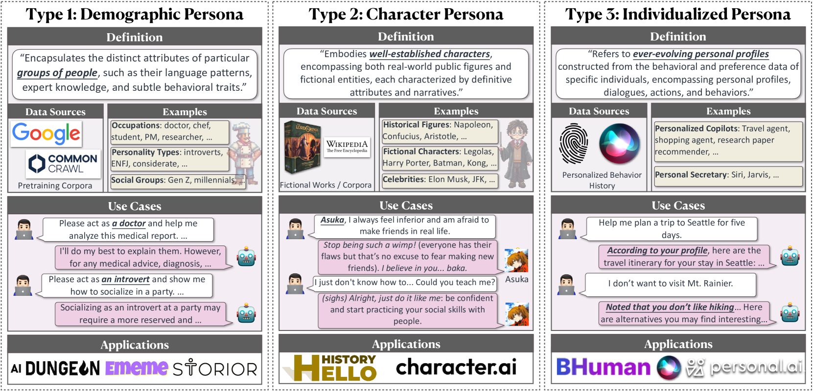

# 探索角色扮演语言代理：个性化之路的调查研究

发布时间：2024年04月28日

`分类：Agent` `人工智能` `角色扮演`

> From Persona to Personalization: A Survey on Role-Playing Language Agents

# 摘要

> 近期大型语言模型（LLMs）的突破性进展极大地促进了角色扮演语言代理（RPLAs）的发展，这是一种专为模拟特定人物角色而设计的AI系统。RPLAs借助LLMs的多项高级功能，如情境学习、指令执行和社交智能，展现出了极高的人类相似度和生动的角色扮演能力。它们能够模拟从历史名人到虚构角色，再到现实生活中的个体等各种人物形象。因此，RPLAs推动了情感伴侣、互动式电子游戏、个性化助理和副驾驶，以及数字克隆等多种AI应用的发展。本文全面梳理了这一领域的研究进展，展示了RPLAs如何与前沿的LLM技术相结合。我们将人物角色分为三类：1）利用统计学刻板印象的人口统计角色；2）专注于知名人物的角色角色；3）通过持续用户互动定制的个性化角色。文章首先全面概述了RPLAs的当前方法，然后详细介绍了每种角色类型的具体情况，包括相应的数据来源、代理构建和评估方法。接着，我们探讨了RPLAs的基本风险、现有局限和未来发展方向。此外，我们还简要回顾了RPLAs在AI应用中的实践，这些应用反映了用户的实际需求，也正是这些需求推动了RPLA研究的发展。通过本研究，我们希望建立一个清晰的RPLA研究和应用分类体系，推动这一关键且快速演变领域的未来研究，并为人类与RPLAs和谐共存的未来奠定基础。

> Recent advancements in large language models (LLMs) have significantly boosted the rise of Role-Playing Language Agents (RPLAs), i.e., specialized AI systems designed to simulate assigned personas. By harnessing multiple advanced abilities of LLMs, including in-context learning, instruction following, and social intelligence, RPLAs achieve a remarkable sense of human likeness and vivid role-playing performance. RPLAs can mimic a wide range of personas, ranging from historical figures and fictional characters to real-life individuals. Consequently, they have catalyzed numerous AI applications, such as emotional companions, interactive video games, personalized assistants and copilots, and digital clones. In this paper, we conduct a comprehensive survey of this field, illustrating the evolution and recent progress in RPLAs integrating with cutting-edge LLM technologies. We categorize personas into three types: 1) Demographic Persona, which leverages statistical stereotypes; 2) Character Persona, focused on well-established figures; and 3) Individualized Persona, customized through ongoing user interactions for personalized services. We begin by presenting a comprehensive overview of current methodologies for RPLAs, followed by the details for each persona type, covering corresponding data sourcing, agent construction, and evaluation. Afterward, we discuss the fundamental risks, existing limitations, and future prospects of RPLAs. Additionally, we provide a brief review of RPLAs in AI applications, which reflects practical user demands that shape and drive RPLA research. Through this work, we aim to establish a clear taxonomy of RPLA research and applications, and facilitate future research in this critical and ever-evolving field, and pave the way for a future where humans and RPLAs coexist in harmony.

[Arxiv](https://arxiv.org/abs/2404.18231)