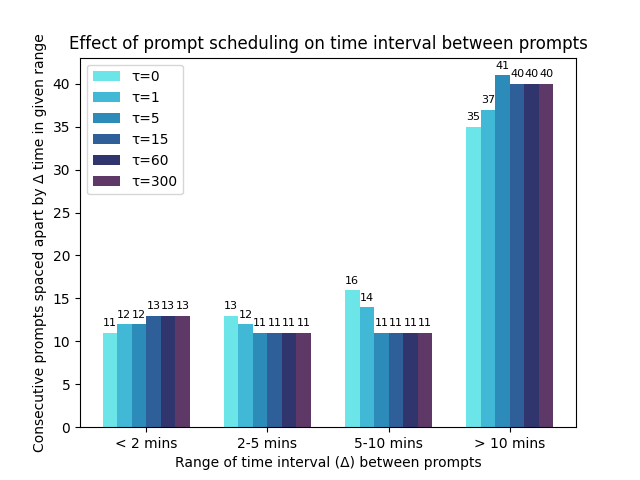
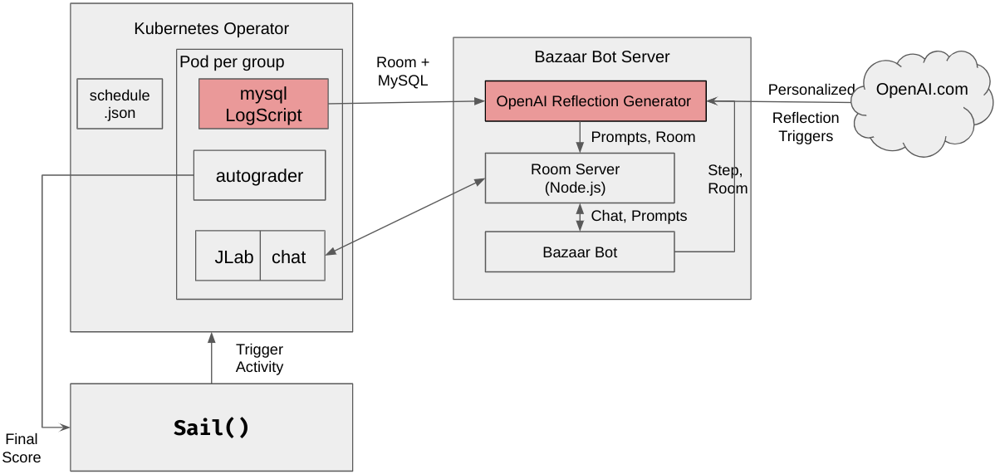
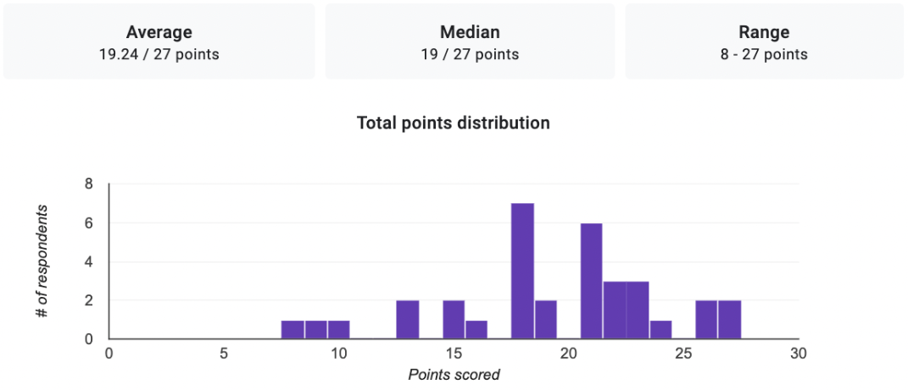
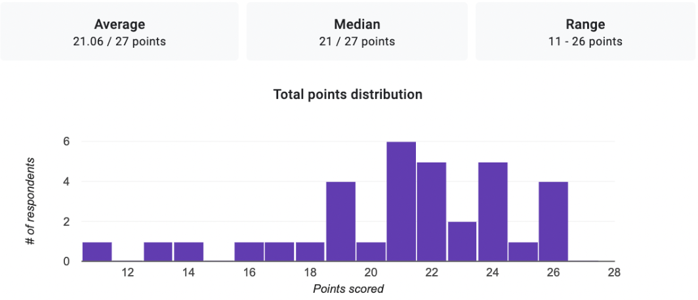

# 探索替代解决路径的情境反思触发器：以计算机辅助协作学习中的生成型AI为例

发布时间：2024年04月28日

`分类：LLM应用` `云计算`

> Generating Situated Reflection Triggers about Alternative Solution Paths: A Case Study of Generative AI for Computer-Supported Collaborative Learning

# 摘要

> 大型语言模型（LLMs）的突出之处在于其上下文化能力，能够根据不同的学生输入，如解题策略或先前的讨论，提供多样化的反馈，从而可能更有效地吸引学生。本研究介绍了一个概念验证的LLM应用，旨在为学生提供动态且具有上下文性的反馈。具体而言，我们为大学级别的云计算课程的在线编程练习机器人集成了ChatGPT，该机器人在数据库设计中的协作查询优化任务中，为学生提供了定制化的反思触发点。我们证明，LLMs能够生成高度情境化的反思触发点，这些触发点融合了正在进行的协作讨论的具体细节。此外，我们还深入探讨了触发点设计空间的探索，它们与学习目标的契合度，以及在一项涉及34名学生的试点研究中对学习成效的影响。

> An advantage of Large Language Models (LLMs) is their contextualization capability - providing different responses based on student inputs like solution strategy or prior discussion, to potentially better engage students than standard feedback. We present a design and evaluation of a proof-of-concept LLM application to offer students dynamic and contextualized feedback. Specifically, we augment an Online Programming Exercise bot for a college-level Cloud Computing course with ChatGPT, which offers students contextualized reflection triggers during a collaborative query optimization task in database design. We demonstrate that LLMs can be used to generate highly situated reflection triggers that incorporate details of the collaborative discussion happening in context. We discuss in depth the exploration of the design space of the triggers and their correspondence with the learning objectives as well as the impact on student learning in a pilot study with 34 students.

[Arxiv](https://arxiv.org/abs/2404.18262)