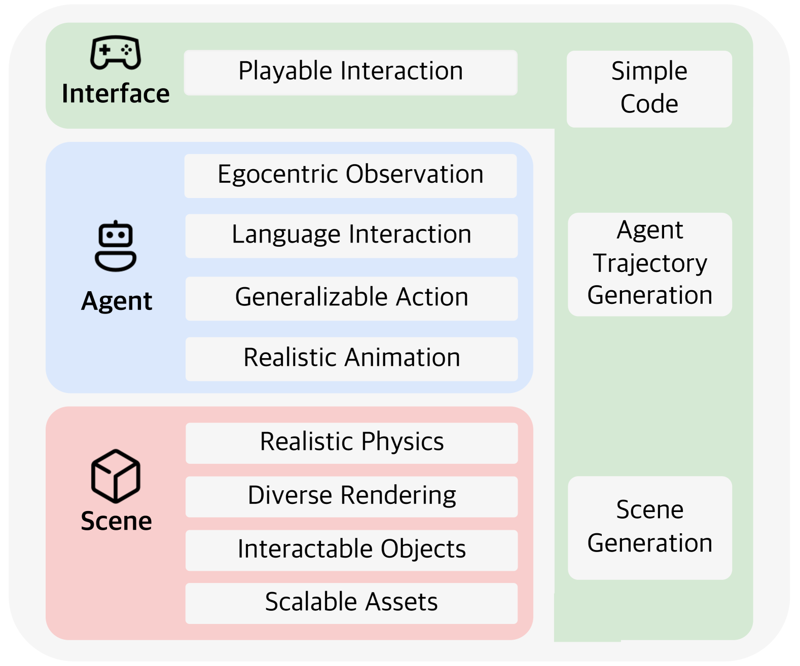
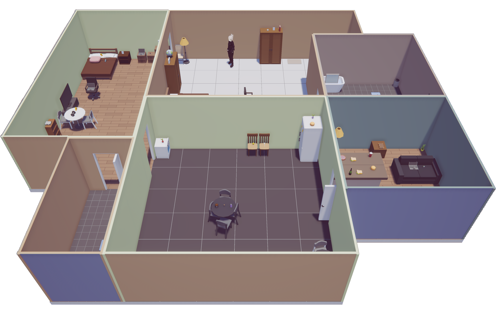
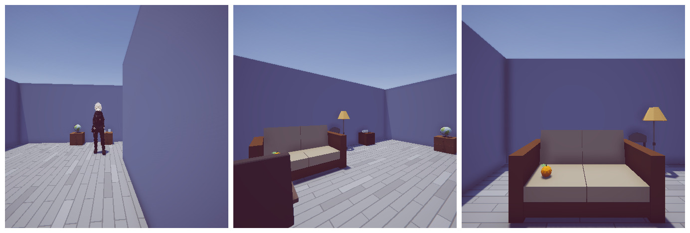

# LEGENT：为具身代理打造的开放平台

发布时间：2024年04月28日

`Agent` `人工智能` `机器人技术`

> LEGENT: Open Platform for Embodied Agents

# 摘要

> 尽管大型语言模型（LLMs）和大型多模态模型（LMMs）取得了显著进步，但将其融入到类似人类的、具有语言能力的具身代理中仍面临挑战，这限制了它们在现实世界任务中的复杂性能。目前，大多数集成工作开源程度有限，这影响了整个领域的进步。为此，我们推出了LEGENT，这是一个开放且可扩展的平台，旨在利用LLMs和LMMs打造具身代理。LEGENT结合了丰富的互动3D环境和易于操作的用户界面，以及一个先进的数据生成流程，该流程使用复杂算法从模拟世界中提取大规模监督信息。在实验中，基于LEGENT数据训练的初级视觉-语言-行动模型在具身任务上的表现超过了GPT-4V，显示了其出色的泛化潜力。

> Despite advancements in Large Language Models (LLMs) and Large Multimodal Models (LMMs), their integration into language-grounded, human-like embodied agents remains incomplete, hindering complex real-life task performance in physical environments. Existing integrations often feature limited open sourcing, challenging collective progress in this field. We introduce LEGENT, an open, scalable platform for developing embodied agents using LLMs and LMMs. LEGENT offers a dual approach: a rich, interactive 3D environment with communicable and actionable agents, paired with a user-friendly interface, and a sophisticated data generation pipeline utilizing advanced algorithms to exploit supervision from simulated worlds at scale. In our experiments, an embryonic vision-language-action model trained on LEGENT-generated data surpasses GPT-4V in embodied tasks, showcasing promising generalization capabilities.

[Arxiv](https://arxiv.org/abs/2404.18243)