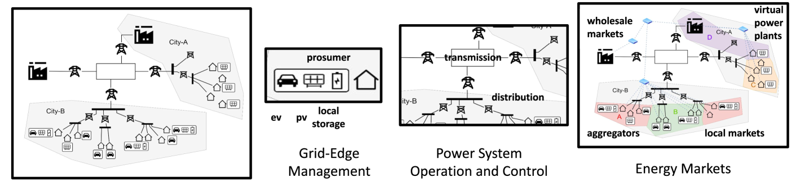

# 多智能体强化学习在能源网络领域的应用面临诸多计算挑战，尽管已有进展，但仍存在一些未解决的问题。

发布时间：2024年04月28日

`Agent` `能源管理`

> Multi-Agent Reinforcement Learning for Energy Networks: Computational Challenges, Progress and Open Problems

# 摘要

> 随着电气网络架构和功能的快速演变，以及可再生与分布式能源资源的日益普及，我们面临着众多技术和管理挑战。这些挑战使得传统的集中式能源市场模式不再适用，因其无法适应网络的动态性和不断演变的需求。本篇综述文章深入探讨了多智能体强化学习（MARL）如何助力能源网络实现去中心化和低碳化，同时应对这些挑战。文章通过明确管理能源网络时面临的主要计算难题，回顾了近期在解决这些问题上的研究进展，并指出了未来可能通过MARL来解决的开放性问题。

> The rapidly changing architecture and functionality of electrical networks and the increasing penetration of renewable and distributed energy resources have resulted in various technological and managerial challenges. These have rendered traditional centralized energy-market paradigms insufficient due to their inability to support the dynamic and evolving nature of the network. This survey explores how multi-agent reinforcement learning (MARL) can support the decentralization and decarbonization of energy networks and mitigate the associated challenges. This is achieved by specifying key computational challenges in managing energy networks, reviewing recent research progress on addressing them, and highlighting open challenges that may be addressed using MARL.

[Arxiv](https://arxiv.org/abs/2404.15583)