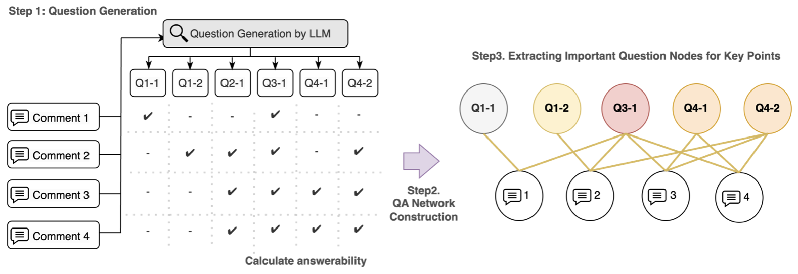
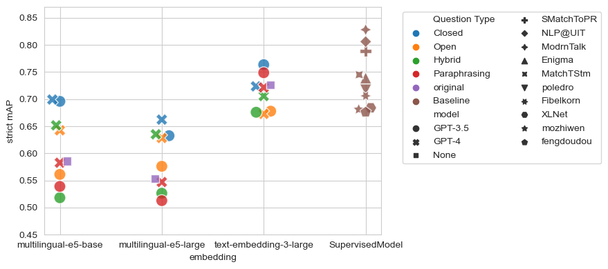

# QANA：利用大型语言模型（LLM）进行问题生成与网络分析，旨在实现零样本关键点分析及其扩展应用。

发布时间：2024年04月28日

`LLM应用` `社交媒体分析` `意见挖掘`

> QANA: LLM-based Question Generation and Network Analysis for Zero-shot Key Point Analysis and Beyond

# 摘要

> 社交媒体的广泛传播引起信息泛滥，同时也激发了对意见挖掘的浓厚兴趣。我们引入了一种创新的意见挖掘框架——“问答网络分析”（QANA），它使用大型语言模型（LLMs）来从用户评论生成问题，构建基于评论对这些问题可回答性的二分图，并采用中心性度量来评估意见的重要程度。通过与标注的关键点分析数据集进行比较，我们探究了问题生成方式、LLM选择以及嵌入模型选择对所构建QA网络质量的影响。QANA在零样本学习环境中，其关键点匹配任务的性能与现有的最先进监督模型相当，同时将计算成本从二次降低到线性。在关键点生成方面，高PageRank或度中心性的问题与人工标注的关键点高度一致。QANA的显著优势在于其能够从多角度评估关键点的重要性，这不仅提升了意见挖掘的质量，也增强了其公正性。

> The proliferation of social media has led to information overload and increased interest in opinion mining. We propose "Question-Answering Network Analysis" (QANA), a novel opinion mining framework that utilizes Large Language Models (LLMs) to generate questions from users' comments, constructs a bipartite graph based on the comments' answerability to the questions, and applies centrality measures to examine the importance of opinions. We investigate the impact of question generation styles, LLM selections, and the choice of embedding model on the quality of the constructed QA networks by comparing them with annotated Key Point Analysis datasets. QANA achieves comparable performance to previous state-of-the-art supervised models in a zero-shot manner for Key Point Matching task, also reducing the computational cost from quadratic to linear. For Key Point Generation, questions with high PageRank or degree centrality align well with manually annotated key points. Notably, QANA enables analysts to assess the importance of key points from various aspects according to their selection of centrality measure. QANA's primary contribution lies in its flexibility to extract key points from a wide range of perspectives, which enhances the quality and impartiality of opinion mining.

[Arxiv](https://arxiv.org/abs/2404.18371)