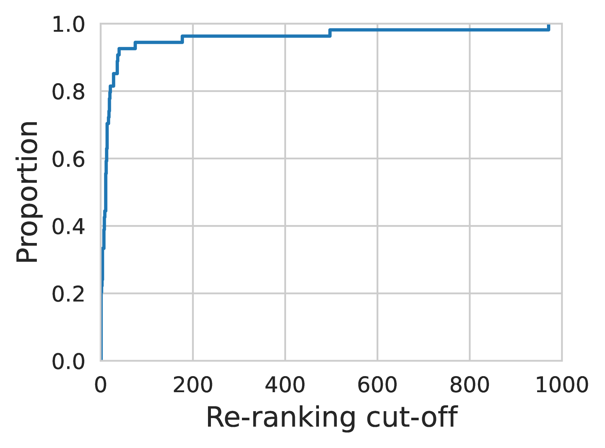

# 为大型语言模型的重新排序引入列表截断技术

发布时间：2024年04月28日

`LLM应用` `信息检索`

> Ranked List Truncation for Large Language Model-based Re-Ranking

# 摘要

> 本研究以“先检索再重新排序”的新视角探讨了排名列表截断（RLT）问题，通过裁剪检索结果列表来优化重新排序过程。RLT 在提升重新排序的效率和效果方面发挥着关键作用，但目前对这一新视角下RLT方法的研究尚不充分。为填补这一研究空白，我们特别针对基于大型语言模型（LLM）的重新排序，复现并测试了现有的RLT方法。我们从三个维度深入探讨了RLT在“先检索再重新排序”框架下的适用性：（i）评估基于LLM重新排序和词汇检索的第一阶段RLT方法，（ii）分析不同类型第一阶段检索器对RLT方法的影响，（iii）探究不同类型重新排序器对RLT方法的影响。我们在TREC 2019和2020深度学习赛道上进行了实验，对涉及3种检索器和2种重新排序器的8种RLT方法进行了测试，从而获得了关于重新排序背景下RLT方法的新洞见。

> We study ranked list truncation (RLT) from a novel "retrieve-then-re-rank" perspective, where we optimize re-ranking by truncating the retrieved list (i.e., trim re-ranking candidates). RLT is crucial for re-ranking as it can improve re-ranking efficiency by sending variable-length candidate lists to a re-ranker on a per-query basis. It also has the potential to improve re-ranking effectiveness. Despite its importance, there is limited research into applying RLT methods to this new perspective. To address this research gap, we reproduce existing RLT methods in the context of re-ranking, especially newly emerged large language model (LLM)-based re-ranking. In particular, we examine to what extent established findings on RLT for retrieval are generalizable to the "retrieve-then-re-rank" setup from three perspectives: (i) assessing RLT methods in the context of LLM-based re-ranking with lexical first-stage retrieval, (ii) investigating the impact of different types of first-stage retrievers on RLT methods, and (iii) investigating the impact of different types of re-rankers on RLT methods. We perform experiments on the TREC 2019 and 2020 deep learning tracks, investigating 8 RLT methods for pipelines involving 3 retrievers and 2 re-rankers. We reach new insights into RLT methods in the context of re-ranking.

[Arxiv](https://arxiv.org/abs/2404.18185)