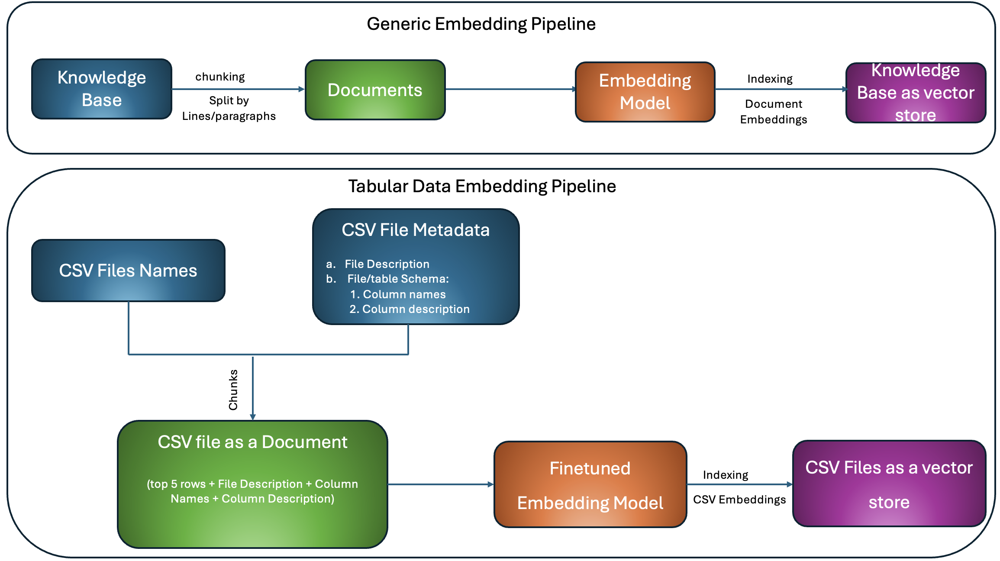
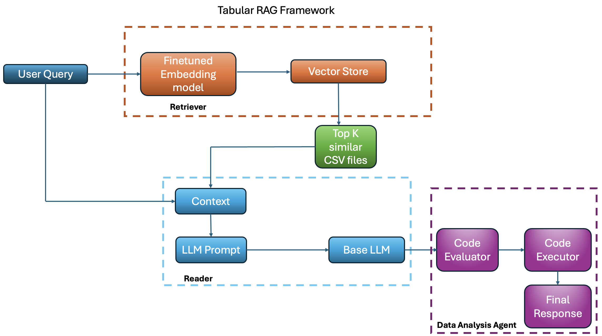
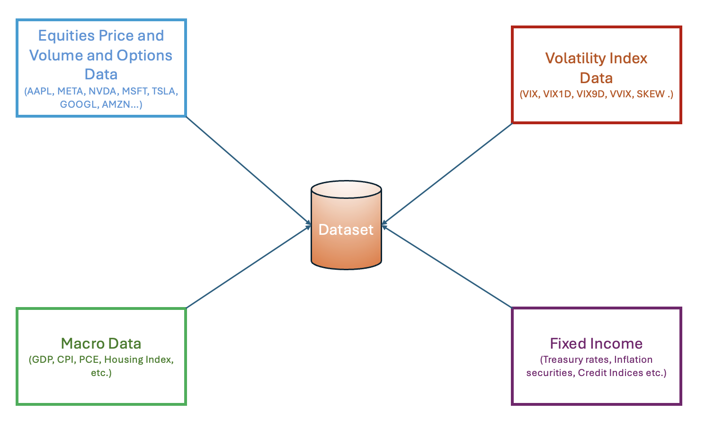
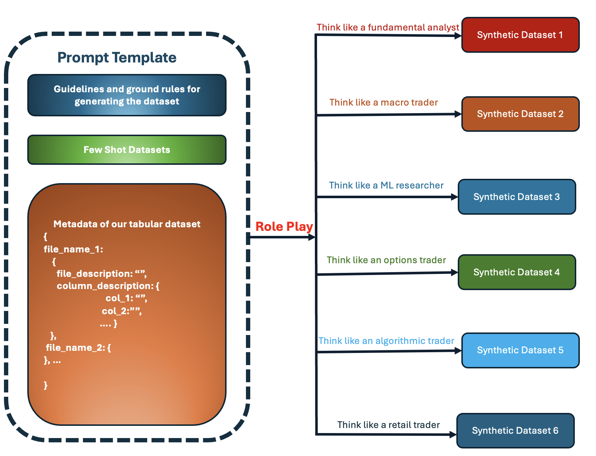
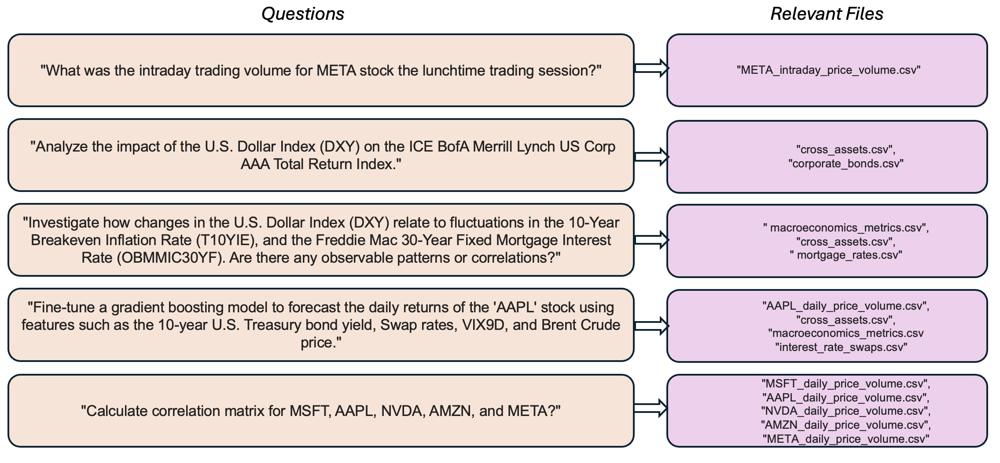

# 表格嵌入模型（TEM）：针对表格 RAG 应用场景，对嵌入模型进行精细化调整。

发布时间：2024年04月28日

`RAG` `数据分析` `人工智能`

> Tabular Embedding Model (TEM): Finetuning Embedding Models For Tabular RAG Applications

# 摘要

> 近期，大型语言模型在数学、代码生成和通用推理等领域展现出了惊人的能力。但面对需要处理和分析大量数值或表格数据的专业领域应用，即便是最尖端的模型也显得力不从心。本文提出了一种创新的方法，通过引入一种新的 RAG 工作流程，有效解决了现有表格 LLM 解决方案在可扩展性上的挑战。我们介绍了一种名为表格嵌入模型（TEM）的新方法，它专门针对表格检索增强生成（RAG）应用来微调嵌入模型。嵌入模型在 RAG 工作流程中扮演着核心角色，而现有的顶尖嵌入模型在处理复杂表格数据时往往表现不佳，因为它们主要是在文本数据集上进行训练的。我们的评估结果显示，TEM 不仅在性能上超越了当前的顶尖嵌入模型，而且模型结构更为紧凑，运行效率更高。

> In recent times Large Language Models have exhibited tremendous capabilities, especially in the areas of mathematics, code generation and general-purpose reasoning. However for specialized domains especially in applications that require parsing and analyzing large chunks of numeric or tabular data even state-of-the-art (SOTA) models struggle. In this paper, we introduce a new approach to solving domain-specific tabular data analysis tasks by presenting a unique RAG workflow that mitigates the scalability issues of existing tabular LLM solutions. Specifically, we present Tabular Embedding Model (TEM), a novel approach to fine-tune embedding models for tabular Retrieval-Augmentation Generation (RAG) applications. Embedding models form a crucial component in the RAG workflow and even current SOTA embedding models struggle as they are predominantly trained on textual datasets and thus underperform in scenarios involving complex tabular data. The evaluation results showcase that our approach not only outperforms current SOTA embedding models in this domain but also does so with a notably smaller and more efficient model structure.

[Arxiv](https://arxiv.org/abs/2405.01585)