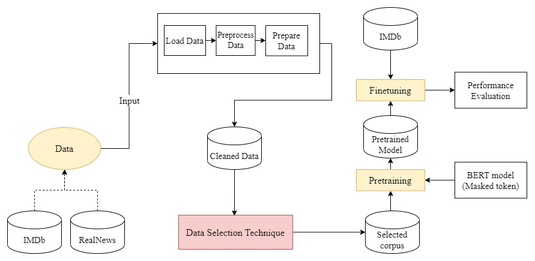
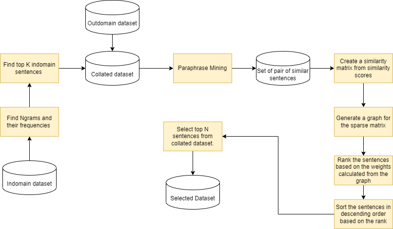

# TextGram：探索更优的领域适应性预训练之路

发布时间：2024年04月28日

`LLM应用` `环境科学`

> TextGram: Towards a better domain-adaptive pretraining

# 摘要

> 绿色AI的核心在于准确衡量并降低大型语言模型训练过程中的碳排放。在自然语言处理领域，对Transformer模型进行预训练需要动用庞大的计算资源。这一过程通过大量文本数据积累知识，以便更好地执行后续任务。因此，从海量语料中精准挑选出与特定领域相关的数据，对于实现最佳任务效果至关重要。尽管基于大规模无监督数据的训练成本高昂，但通过在预训练前进行数据筛选可以优化这一过程。精选关键数据不仅减少了存储开销，还缩短了模型预训练的时间，同时确保了准确性。我们深入研究了现有的数据筛选策略，并提出了一种新的领域适应性数据筛选方法——TextGram，它能够高效地从大型语料库中筛选出关键数据。我们对比了应用和不应用数据筛选的文本分类任务的微调模型效果，并验证了我们策略的优越性。

> For green AI, it is crucial to measure and reduce the carbon footprint emitted during the training of large language models. In NLP, performing pre-training on Transformer models requires significant computational resources. This pre-training involves using a large amount of text data to gain prior knowledge for performing downstream tasks. Thus, it is important that we select the correct data in the form of domain-specific data from this vast corpus to achieve optimum results aligned with our domain-specific tasks. While training on large unsupervised data is expensive, it can be optimized by performing a data selection step before pretraining. Selecting important data reduces the space overhead and the substantial amount of time required to pre-train the model while maintaining constant accuracy. We investigate the existing selection strategies and propose our own domain-adaptive data selection method - TextGram - that effectively selects essential data from large corpora. We compare and evaluate the results of finetuned models for text classification task with and without data selection. We show that the proposed strategy works better compared to other selection methods.

[Arxiv](https://arxiv.org/abs/2404.18228)