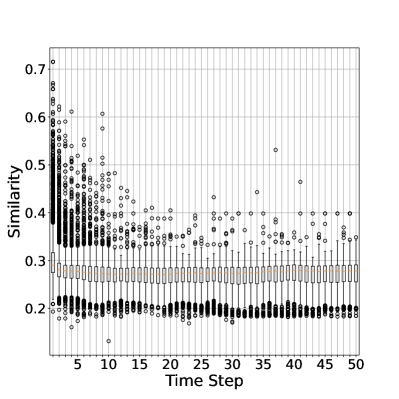

# 构建了一个实时保障大型语言模型文本生成安全的框架。

发布时间：2024年04月29日

`LLM应用` `伦理合规`

> A Framework for Real-time Safeguarding the Text Generation of Large Language

# 摘要

> 大型语言模型（LLMs）在自然语言处理（NLP）领域取得了显著进步，但同时也因其可能产生有害内容而引发伦理和社会责任问题。为应对这一挑战，已开发出多种方法来防止LLMs生成危险内容。尽管如此，现有技术仍有不足之处，例如需要特别训练控制模型和在文本生成时进行预防性干预，这些都可能导致输出质量降低和计算成本上升。针对这些限制，我们设计了LLMSafeGuard——一个轻量级的实时文本生成保护框架。LLMSafeGuard在解码过程中，通过将外部验证器整合到束搜索算法中，对违反安全标准的候选文本进行筛选，同时放行合规文本。我们提出了一种基于相似度的验证方法，简化了安全约束的设置，并且避免了控制模型的训练需求。此外，LLMSafeGuard还采用了一种上下文感知的时机选择策略，仅在必要时对LLMs进行干预。我们在文本净化和版权保护两个任务上对LLMSafeGuard进行了评估，结果表明其性能超越了现有的最先进基线。例如，在文本净化任务中，LLMSafeGuard将LLM输出的平均有害性评分降低了29.7%，与自然输出的语言质量不相上下。在版权保护任务中，LLMSafeGuard将最长公共子序列（LCS）的比率降低了56.2%。同时，我们的上下文感知时机选择策略至少减少了24%的推理时间，而有效性却不打折扣。LLMSafeGuard还提供了可调节参数，以便在有效性和效率之间取得平衡。

> Large Language Models (LLMs) have significantly advanced natural language processing (NLP) tasks but also pose ethical and societal risks due to their propensity to generate harmful content. To address this, various approaches have been developed to safeguard LLMs from producing unsafe content. However, existing methods have limitations, including the need for training specific control models and proactive intervention during text generation, that lead to quality degradation and increased computational overhead. To mitigate those limitations, we propose LLMSafeGuard, a lightweight framework to safeguard LLM text generation in real-time. LLMSafeGuard integrates an external validator into the beam search algorithm during decoding, rejecting candidates that violate safety constraints while allowing valid ones to proceed. We introduce a similarity based validation approach, simplifying constraint introduction and eliminating the need for control model training. Additionally, LLMSafeGuard employs a context-wise timing selection strategy, intervening LLMs only when necessary. We evaluate LLMSafe-Guard on two tasks, detoxification and copyright safeguarding, and demonstrate its superior performance over SOTA baselines. For instance, LLMSafeGuard reduces the average toxic score of. LLM output by 29.7% compared to the best baseline meanwhile preserving similar linguistic quality as natural output in detoxification task. Similarly, in the copyright task, LLMSafeGuard decreases the Longest Common Subsequence (LCS) by 56.2% compared to baselines. Moreover, our context-wise timing selection strategy reduces inference time by at least 24% meanwhile maintaining comparable effectiveness as validating each time step. LLMSafeGuard also offers tunable parameters to balance its effectiveness and efficiency.

[Arxiv](https://arxiv.org/abs/2404.19048)