# 本文介绍了一种新颖的几何方法，用于分析具有延迟的系统的稳定性，并将其应用于网络动态的研究。

发布时间：2024年04月29日

`Agent` `智能体系统` `控制理论`

> A geometric approach for stability analysis of delay systems: Applications to network dynamics

# 摘要

> 探究具有时间延迟的多智能体系统的稳定性与同步行为对于现实世界中的众多应用至关重要。此类研究通常需要求解从特定解出发对系统进行线性化后得到的超越特征方程（TCEs）。尽管关于由对称网络在时间延迟模型中引起的实系数TCEs的稳定性研究已广泛开展，但对于由非对称网络动态引起的复值系数TCEs的稳定性分析尚存在明显缺口。为全面应对这一挑战，我们提出了一种严谨的几何分析方法。通过分析复平面上的稳定性临界曲线，我们得以界定这些系统的稳定区域。此方法不仅适用于离散时间延迟模型，也适用于包含分布式延迟等多种延迟类型的模型，并且能够处理随机网络。我们通过为汽车跟随系统、机械系统和深脑刺激模型设计延迟控制策略，证明了该方法在处理复值TCEs或不同类型延迟时的有效性，从而突显了该方法在多个领域的广泛适用性。

> Investigating the network stability or synchronization dynamics of multi-agent systems with time delays is of significant importance in numerous real-world applications. Such investigations often rely on solving the transcendental characteristic equations (TCEs) obtained from linearization of the considered systems around specific solutions. While stability results based on the TCEs with real-valued coefficients induced by symmetric networks in time-delayed models have been extensively explored in the literature, there remains a notable gap in stability analysis for the TCEs with complexvalued coefficients arising from asymmetric networked dynamics with time delays. To address this challenge comprehensively, we propose a rigorously geometric approach. By identifying and studying the stability crossing curves in the complex plane, we are able to determine the stability region of these systems. This approach is not only suitable for analyzing the stability of models with discrete time delays but also for models with various types of delays, including distributed time delays. Additionally, it can also handle random networks. We demonstrate the efficacy of this approach in designing delayed control strategies for car-following systems, mechanical systems, and deep brain stimulation modeling, where involved are complex-valued TCEs or/and different types of delays. All these therefore highlight the broad applicability of our approach across diverse domains.

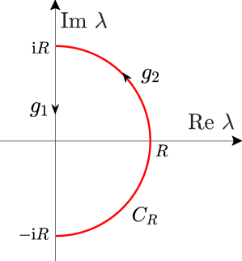

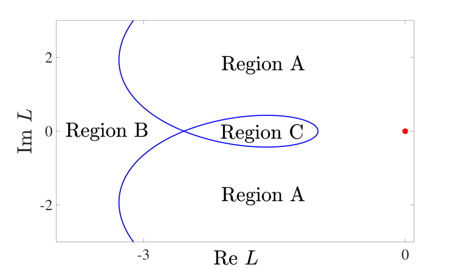

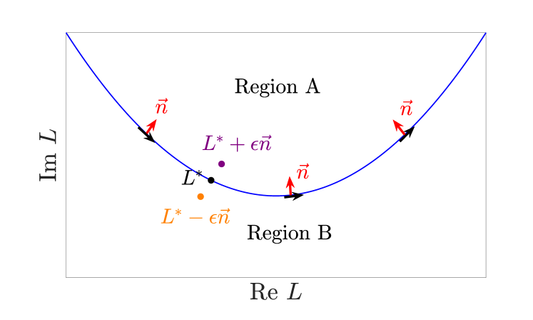

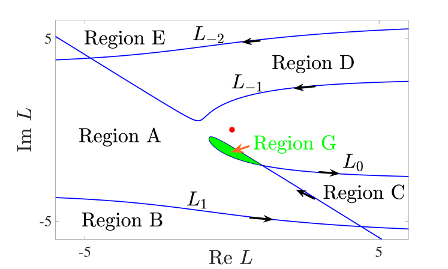

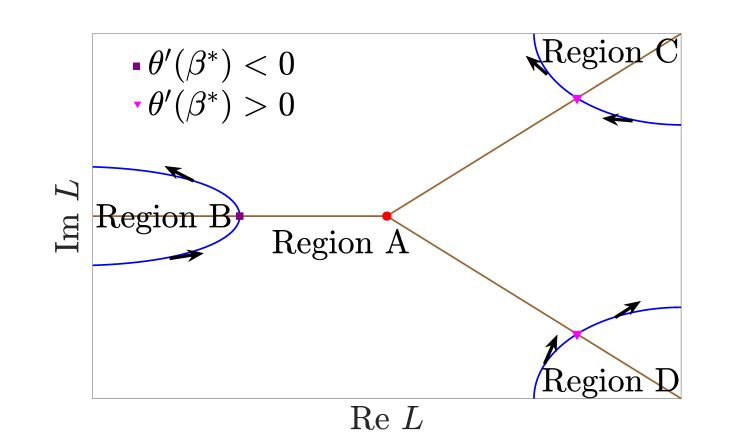

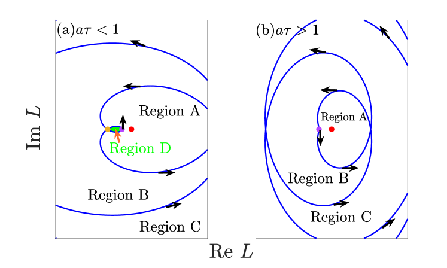

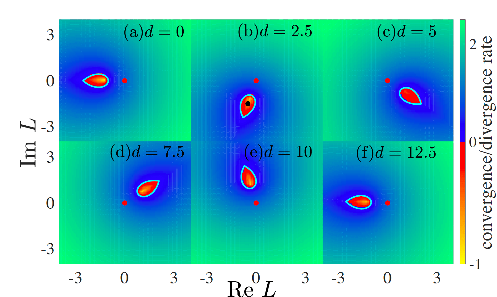

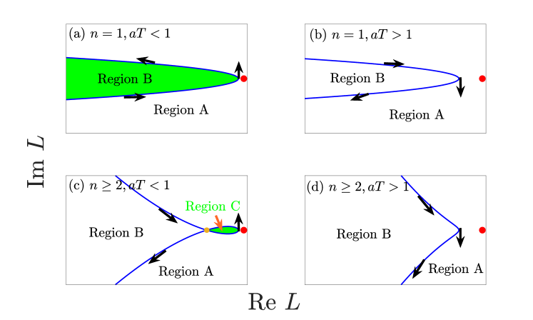

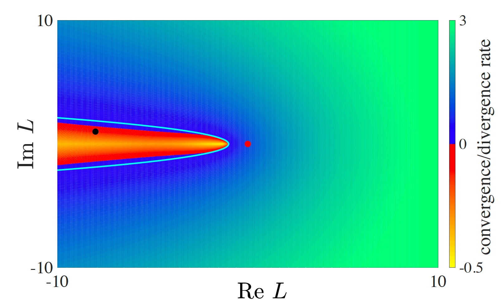

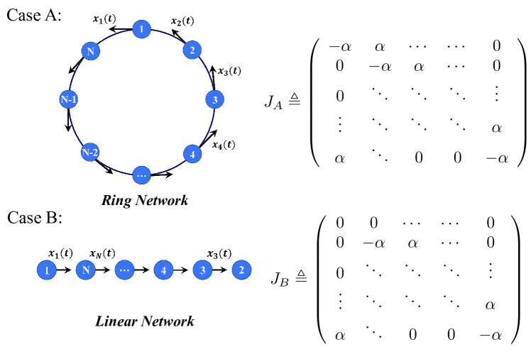

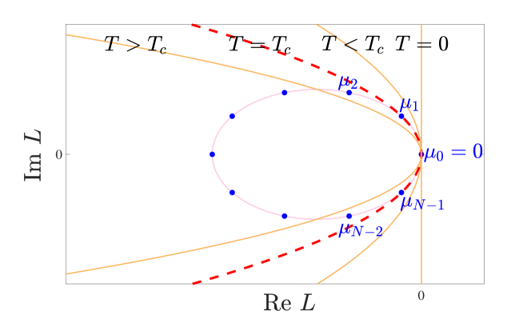

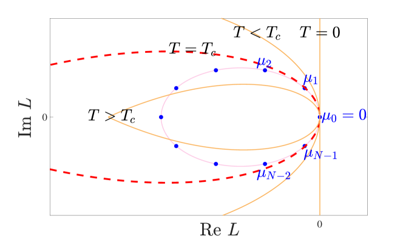

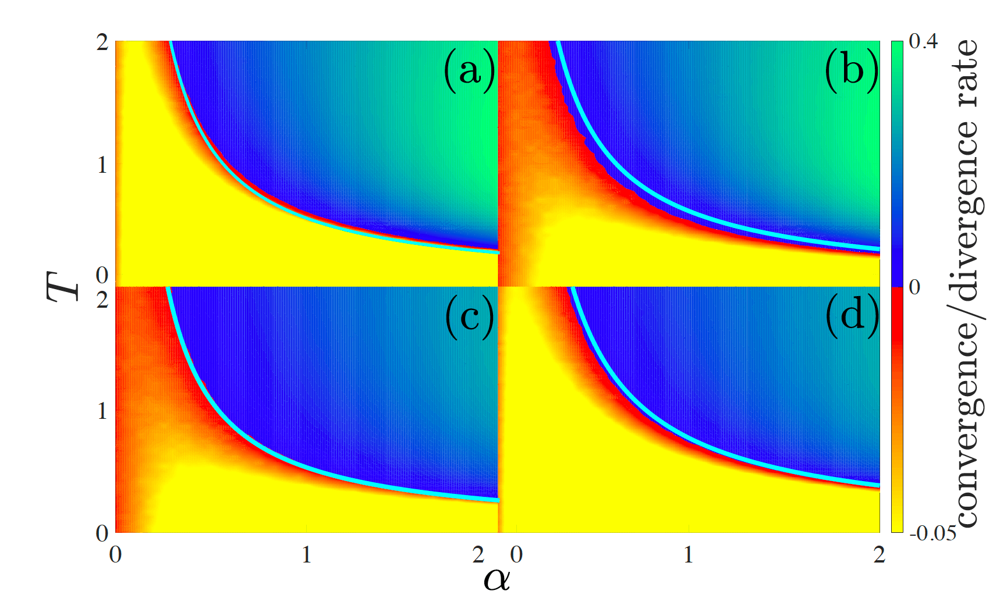

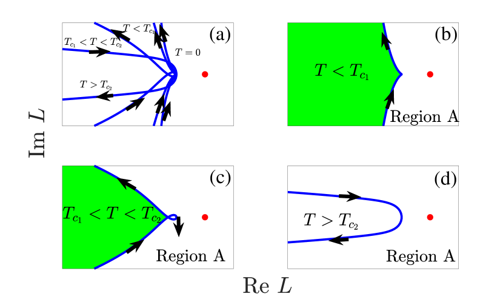

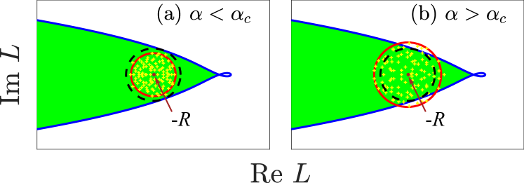

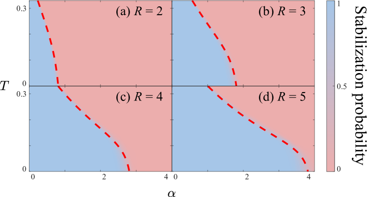

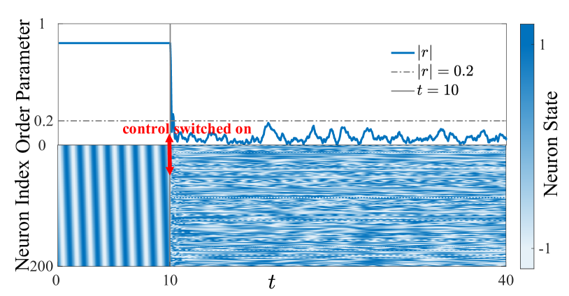

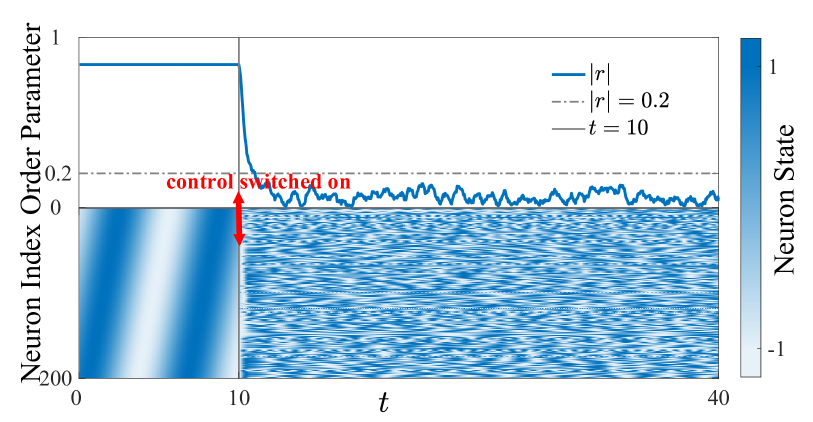

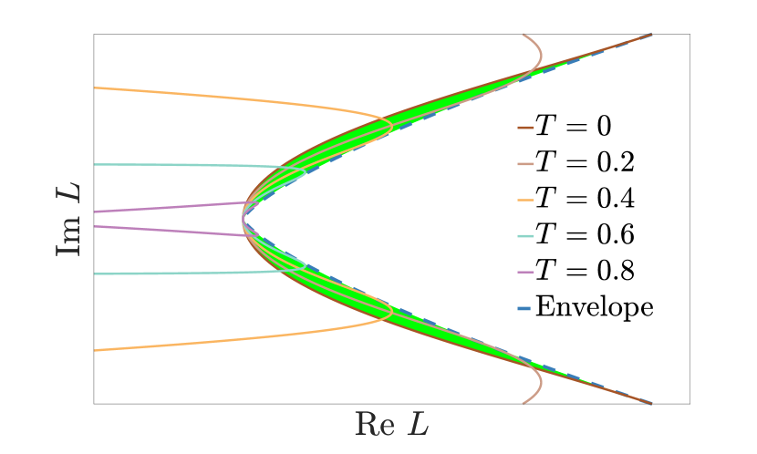

[Arxiv](https://arxiv.org/abs/2404.18704)