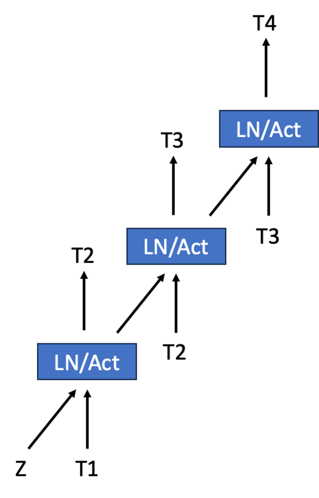
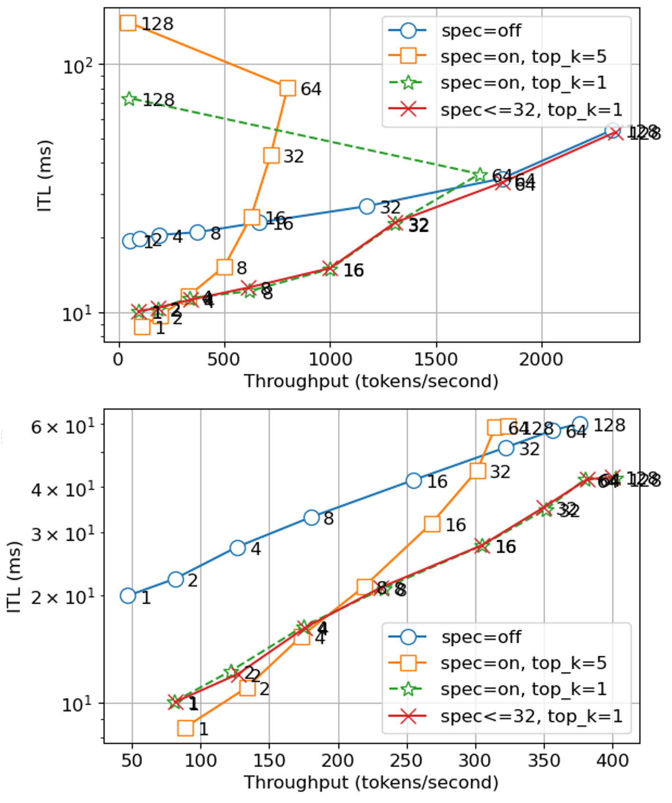
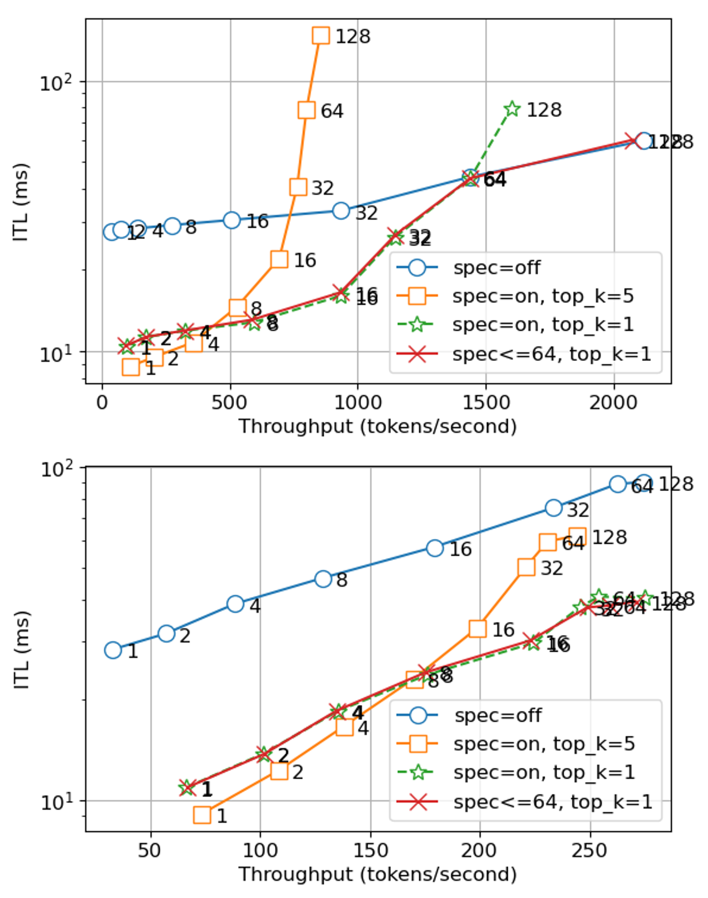

# 结合令牌与嵌入预测器，我们能够加速大型语言模型的生产流程。

发布时间：2024年04月29日

`LLM应用` `机器学习`

> Accelerating Production LLMs with Combined Token/Embedding Speculators

# 摘要

> 本篇技术报告详细介绍了一种创新的推测性解码草案模型的设计与训练过程，目的在于提升大型语言模型在生产环境下的推理效率。我们的方法是通过结合上下文向量和采样标记来训练模型，使其能够高效地预测出高质量的n-gram序列，随后基础模型将决定是否采纳这些预测结果。这一策略显著提升了优化后的基础模型的推理速度，加速比达到了2至3倍。报告中还讨论了初步成果，并对未来的改进方向进行了展望。

> This technical report describes the design and training of novel speculative decoding draft models, for accelerating the inference speeds of large language models in a production environment. By conditioning draft predictions on both context vectors and sampled tokens, we can train our speculators to efficiently predict high-quality n-grams, which the base model then accepts or rejects. This allows us to effectively predict multiple tokens per inference forward pass, accelerating wall-clock inference speeds of highly optimized base model implementations by a factor of 2-3x. We explore these initial results and describe next steps for further improvements.

[Arxiv](https://arxiv.org/abs/2404.19124)