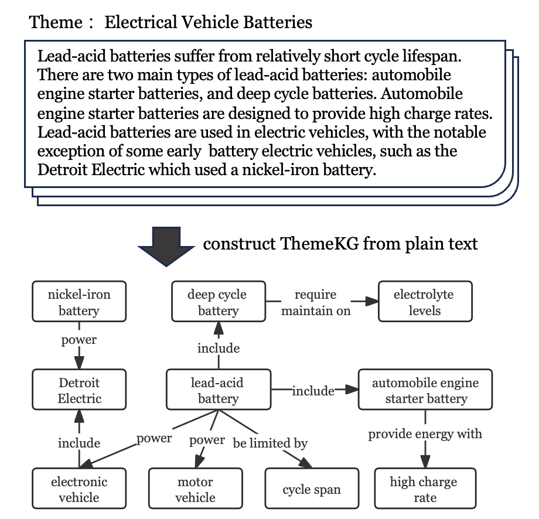
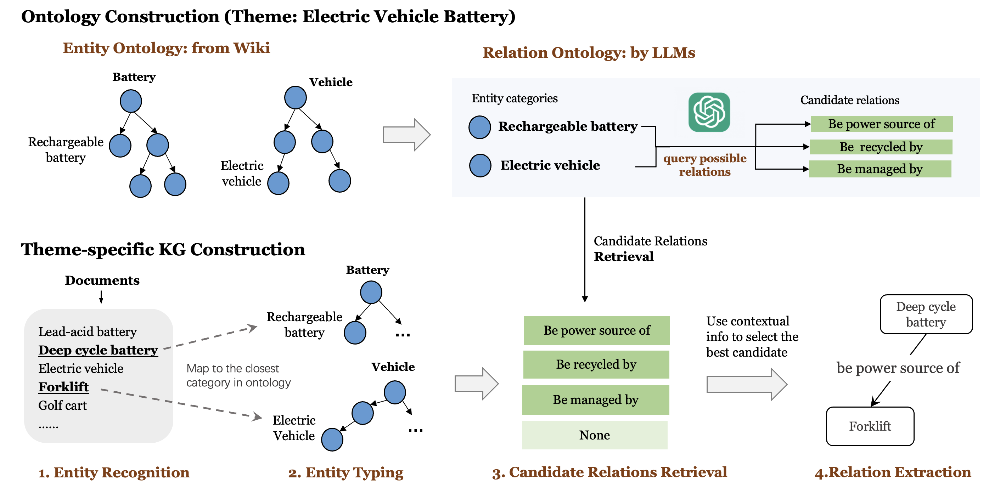

# 自动化构建针对性主题的知识图谱

发布时间：2024年04月29日

`分类：LLM应用` `问答系统` `知识图谱`

> Automated Construction of Theme-specific Knowledge Graphs

# 摘要

> 知识图谱在问答和智能对话系统等任务中应用广泛，但现有知识图谱在信息细节和即时性上存在不足，尤其在专业研究和快速变化的情境如突发新闻追踪中，这些不足严重影响了知识的检索与分析。为此，我们提出了一个针对特定主题的知识图谱（ThemeKG），并设计了一个无监督的构建框架（TKGCon）。该框架能够从特定主题的原始语料库中提炼出包含关键实体和关系的高质量知识图谱。我们首先利用维基百科中的实体本体作为起点，然后利用大型语言模型（LLMs）探索候选关系，形成关系本体。在处理主题语料库的文档时，我们将实体对与本体映射，筛选出候选关系。最终，结合上下文和本体，我们巩固了实体对之间的关系。我们发现，直接向GPT-4查询特定主题的知识图谱会导致实体识别不准确，关系描述模糊或错误。而我们的模型通过逐步构建主题知识图谱，在准确性上超越了GPT-4。实验结果显示，我们的框架在各项评估中均优于传统知识图谱构建方法。

> Despite widespread applications of knowledge graphs (KGs) in various tasks such as question answering and intelligent conversational systems, existing KGs face two major challenges: information granularity and deficiency in timeliness. These hinder considerably the retrieval and analysis of in-context, fine-grained, and up-to-date knowledge from KGs, particularly in highly specialized themes (e.g., specialized scientific research) and rapidly evolving contexts (e.g., breaking news or disaster tracking). To tackle such challenges, we propose a theme-specific knowledge graph (i.e., ThemeKG), a KG constructed from a theme-specific corpus, and design an unsupervised framework for ThemeKG construction (named TKGCon). The framework takes raw theme-specific corpus and generates a high-quality KG that includes salient entities and relations under the theme. Specifically, we start with an entity ontology of the theme from Wikipedia, based on which we then generate candidate relations by Large Language Models (LLMs) to construct a relation ontology. To parse the documents from the theme corpus, we first map the extracted entity pairs to the ontology and retrieve the candidate relations. Finally, we incorporate the context and ontology to consolidate the relations for entity pairs. We observe that directly prompting GPT-4 for theme-specific KG leads to inaccurate entities (such as "two main types" as one entity in the query result) and unclear (such as "is", "has") or wrong relations (such as "have due to", "to start"). In contrast, by constructing the theme-specific KG step by step, our model outperforms GPT-4 and could consistently identify accurate entities and relations. Experimental results also show that our framework excels in evaluations compared with various KG construction baselines.

[Arxiv](https://arxiv.org/abs/2404.19146)