# 变色龙：一种在野外环境中进行密集视觉预测的数据高效多面手。

发布时间：2024年04月29日

`分类：LLM应用` `计算机视觉` `元学习`

> Chameleon: A Data-Efficient Generalist for Dense Visual Prediction in the Wild

# 摘要

> 大型语言模型已经进化为数据高效的多面手，这得益于统一的语言接口和大规模的预训练。然而，要构建一个能够应对不同任务中标签结构变化的密集视觉预测领域的数据高效多面手，面临着特别的挑战。在数据稀缺的情况下，对于未见过的密集预测任务的泛化并非易事，这一点在以往的视觉多面手研究中并未受到足够的关注。本研究中，我们探究了一种能够通过少量示例灵活适应未知密集标签结构的通用模型，使其能够在多种现实世界场景中充当数据高效的视觉多面手。为此，我们采用了一个强大的元学习框架，并探索了多个维度以提升模型的性能和适应性，包括灵活的适应机制和可扩展性。我们在一系列低样本学习需求的现实世界场景中对模型进行了评估，这些场景涵盖了视频、3D、医学、生物和用户交互任务。我们的模型凭借其通用架构和有效的适应机制，在这些任务中最多仅需50张标记图像即可灵活适应，相较于现有的数据高效多面手方法取得了显著的进步。相关代码可在 https://github.com/GitGyun/chameleon 上获取。

> Large language models have evolved data-efficient generalists, benefiting from the universal language interface and large-scale pre-training. However, constructing a data-efficient generalist for dense visual prediction presents a distinct challenge due to the variation in label structures across different tasks. Consequently, generalization to unseen dense prediction tasks in the low-data regime is not straightforward and has received less attention from previous vision generalists. In this study, we explore a universal model that can flexibly adapt to unseen dense label structures with a few examples, enabling it to serve as a data-efficient vision generalist in diverse real-world scenarios. To this end, we base our method on a powerful meta-learning framework and explore several axes to improve its performance and versatility for real-world problems, such as flexible adaptation mechanisms and scalability. We evaluate our model across a spectrum of unseen real-world scenarios where low-shot learning is desirable, including video, 3D, medical, biological, and user-interactive tasks. Equipped with a generic architecture and an effective adaptation mechanism, our model flexibly adapts to all of these tasks with at most 50 labeled images, showcasing a significant advancement over existing data-efficient generalist approaches. Codes are available at https://github.com/GitGyun/chameleon.

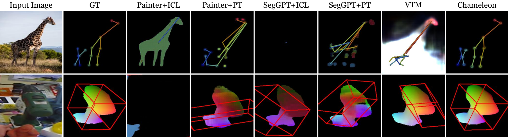

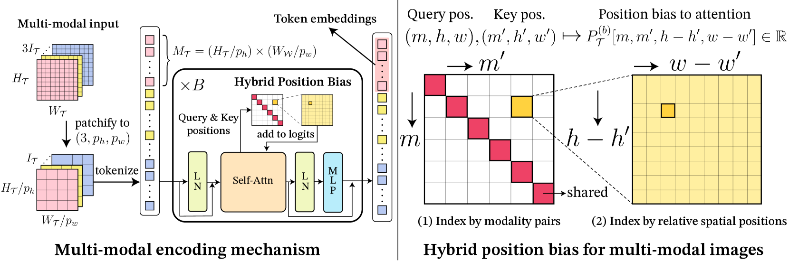

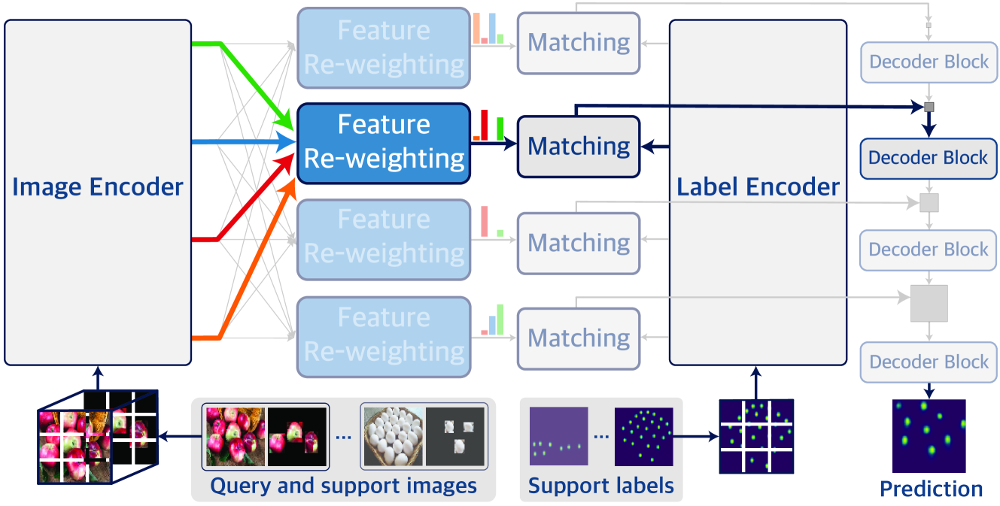

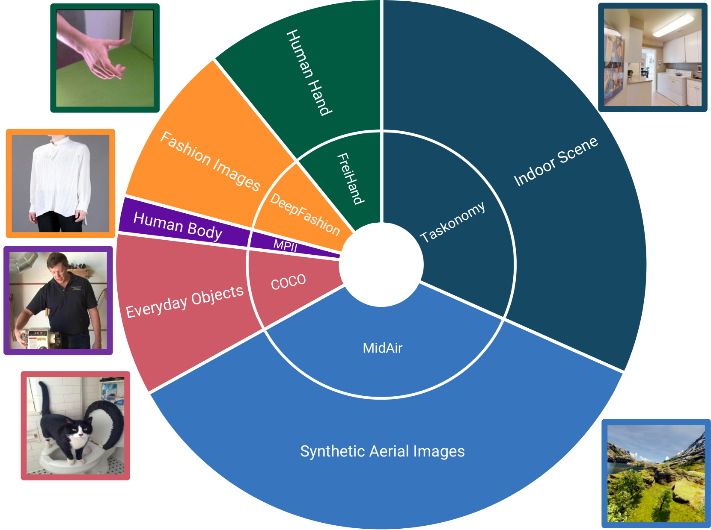

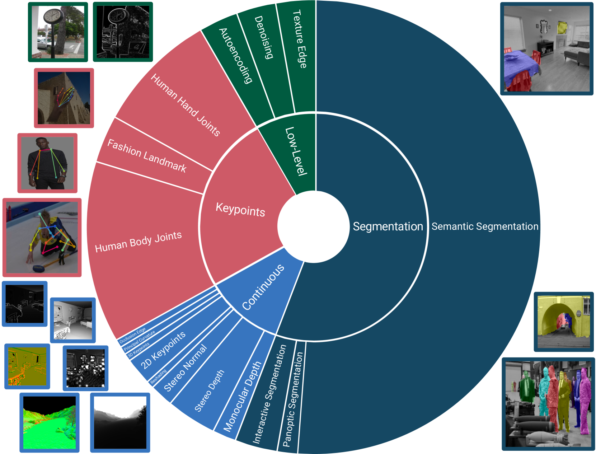

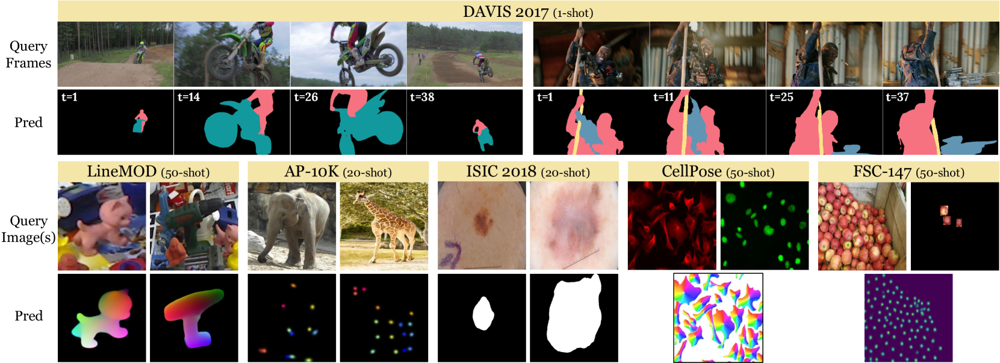

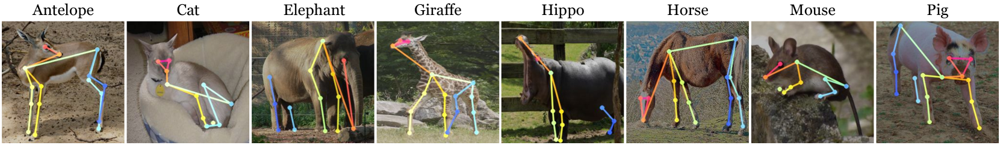

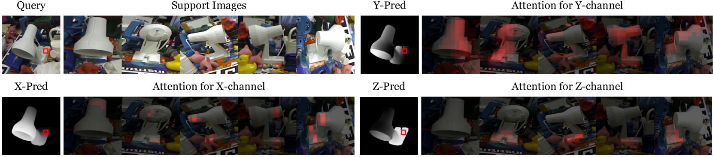

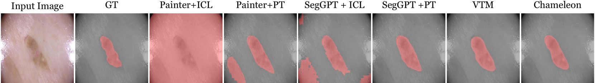

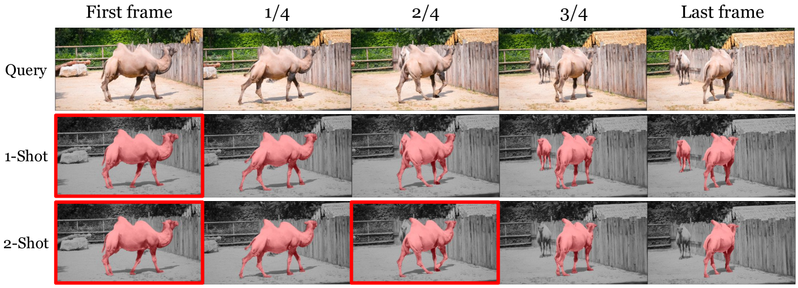

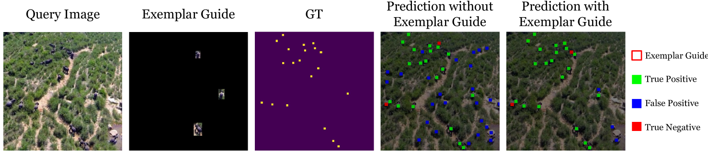

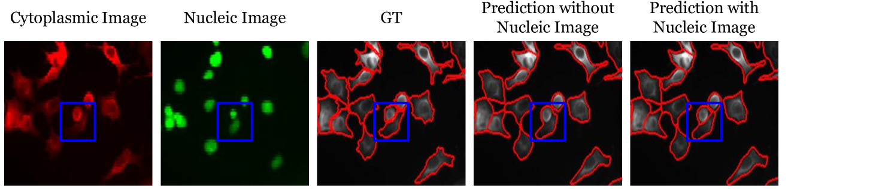

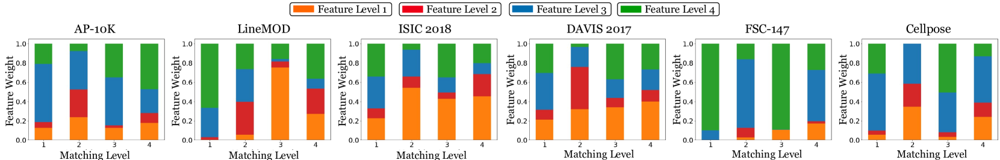

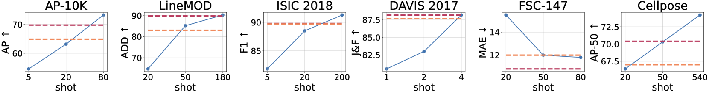

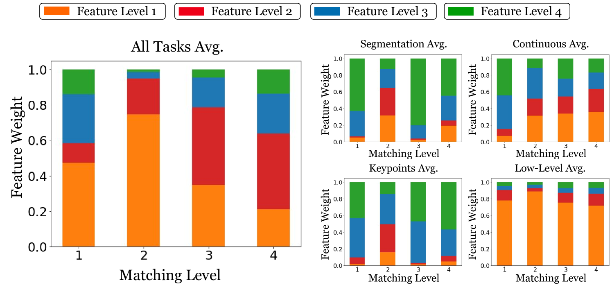

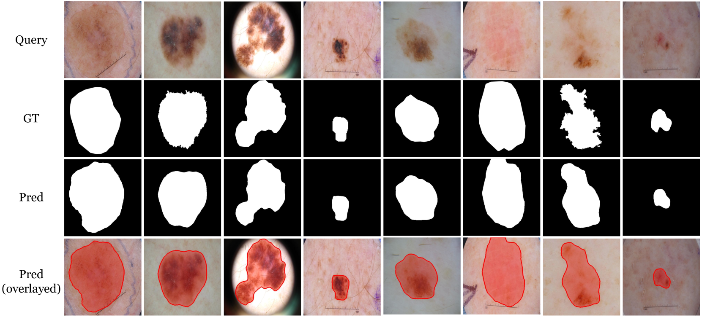

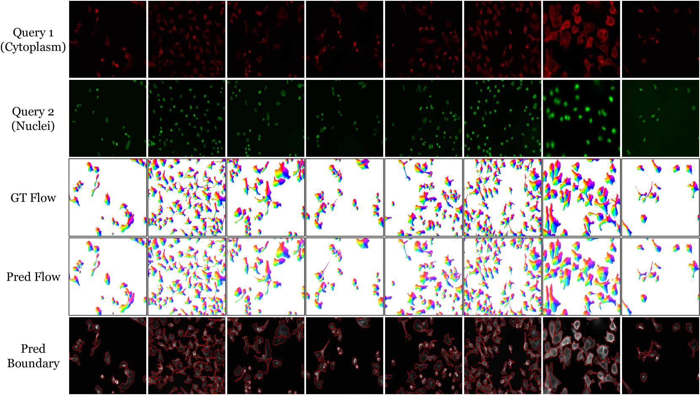

[Arxiv](https://arxiv.org/abs/2404.18459)