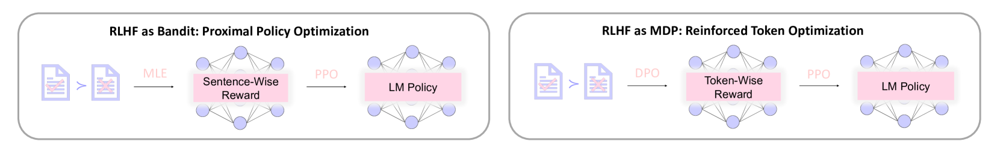
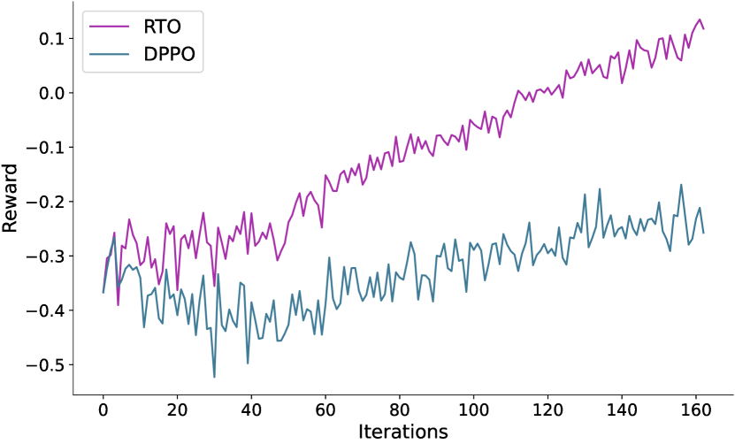

# DPO 邂逅 PPO：在强化学习框架下，为人类偏好的令牌优化注入动力

发布时间：2024年04月29日

`LLM应用`

> DPO Meets PPO: Reinforced Token Optimization for RLHF

# 摘要

> 在传统的基于人类反馈的强化学习框架内，近端策略优化（PPO）面临从稀疏句子级奖励中学习的挑战。尽管PPO在调整顶尖闭源大型语言模型方面取得了显著成就，但其开源版本的表现往往不尽如人意，这一点已在多项研究中被指出。为克服这些难题，我们提出了一个新的框架，将RLHF问题视为马尔可夫决策过程，以捕捉更细致的标记级信息。我们还从理论上展示了该MDP框架相较于传统基于句子的强盗模型的优越性。在此框架基础上，我们开发了一种名为强化标记优化（RTO）的算法，该算法能够从偏好数据中学习标记级的奖励函数，并通过这些学习到的标记级奖励信号进行策略优化。理论上，RTO已被证实能够有效地找到近似最优策略。在实际应用中，RTO创新地融合了直接偏好优化（DPO）与PPO，DPO从稀疏句子奖励中提取出标记级的质量特征，并在我们的PPO训练阶段中得到有效利用。广泛的实际对齐实验证明了我们方法的有效性。

> In the classical Reinforcement Learning from Human Feedback (RLHF) framework, Proximal Policy Optimization (PPO) is employed to learn from sparse, sentence-level rewards -- a challenging scenario in traditional deep reinforcement learning. Despite the great successes of PPO in the alignment of state-of-the-art closed-source large language models (LLMs), its open-source implementation is still largely sub-optimal, as widely reported by numerous research studies. To address these issues, we introduce a framework that models RLHF problems as a Markov decision process (MDP), enabling the capture of fine-grained token-wise information. Furthermore, we provide theoretical insights that demonstrate the superiority of our MDP framework over the previous sentence-level bandit formulation. Under this framework, we introduce an algorithm, dubbed as Reinforced Token Optimization (\texttt{RTO}), which learns the token-wise reward function from preference data and performs policy optimization based on this learned token-wise reward signal. Theoretically, \texttt{RTO} is proven to have the capability of finding the near-optimal policy sample-efficiently. For its practical implementation, \texttt{RTO} innovatively integrates Direct Preference Optimization (DPO) and PPO. DPO, originally derived from sparse sentence rewards, surprisingly provides us with a token-wise characterization of response quality, which is seamlessly incorporated into our subsequent PPO training stage. Extensive real-world alignment experiments verify the effectiveness of the proposed approach.

[Arxiv](https://arxiv.org/abs/2404.18922)