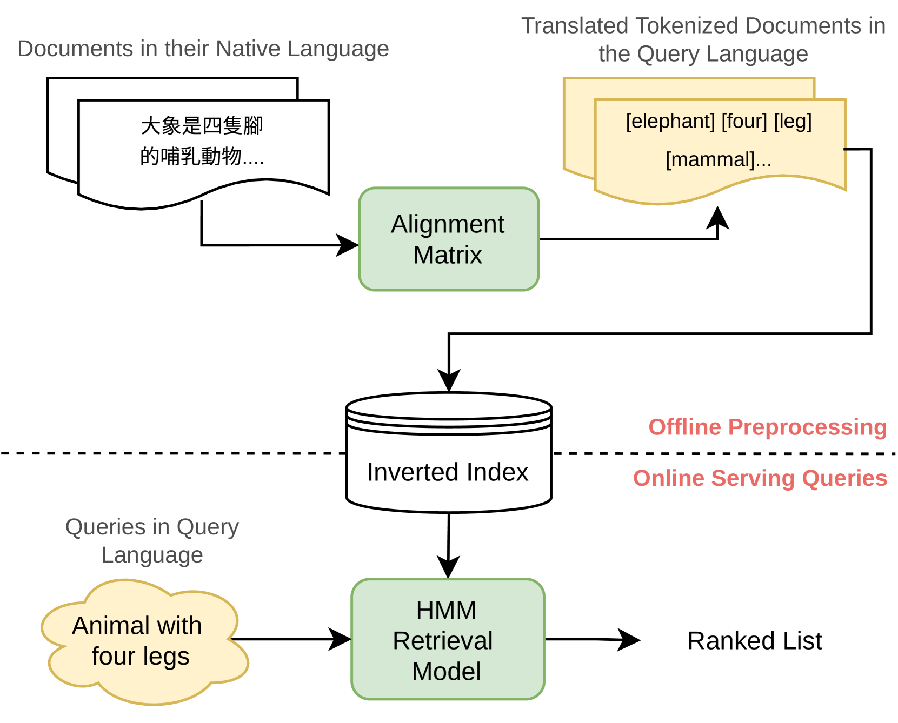

# 在跨语言信息检索领域，概率结构化查询的效率与效果之间存在一种权衡。

发布时间：2024年04月29日

`分类：Agent` `跨语言信息检索` `搜索引擎`

> Efficiency-Effectiveness Tradeoff of Probabilistic Structured Queries for Cross-Language Information Retrieval

# 摘要

> 概率结构化查询（PSQ）作为一种跨语言信息检索（CLIR）技术，通过利用对齐语料库中统计得出的翻译概率，为高效的 CLIR 提供了坚实的基准。它特别适合作为级联神经 CLIR 系统的前置阶段，后者虽然检索效果更佳，但效率不足以独立处理大规模文本集合。本研究通过推出一个高效的 Python 版本，对 PSQ 进行了深入探讨。由于无限制地利用所有可从平行文本中估算的翻译概率，将导致为每个词汇项赋予权重，从而无法高效地使用倒排索引。因此，PSQ 的性能和效率均依赖于翻译概率的筛选方式。本文通过在多个现代 CLIR 测试集上的实验，展示了通过多标准筛选实现帕累托最优的 PSQ 性能与效率平衡，这一点在以往的研究中尚未得到充分探讨。我们的 Python PSQ 实现已在 GitHub 上发布（https://github.com/hltcoe/PSQ），同时未筛选的翻译表也可在 Huggingface Models 查找（https://huggingface.co/hltcoe/psq_translation_tables）。

> Probabilistic Structured Queries (PSQ) is a cross-language information retrieval (CLIR) method that uses translation probabilities statistically derived from aligned corpora. PSQ is a strong baseline for efficient CLIR using sparse indexing. It is, therefore, useful as the first stage in a cascaded neural CLIR system whose second stage is more effective but too inefficient to be used on its own to search a large text collection. In this reproducibility study, we revisit PSQ by introducing an efficient Python implementation. Unconstrained use of all translation probabilities that can be estimated from aligned parallel text would in the limit assign a weight to every vocabulary term, precluding use of an inverted index to serve queries efficiently. Thus, PSQ's effectiveness and efficiency both depend on how translation probabilities are pruned. This paper presents experiments over a range of modern CLIR test collections to demonstrate that achieving Pareto optimal PSQ effectiveness-efficiency tradeoffs benefits from multi-criteria pruning, which has not been fully explored in prior work. Our Python PSQ implementation is available on GitHub(https://github.com/hltcoe/PSQ) and unpruned translation tables are available on Huggingface Models(https://huggingface.co/hltcoe/psq_translation_tables).

[Arxiv](https://arxiv.org/abs/2404.18797)