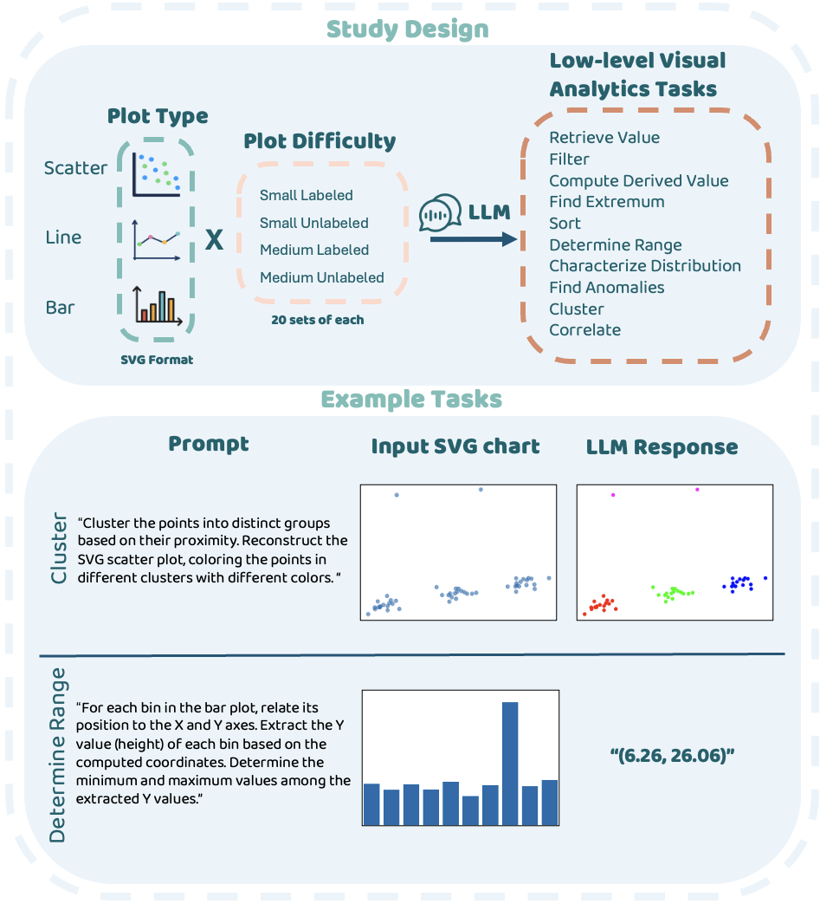
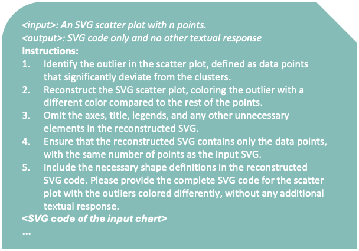
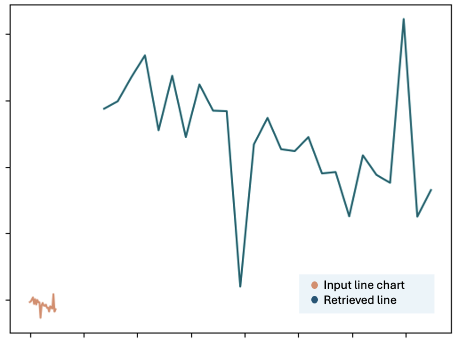

# 本文旨在探究大型语言模型在处理SVG数据可视化时，执行基础视觉分析任务的潜力。

发布时间：2024年04月29日

`LLM应用` `数据可视化`

> Exploring the Capability of LLMs in Performing Low-Level Visual Analytic Tasks on SVG Data Visualizations

# 摘要

> 数据可视化是洞察数据集的利器，但要深入挖掘这些洞见，需将宏观目标细化为微观分析任务，这一过程可能因个人数据理解能力和经验的差异而变得颇具挑战。近期，大型语言模型（LLMs）的进展为简化用户执行编码等任务的难度带来了希望。作为数据可视化中常用的基于文本的图像格式，可缩放矢量图形（SVG）与基于变换器的LLMs的文本序列处理能力相得益彰。本文旨在探讨LLMs在SVG可视化基础上执行Amar、Eagan和Stasko定义的微观视觉分析任务的能力。我们利用零次拍摄提示，引导模型根据特定的可视化结果提供反馈或调整SVG代码。研究结果显示，LLMs能够高效地为特定任务（如聚类）修改SVG可视化，但在需要连续数学运算的任务上表现欠佳。此外，我们还发现LLMs的表现受到数据点数量、值标签的有无以及图表类型的不同影响。这些发现不仅为我们评估LLMs的通用能力提供了参考，也突显了进一步探索和发展的必要性，以便更好地发挥它们在视觉分析任务中的辅助作用。

> Data visualizations help extract insights from datasets, but reaching these insights requires decomposing high level goals into low-level analytic tasks that can be complex due to varying data literacy and experience. Recent advancements in large language models (LLMs) have shown promise for lowering barriers for users to achieve tasks such as writing code. Scalable Vector Graphics (SVG), a text-based image format common in data visualizations, matches well with the text sequence processing of transformer-based LLMs. In this paper, we explore the capability of LLMs to perform low-level visual analytic tasks defined by Amar, Eagan, and Stasko directly on SVG-based visualizations. Using zero-shot prompts, we instruct the models to provide responses or modify the SVG code based on given visualizations. Our findings demonstrate that LLMs can effectively modify existing SVG visualizations for specific tasks like Cluster but perform poorly on tasks requiring a sequence of math operations. We also discovered that LLM performance varies based on factors such as the number of data points, the presence of value labels, and the chart type. Our findings contribute to gauging the general capabilities of LLMs and highlight the need for further exploration and development to fully harness their potential in supporting visual analytic tasks.

[Arxiv](https://arxiv.org/abs/2404.19097)