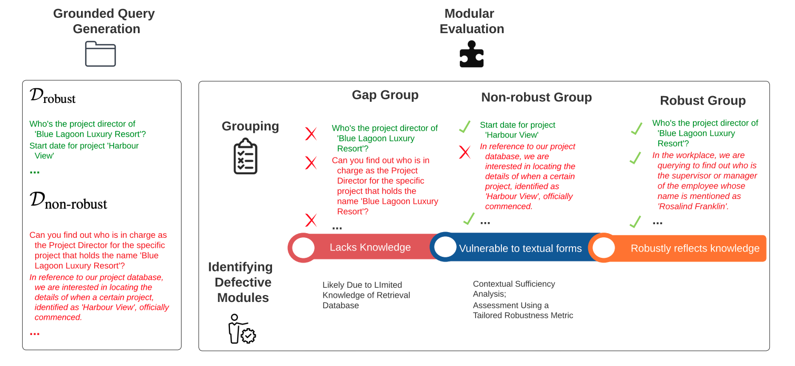
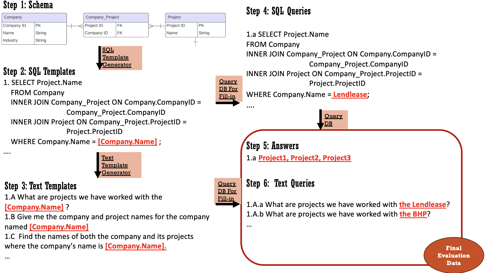
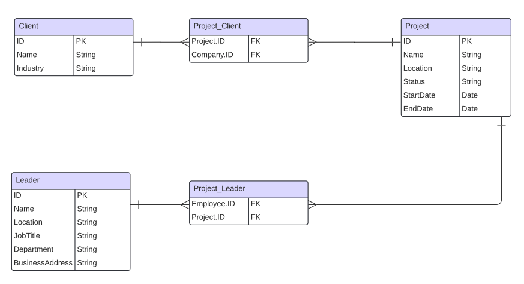
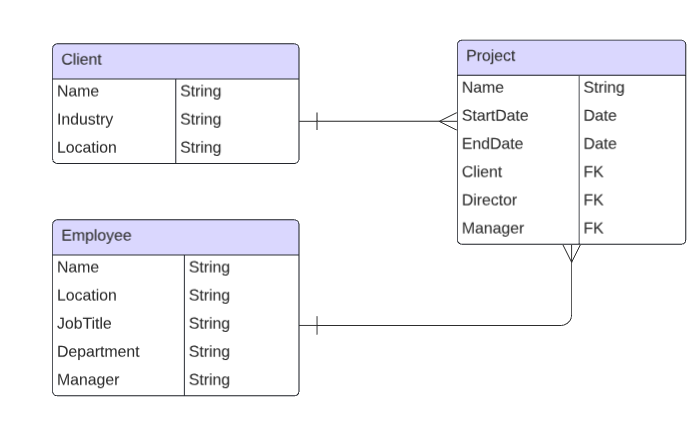

# 《语法：领域特定检索增强语言模型的实证与模块化评估》

发布时间：2024年04月29日

`RAG` `数据库管理` `人工智能`

> GRAMMAR: Grounded and Modular Evaluation of Domain-Specific Retrieval-Augmented Language Models

# 摘要

> 检索增强生成（RAG）系统在各行业被广泛研究和应用，主要针对特定领域的知识库查询。但评估这些系统时，由于缺乏特定领域的查询和真实答案，以及缺少系统化诊断失败原因的方法，面临不少挑战。为此，我们提出了GRAMMAR（一种评估RAG的有根据且模块化的方法），它包含两个核心部分：首先是一个数据生成流程，它结合关系数据库和大型语言模型（LLMs）来高效产出可扩展的查询-答案对，这种方法有助于将查询逻辑与语言变化分离，从而提升调试效率；其次是一个评估框架，它能够区分知识缺陷和系统鲁棒性问题，并识别出有问题的模块。我们的实证研究结果揭示了现有无参照评估方法的不足，并证明了GRAMMAR在准确识别模型弱点方面的可靠性。

> Retrieval-augmented Generation (RAG) systems have been actively studied and deployed across various industries to query on domain-specific knowledge base. However, evaluating these systems presents unique challenges due to the scarcity of domain-specific queries and corresponding ground truths, as well as a lack of systematic approaches to diagnosing the cause of failure cases -- whether they stem from knowledge deficits or issues related to system robustness. To address these challenges, we introduce GRAMMAR (GRounded And Modular Methodology for Assessment of RAG), an evaluation framework comprising two key elements: 1) a data generation process that leverages relational databases and LLMs to efficiently produce scalable query-answer pairs. This method facilitates the separation of query logic from linguistic variations for enhanced debugging capabilities; and 2) an evaluation framework that differentiates knowledge gaps from robustness and enables the identification of defective modules. Our empirical results underscore the limitations of current reference-free evaluation approaches and the reliability of GRAMMAR to accurately identify model vulnerabilities.

[Arxiv](https://arxiv.org/abs/2404.19232)