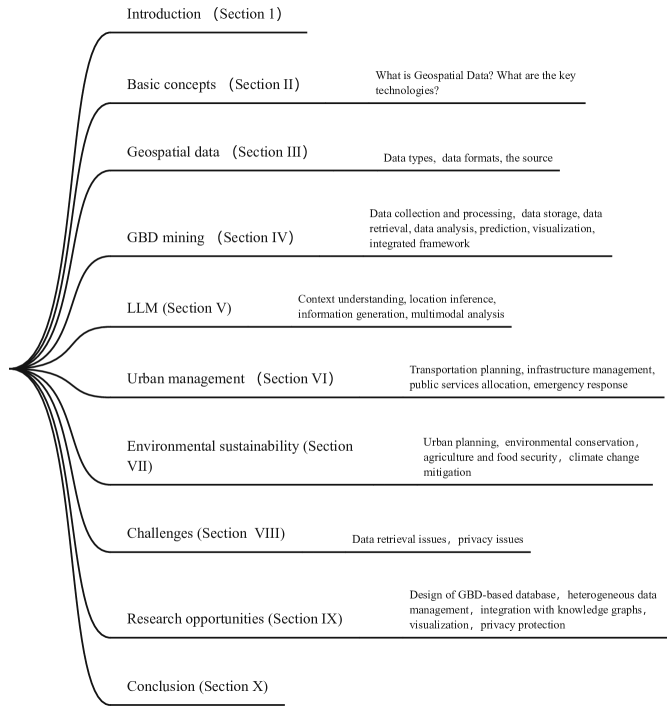
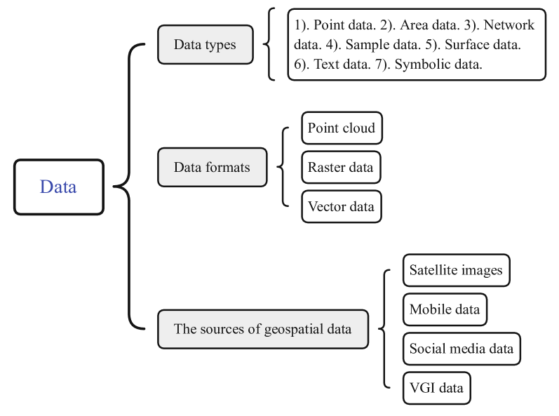
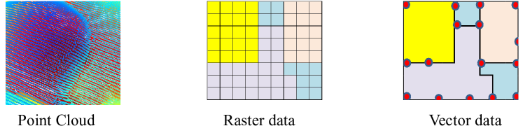
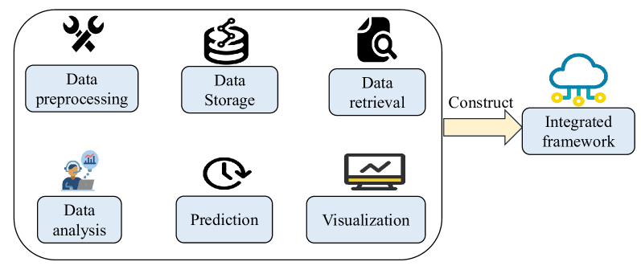
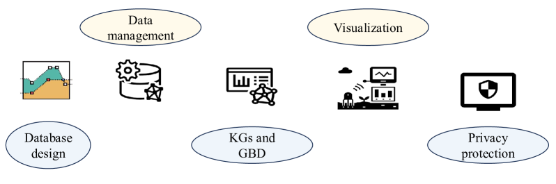

# 地理空间大数据：一项全面调查及其面临的挑战

发布时间：2024年04月29日

`分类：LLM应用

这篇论文摘要讨论了地理空间大数据（GBD）的挖掘技术，以及如何将这些技术与先进的人工智能技术（包括大型语言模型LLM）融合。论文还探讨了LLM、元宇宙和知识图谱等新兴技术在GBD应用中的潜力。因此，这篇论文可以归类为LLM应用，因为它涉及到大型语言模型在地理空间大数据挖掘中的应用。` `城市管理` `环境保护`

> Geospatial Big Data: Survey and Challenges

# 摘要

> 近年来，地理空间大数据（GBD）因其在多个学科中的应用而备受关注，主要分为地球观测大数据和人类行为大数据两大类。在城市管理和环境可持续性研究中，挖掘GBD中的地理空间模式成为了一个关键的研究议题。本文回顾了GBD挖掘技术的发展及其与先进人工智能技术的融合。GBD包括由卫星、传感器、移动设备和地理信息系统产生的数据，我们从多个角度对这些数据进行了分类。文章概述了GBD挖掘的流程，并展示了如何将其整合到一个统一的框架之中。同时，我们探讨了大型语言模型（LLM）、元宇宙和知识图谱等新兴技术，以及它们如何进一步提升GBD的应用价值。文中还展示了GBD在城市治理和环境保护方面的应用案例。最后，我们讨论了在GBD工作中遇到的挑战，包括数据获取和安全问题。我们旨在为读者提供一个清晰的视角，了解GBD挖掘的现状及其未来的发展方向。

> In recent years, geospatial big data (GBD) has obtained attention across various disciplines, categorized into big earth observation data and big human behavior data. Identifying geospatial patterns from GBD has been a vital research focus in the fields of urban management and environmental sustainability. This paper reviews the evolution of GBD mining and its integration with advanced artificial intelligence (AI) techniques. GBD consists of data generated by satellites, sensors, mobile devices, and geographical information systems, and we categorize geospatial data based on different perspectives. We outline the process of GBD mining and demonstrate how it can be incorporated into a unified framework. Additionally, we explore new technologies like large language models (LLM), the Metaverse, and knowledge graphs, and how they could make GBD even more useful. We also share examples of GBD helping with city management and protecting the environment. Finally, we discuss the real challenges that come up when working with GBD, such as issues with data retrieval and security. Our goal is to give readers a clear view of where GBD mining stands today and where it might go next.

[Arxiv](https://arxiv.org/abs/2404.18428)