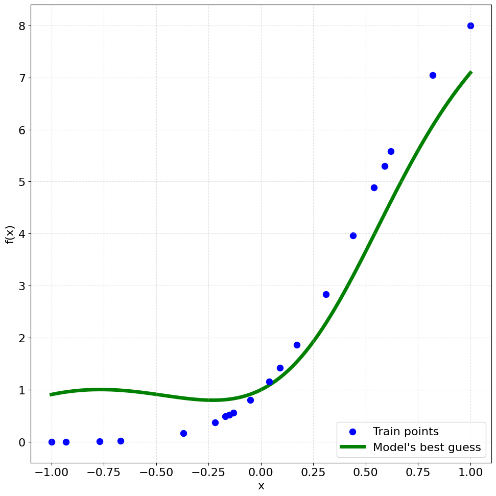
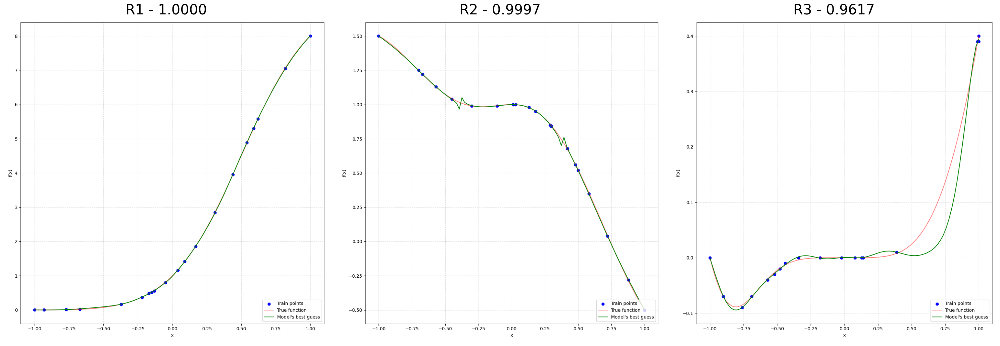

# 利用语言模型进行函数发现：探索上下文符号回归。

发布时间：2024年04月29日

`LLM应用` `科学计算` `自动化设计`

> In-Context Symbolic Regression: Leveraging Language Models for Function Discovery

# 摘要

> 符号回归（SR）目标是从一系列经验数据中提炼出相应的数学表达式。目前，基于Transformer的模型在SR领域的性能领先，但大型语言模型（LLMs）在SR中的应用尚未被充分挖掘。本研究探讨了将预训练的LLMs整合到SR流程中，通过迭代优化函数形式，直至预测误差在观测集上达到最小并收敛。我们利用LLMs强大的预训练知识，提出基于观测数据的初始函数集，然后通过模型自身和外部优化器对这些函数及其系数进行迭代细化。在结果令人满意之前，这一过程将持续进行。此外，我们还研究了视觉-语言模型在SR中的表现，特别是通过将图表作为视觉输入来辅助优化过程。研究发现，LLMs在恢复与给定数据相匹配的高质量符号方程方面表现出色，性能超过了基于遗传编程的SR基线，且在输入中加入图像对于解决最复杂的基准测试显示出了积极的成效。

> Symbolic Regression (SR) is a task which aims to extract the mathematical expression underlying a set of empirical observations. Transformer-based methods trained on SR datasets detain the current state-of-the-art in this task, while the application of Large Language Models (LLMs) to SR remains unexplored. This work investigates the integration of pre-trained LLMs into the SR pipeline, utilizing an approach that iteratively refines a functional form based on the prediction error it achieves on the observation set, until it reaches convergence. Our method leverages LLMs to propose an initial set of possible functions based on the observations, exploiting their strong pre-training prior. These functions are then iteratively refined by the model itself and by an external optimizer for their coefficients. The process is repeated until the results are satisfactory. We then analyze Vision-Language Models in this context, exploring the inclusion of plots as visual inputs to aid the optimization process. Our findings reveal that LLMs are able to successfully recover good symbolic equations that fit the given data, outperforming SR baselines based on Genetic Programming, with the addition of images in the input showing promising results for the most complex benchmarks.

[Arxiv](https://arxiv.org/abs/2404.19094)