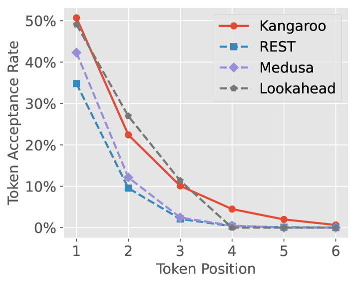
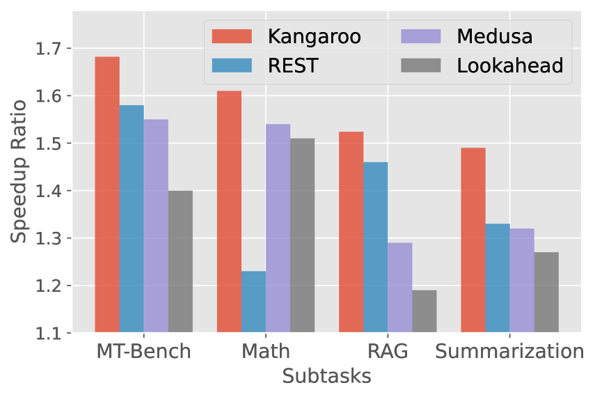
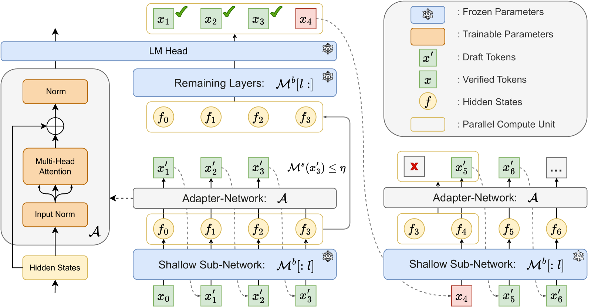
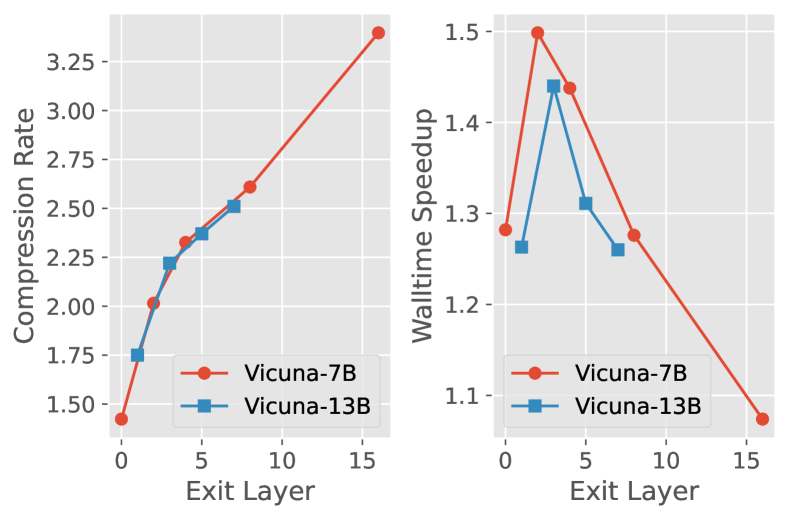
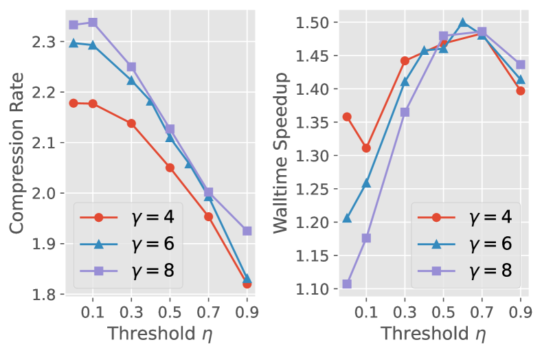

# 袋鼠：一种无损自我推测解码技术，采用双重早期退出机制。

发布时间：2024年04月29日

`LLM应用`

> Kangaroo: Lossless Self-Speculative Decoding via Double Early Exiting

# 摘要

> 推测性解码技术通过维持稳定的采样分布，有效加速了大型语言模型的推理过程。然而，传统方法通过训练独立草稿模型以提高令牌接受率，成本较高。借鉴早期退出策略，我们提出了一种创新的自我推测解码框架——“袋鼠”。该框架采用固定浅层子网络作为自我草稿模型，而其他层则构成更大的目标模型。为了弥补子网络与完整模型在表示能力上的差异，我们在子网络之上训练了一个高效轻量的适配器模块。值得注意的是，自我草稿模型的推理延迟相较于大型模型已不容忽视，因此需要采取策略来提高令牌接受率，同时减少小型模型的起草步骤。为此，我们引入了一种新的早期退出机制，用于生成草稿令牌。具体来说，当当前令牌的置信度降至某一阈值以下时，我们会在起草阶段停止小型模型的后续预测。在 Spec-Bench 上的大量实验显示，袋鼠框架显著提升了效率，单序列验证下速度提升高达 1.68 倍，性能超越了 Medusa-1，且额外参数减少了 88.7%（6700 万对比 5910 万）。袋鼠框架的代码已在 GitHub 上开源，地址为 https://github.com/Equationliu/Kangaroo。

> Speculative decoding has demonstrated its effectiveness in accelerating the inference of large language models while maintaining a consistent sampling distribution. However, the conventional approach of training a separate draft model to achieve a satisfactory token acceptance rate can be costly. Drawing inspiration from early exiting, we propose a novel self-speculative decoding framework \emph{Kangaroo}, which uses a fixed shallow sub-network as a self-draft model, with the remaining layers serving as the larger target model. We train a lightweight and efficient adapter module on top of the sub-network to bridge the gap between the sub-network and the full model's representation ability. It is noteworthy that the inference latency of the self-draft model may no longer be negligible compared to the large model, necessitating strategies to increase the token acceptance rate while minimizing the drafting steps of the small model. To address this challenge, we introduce an additional early exiting mechanism for generating draft tokens. Specifically, we halt the small model's subsequent prediction during the drafting phase once the confidence level for the current token falls below a certain threshold. Extensive experiments on the Spec-Bench demonstrate the effectiveness of Kangaroo. Under single-sequence verification, Kangaroo achieves speedups up to $1.68\times$ on Spec-Bench, outperforming Medusa-1 with 88.7\% fewer additional parameters (67M compared to 591M). The code for Kangaroo is available at https://github.com/Equationliu/Kangaroo.

[Arxiv](https://arxiv.org/abs/2404.18911)