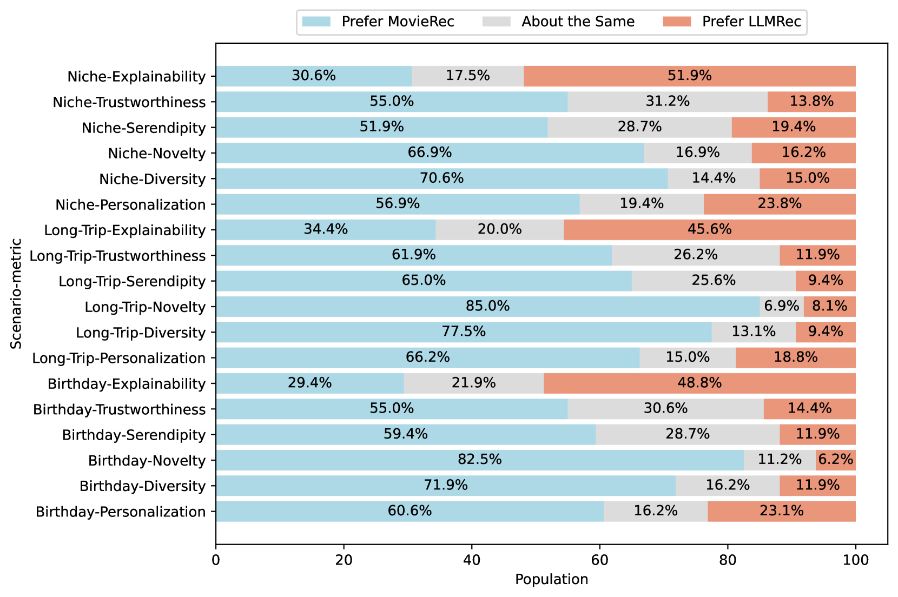

# 大型语言模型：对话式电影推荐的用户研究

发布时间：2024年04月29日

`LLM应用` `个性化推荐`

> Large Language Models as Conversational Movie Recommenders: A User Study

# 摘要

> 本研究在线实地实验中，从用户视角出发，探究了运用大型语言模型（LLMs）进行个性化电影推荐的效能。研究结合了受试者间的提示与历史消费评估，以及受试者内的推荐场景评价。通过对160位活跃用户的对话和调查反馈进行分析，我们发现LLMs在推荐解释性上表现出色，但在个性化、多样性和赢得用户信任方面尚有欠缺。研究还发现，不同的个性化提示手法并未显著提升用户对推荐质量的感知，而用户观影数量的多少则更为关键。此外，LLMs在推荐知名度较低或小众电影方面更具优势。通过深入的定性分析，我们揭示了与用户互动体验正负面相关的主要对话模式，并得出结论，提供个性化的背景和实例对于从LLMs获得优质推荐至关重要。

> This paper explores the effectiveness of using large language models (LLMs) for personalized movie recommendations from users' perspectives in an online field experiment. Our study involves a combination of between-subject prompt and historic consumption assessments, along with within-subject recommendation scenario evaluations. By examining conversation and survey response data from 160 active users, we find that LLMs offer strong recommendation explainability but lack overall personalization, diversity, and user trust. Our results also indicate that different personalized prompting techniques do not significantly affect user-perceived recommendation quality, but the number of movies a user has watched plays a more significant role. Furthermore, LLMs show a greater ability to recommend lesser-known or niche movies. Through qualitative analysis, we identify key conversational patterns linked to positive and negative user interaction experiences and conclude that providing personal context and examples is crucial for obtaining high-quality recommendations from LLMs.

[Arxiv](https://arxiv.org/abs/2404.19093)