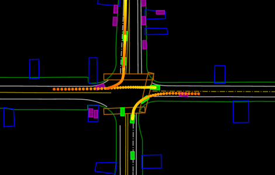

# MRIC：一种融合码本混合技术的模型驱动强化模仿学习方法，专为自动驾驶模拟设计。

发布时间：2024年04月29日

`分类：Agent` `自动驾驶` `仿真技术`

> MRIC: Model-Based Reinforcement-Imitation Learning with Mixture-of-Codebooks for Autonomous Driving Simulation

# 摘要

> 精确地模拟各种情境下异构智能体的多样行为对于自动驾驶仿真至关重要。这一任务因行为分布的多样性、驾驶情境的高维度、分布偏移和信息缺失等因素而充满挑战。我们首先洞察到，通过可微仿真实现的状态匹配，能够提供有益的学习信号，为策略高效分配信用。这一点通过发现梯度高速公路和智能体间的梯度路径而得到证实。然而，我们也发现了梯度爆炸和低密度区域中的弱监督问题。我们的第二个洞察是，这些问题可以通过双重策略正则化来解决，以此缩小功能空间。考虑到多样性，我们的第三个洞察是，数据集中异构智能体的行为可以被有效压缩成一系列原型向量，以便于检索。这些洞察催生了我们的基于模型的强化模仿学习框架——时间抽象的混合码本（MRIC）。MRIC引入了开环模型基模仿学习正则化以稳定训练，并融入了基于模型的强化学习（RL）正则化以注入领域知识。RL正则化包括了基于可微分的Minkowski差异的避碰机制，以及基于投影的遵守道路和交通规则的奖励。此外，我们还提出了一种动态乘数机制，以消除正则化间的干扰并确保其效果。在大规模Waymo开放运动数据集上的实验结果显示，MRIC在多样性、行为真实性和分布真实性方面均超越了现有的最先进基线，尤其在关键指标（如碰撞率、最小SADE和碰撞时间JSD）上取得了显著优势。

> Accurately simulating diverse behaviors of heterogeneous agents in various scenarios is fundamental to autonomous driving simulation. This task is challenging due to the multi-modality of behavior distribution, the high-dimensionality of driving scenarios, distribution shift, and incomplete information. Our first insight is to leverage state-matching through differentiable simulation to provide meaningful learning signals and achieve efficient credit assignment for the policy. This is demonstrated by revealing the existence of gradient highways and interagent gradient pathways. However, the issues of gradient explosion and weak supervision in low-density regions are discovered. Our second insight is that these issues can be addressed by applying dual policy regularizations to narrow the function space. Further considering diversity, our third insight is that the behaviors of heterogeneous agents in the dataset can be effectively compressed as a series of prototype vectors for retrieval. These lead to our model-based reinforcement-imitation learning framework with temporally abstracted mixture-of-codebooks (MRIC). MRIC introduces the open-loop modelbased imitation learning regularization to stabilize training, and modelbased reinforcement learning (RL) regularization to inject domain knowledge. The RL regularization involves differentiable Minkowskidifference-based collision avoidance and projection-based on-road and traffic rule compliance rewards. A dynamic multiplier mechanism is further proposed to eliminate the interference from the regularizations while ensuring their effectiveness. Experimental results using the largescale Waymo open motion dataset show that MRIC outperforms state-ofthe-art baselines on diversity, behavioral realism, and distributional realism, with large margins on some key metrics (e.g., collision rate, minSADE, and time-to-collision JSD).

[Arxiv](https://arxiv.org/abs/2404.18464)