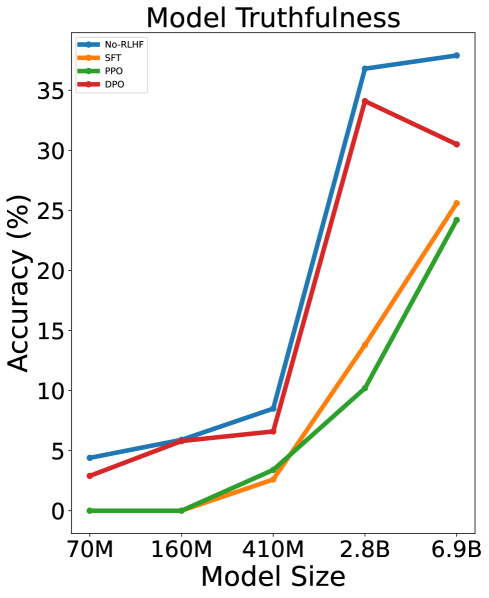

# 偏好更贴近人类，信任更深厚？探讨人类偏好对齐如何提升语言模型的可信性

发布时间：2024年04月29日

`LLM应用` `人工智能` `伦理学`

> More RLHF, More Trust? On The Impact of Human Preference Alignment On Language Model Trustworthiness

# 摘要

> 大型语言模型（LLMs）的迅猛发展不仅提升了认知任务的执行效率，也突显了将这些模型与人类价值观紧密结合的必要性，以确保其安全有效地发挥作用。尽管基于人类反馈的强化学习（RLHF）等偏好学习算法在匹配人类偏好方面显示出了显著效果，但它们对提升模型可信度的贡献尚未得到全面验证。本项研究旨在探究那些依据通用偏好数据进行有用性和无害性对齐的模型，在五个关键的可信度维度上的表现：毒性、刻板印象偏见、机器伦理、真实性和隐私。我们特别关注了三种流行的RLHF变体：监督微调（SFT）、近端策略优化（PPO）和直接偏好优化（DPO）。通过深入的实证研究，我们揭示了RLHF在提升模型可信度方面的成效并非一蹴而就，并且偏好数据、对齐算法以及特定可信度维度之间存在着复杂的相互作用。我们的发现强调了在模型对齐过程中采取更为精细方法的必要性。我们期望本研究能够揭示模型对齐中这些要素的复杂相互作用，从而引导业界开发出既高效又可信的语言模型。

> The surge in Large Language Models (LLMs) development has led to improved performance on cognitive tasks as well as an urgent need to align these models with human values in order to safely exploit their power. Despite the effectiveness of preference learning algorithms like Reinforcement Learning From Human Feedback (RLHF) in aligning human preferences, their assumed improvements on model trustworthiness haven't been thoroughly testified. Toward this end, this study investigates how models that have been aligned with general-purpose preference data on helpfulness and harmlessness perform across five trustworthiness verticals: toxicity, stereotypical bias, machine ethics, truthfulness, and privacy. For model alignment, we focus on three widely used RLHF variants: Supervised Finetuning (SFT), Proximal Policy Optimization (PPO), and Direct Preference Optimization (DPO). Through extensive empirical investigations, we discover that the improvement in trustworthiness by RLHF is far from guaranteed, and there exists a complex interplay between preference data, alignment algorithms, and specific trustworthiness aspects. Together, our results underscore the need for more nuanced approaches for model alignment. By shedding light on the intricate dynamics of these components within model alignment, we hope this research will guide the community towards developing language models that are both capable and trustworthy.

[Arxiv](https://arxiv.org/abs/2404.18870)