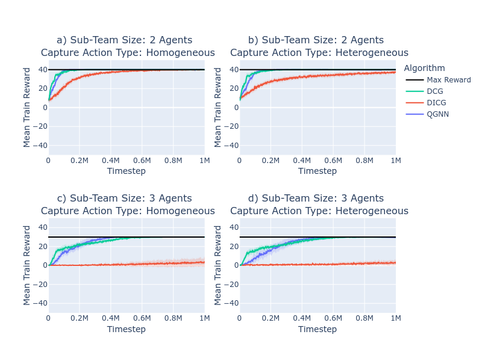

# 多智能体同步作业

发布时间：2024年04月29日

`Agent` `人工智能` `多智能体系统`

> Multi-Agent Synchronization Tasks

# 摘要

> 在多智能体强化学习领域，协调是提升智能体协作效果的关键。本文提出了“多智能体同步任务”（MSTs）这一新概念，并以“同步捕食者-猎物”为例，详细阐述了其特点。这些特点将用于评估一系列专为解决协调问题而设计的先进MARL算法。研究还展示了这些算法在处理超过两个智能体的协调任务时的局限性，尤其是在沟通至关重要的情况下。最终，这些发现对于当前顶尖方法在处理复杂协调任务时的适用性提出了质疑，并激发了对这些算法局限性背后原因的深入研究。

> In multi-agent reinforcement learning (MARL), coordination plays a crucial role in enhancing agents' performance beyond what they could achieve through cooperation alone. The interdependence of agents' actions, coupled with the need for communication, leads to a domain where effective coordination is crucial. In this paper, we introduce and define $\textit{Multi-Agent Synchronization Tasks}$ (MSTs), a novel subset of multi-agent tasks. We describe one MST, that we call $\textit{Synchronized Predator-Prey}$, offering a detailed description that will serve as the basis for evaluating a selection of recent state-of-the-art (SOTA) MARL algorithms explicitly designed to address coordination challenges through the use of communication strategies. Furthermore, we present empirical evidence that reveals the limitations of the algorithms assessed to solve MSTs, demonstrating their inability to scale effectively beyond 2-agent coordination tasks in scenarios where communication is a requisite component. Finally, the results raise questions about the applicability of recent SOTA approaches for complex coordination tasks (i.e. MSTs) and prompt further exploration into the underlying causes of their limitations in this context.

[Arxiv](https://arxiv.org/abs/2404.18798)