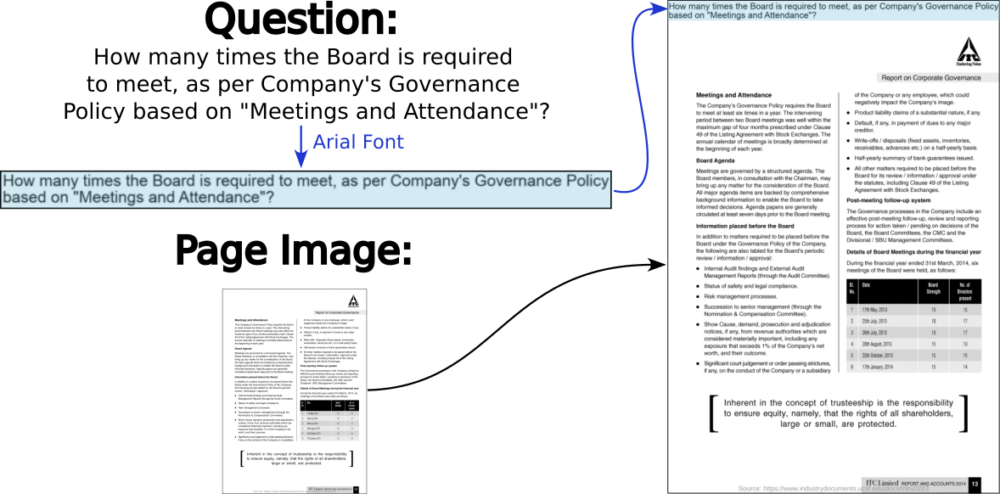
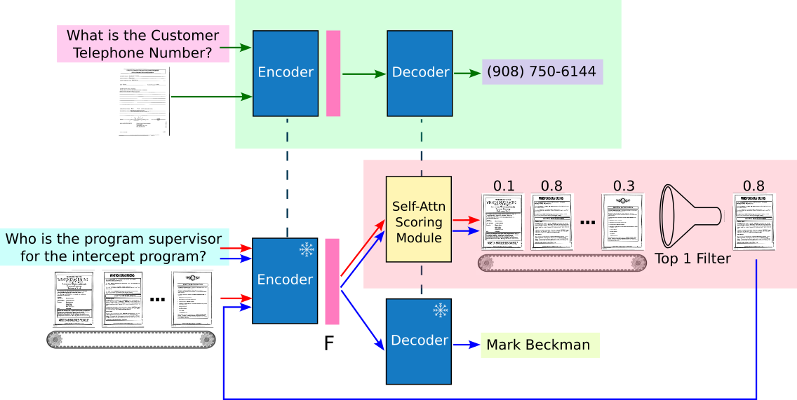
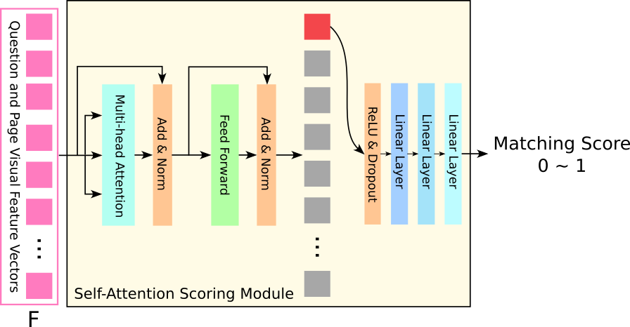
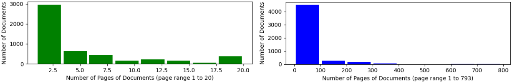
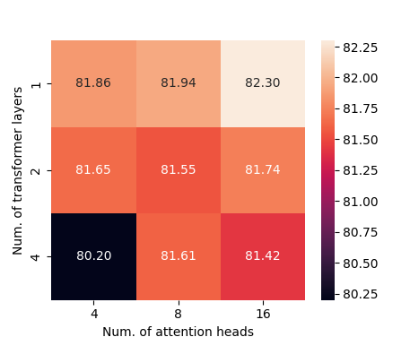
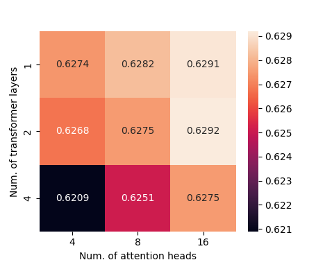
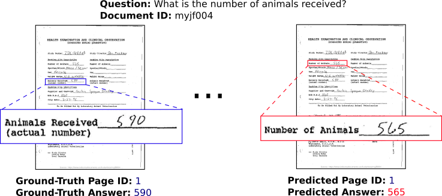
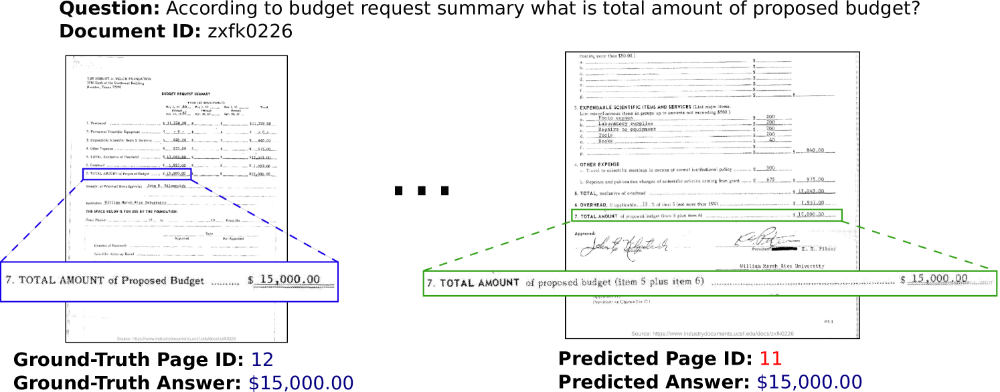
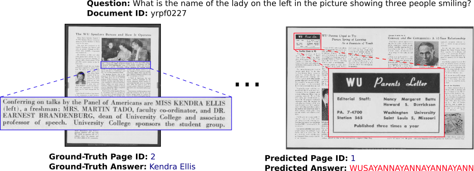

# 利用自注意力评分机制进行多页文档的视觉问答解答

发布时间：2024年04月29日

`分类：Agent` `文档理解`

> Multi-Page Document Visual Question Answering using Self-Attention Scoring Mechanism

# 摘要

> 文档作为承载书面交流的二维平台，解读它们需融合文本与视觉信息，采取多模态策略。正因如此，文档视觉问答（Document VQA）在文档理解与自然语言处理领域备受关注。尽管现有的单页文档 VQA 技术表现出色，但在处理多页文档时却力有未逮，常需将多页合并为一，以适应处理需求，这对 GPU 资源的消耗甚大。本研究提出了一种创新的多页文档 VQA 方法和高效的训练策略。我们引入了一种视觉主导的文档表达方式，借助文档理解模型 Pix2Struct 中的编码器，并通过自注意力机制为文档各页打分，筛选出关键页面。这种方法让我们得以在评估时不受页面数量限制地将单页模型扩展至多页场景，同时大幅降低了对 GPU 资源的依赖。实验结果表明，我们的方法不仅在无需光学字符识别（OCR）的情况下达到了业界领先水平，而且在处理接近 800 页的文档时仍能保持性能，远超 MP-DocVQA 数据集中最多 20 页的极限。相关代码已在 \url{https://github.com/leitro/SelfAttnScoring-MPDocVQA} 上开源。

> Documents are 2-dimensional carriers of written communication, and as such their interpretation requires a multi-modal approach where textual and visual information are efficiently combined. Document Visual Question Answering (Document VQA), due to this multi-modal nature, has garnered significant interest from both the document understanding and natural language processing communities. The state-of-the-art single-page Document VQA methods show impressive performance, yet in multi-page scenarios, these methods struggle. They have to concatenate all pages into one large page for processing, demanding substantial GPU resources, even for evaluation. In this work, we propose a novel method and efficient training strategy for multi-page Document VQA tasks. In particular, we employ a visual-only document representation, leveraging the encoder from a document understanding model, Pix2Struct. Our approach utilizes a self-attention scoring mechanism to generate relevance scores for each document page, enabling the retrieval of pertinent pages. This adaptation allows us to extend single-page Document VQA models to multi-page scenarios without constraints on the number of pages during evaluation, all with minimal demand for GPU resources. Our extensive experiments demonstrate not only achieving state-of-the-art performance without the need for Optical Character Recognition (OCR), but also sustained performance in scenarios extending to documents of nearly 800 pages compared to a maximum of 20 pages in the MP-DocVQA dataset. Our code is publicly available at \url{https://github.com/leitro/SelfAttnScoring-MPDocVQA}.

[Arxiv](https://arxiv.org/abs/2404.19024)