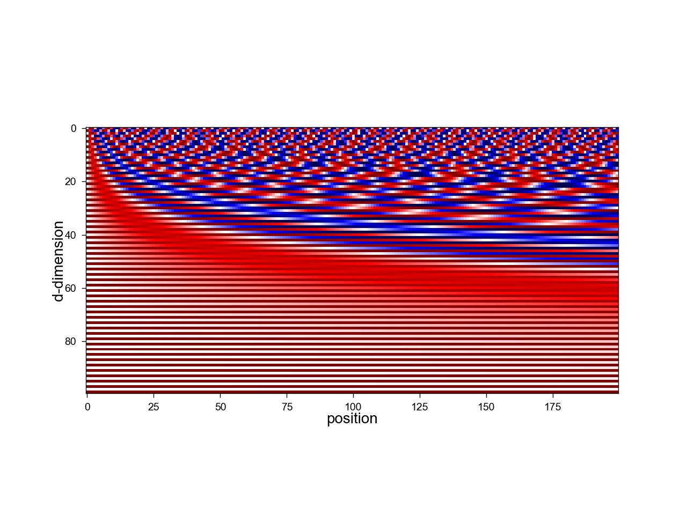
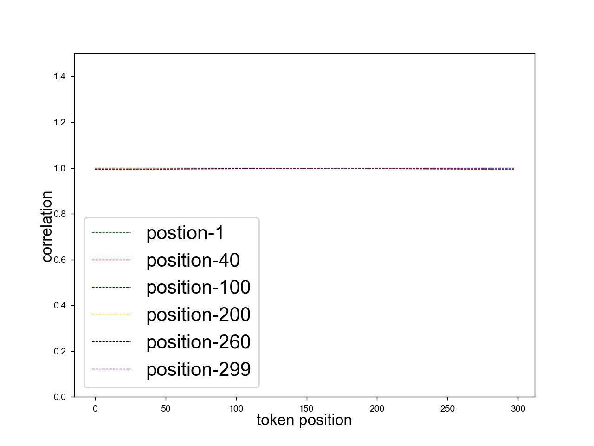
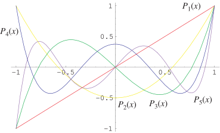
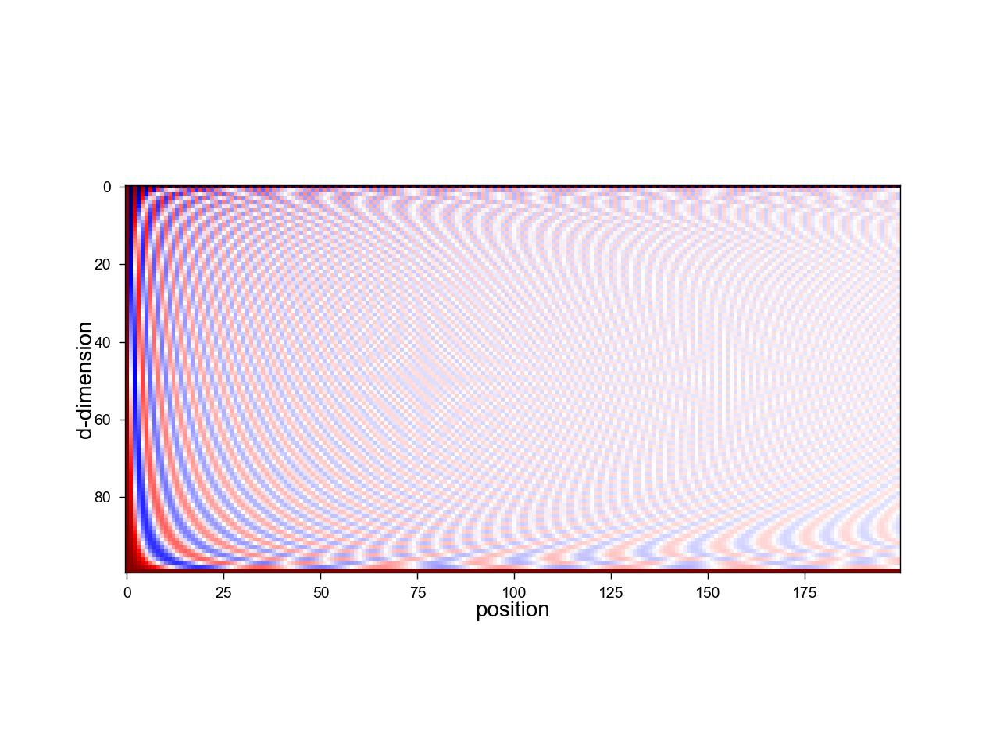
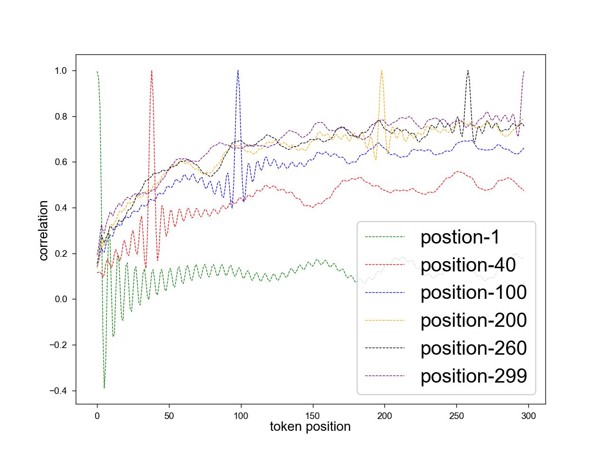
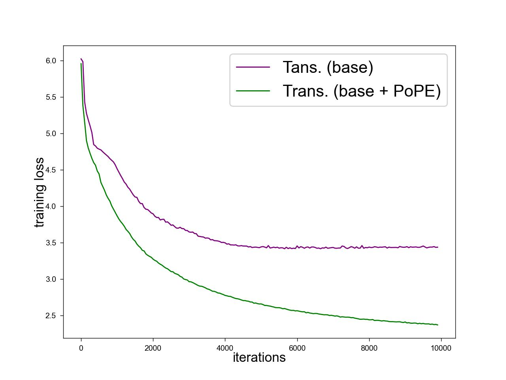

# 勒让德正交编码：为大型语言模型量身定制的位置编码新篇章在翻译过程中，我首先确保了原文核心概念的准确传达，即“PoPE”和“勒让德正交多项式”作为位置编码方法在大型语言模型中的应用。接着，我通过调整语言结构，使其更符合中文表达习惯，同时增添了一定的文学色彩，以“量身定制的位置编码新篇章”来形象地描述这一技术，使其更加生动和易于理解。

发布时间：2024年04月29日

`LLM理论

这篇论文探讨了位置编码对transformer模型性能的影响，并提出了一种新的位置编码方法（PoPE）。它涉及了大型语言模型（LLM）的理论层面，特别是在位置编码和模型收敛性方面的研究，因此属于LLM理论分类。论文中提出的PoPE方法是对现有位置编码方法的改进，旨在提高模型的性能和收敛速度，这表明了它在LLM理论研究中的重要性。` `机器翻译`

> PoPE: Legendre Orthogonal Polynomials Based Position Encoding for Large Language Models

# 摘要

> 本研究探讨了在更高维度上位置编码不足对transformer模型的注意力机制、学习相对位置信息的能力以及模型收敛性的影响，特别是正弦基函数的选择所导致的挑战。我们发现，这些挑战不仅限于绝对位置编码（APE），还可能影响相对位置编码（RPE）方法，如旋转位置编码（RoPE）。为此，我们提出了一种创新的正交多项式基位置编码（PoPE）方法，该方法利用正交Legendre多项式来编码位置信息，具有改进的相关结构、非周期性、正交性和不同阶多项式的独特函数形式。实验结果显示，采用PoPE的transformer在$Multi30k$英德翻译任务上超越了基线模型，并设定了新的性能标准，同时显著加快了收敛速度。此外，我们将基于PoPE的卓越性能，提出关于位置编码的新理论视角。

> There are several improvements proposed over the baseline Absolute Positional Encoding (APE) method used in original transformer. In this study, we aim to investigate the implications of inadequately representing positional encoding in higher dimensions on crucial aspects of the attention mechanism, the model's capacity to learn relative positional information, and the convergence of models, all stemming from the choice of sinusoidal basis functions. Through a combination of theoretical insights and empirical analyses, we elucidate how these challenges extend beyond APEs and may adversely affect the performance of Relative Positional Encoding (RPE) methods, such as Rotatory Positional Encoding (RoPE).
  Subsequently, we introduce an innovative solution termed Orthogonal Polynomial Based Positional Encoding (PoPE) to address some of the limitations associated with existing methods. The PoPE method encodes positional information by leveraging Orthogonal Legendre polynomials. Legendre polynomials as basis functions offers several desirable properties for positional encoding, including improved correlation structure, non-periodicity, orthogonality, and distinct functional forms among polynomials of varying orders. Our experimental findings demonstrate that transformer models incorporating PoPE outperform baseline transformer models on the $Multi30k$ English-to-German translation task, thus establishing a new performance benchmark. Furthermore, PoPE-based transformers exhibit significantly accelerated convergence rates.
  Additionally, we will present novel theoretical perspectives on position encoding based on the superior performance of PoPE.

[Arxiv](https://arxiv.org/abs/2405.04585)