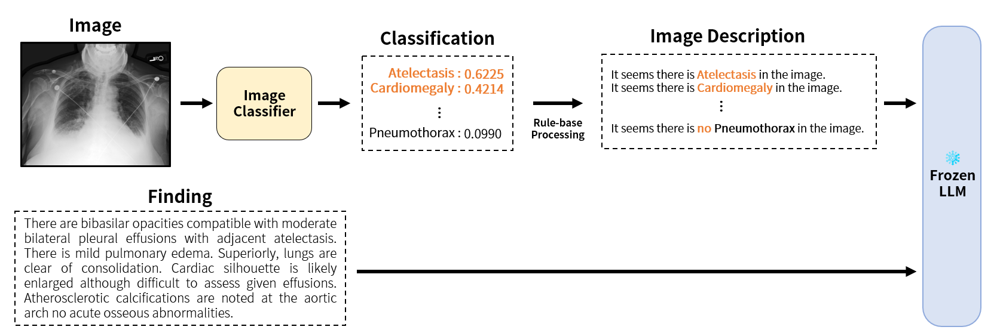

# 化繁为简：在放射学领域，运用通用的大型语言模型，以单模态策略应对多模态挑战。

发布时间：2024年04月29日

`LLM应用` `人工智能`

> Simplifying Multimodality: Unimodal Approach to Multimodal Challenges in Radiology with General-Domain Large Language Model

# 摘要

> 近期大型多模态模型（LMMs）的突破因其在少量样本提示下的泛化能力而备受关注。尤其在医学领域，这一进步尤为关键，因为数据的质量和敏感性对模型的训练和应用提出了特别的挑战。尽管如此，有效的上下文学习对高质量数据的依赖性，对于模型在面对现实世界医学数据中固有的变异和错误时的可行性提出了疑问。本文提出了MID-M，这是一个创新框架，它利用通用领域的大型语言模型（LLM）的上下文学习能力，通过图像描述来处理多模态数据。MID-M在性能上可与特定任务微调的LMMs及其他通用领域模型相媲美甚至更优，而且避免了大规模的领域特定训练或多模态数据的预训练，显著减少了参数数量。这不仅凸显了利用通用领域LLMs解决特定领域任务的潜力，而且为传统LMM开发提供了一种经济且可持续的替代方案。MID-M对数据质量问题的强鲁棒性，也证明了其在实际医学应用中的实用价值。

> Recent advancements in Large Multimodal Models (LMMs) have attracted interest in their generalization capability with only a few samples in the prompt. This progress is particularly relevant to the medical domain, where the quality and sensitivity of data pose unique challenges for model training and application. However, the dependency on high-quality data for effective in-context learning raises questions about the feasibility of these models when encountering with the inevitable variations and errors inherent in real-world medical data. In this paper, we introduce MID-M, a novel framework that leverages the in-context learning capabilities of a general-domain Large Language Model (LLM) to process multimodal data via image descriptions. MID-M achieves a comparable or superior performance to task-specific fine-tuned LMMs and other general-domain ones, without the extensive domain-specific training or pre-training on multimodal data, with significantly fewer parameters. This highlights the potential of leveraging general-domain LLMs for domain-specific tasks and offers a sustainable and cost-effective alternative to traditional LMM developments. Moreover, the robustness of MID-M against data quality issues demonstrates its practical utility in real-world medical domain applications.

[Arxiv](https://arxiv.org/abs/2405.01591)