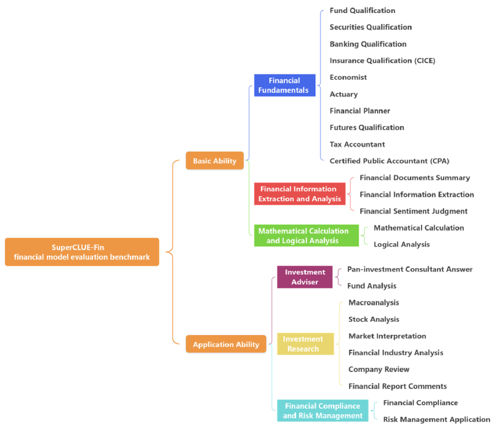
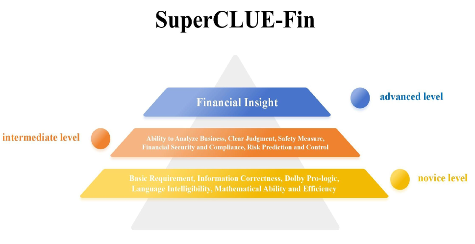
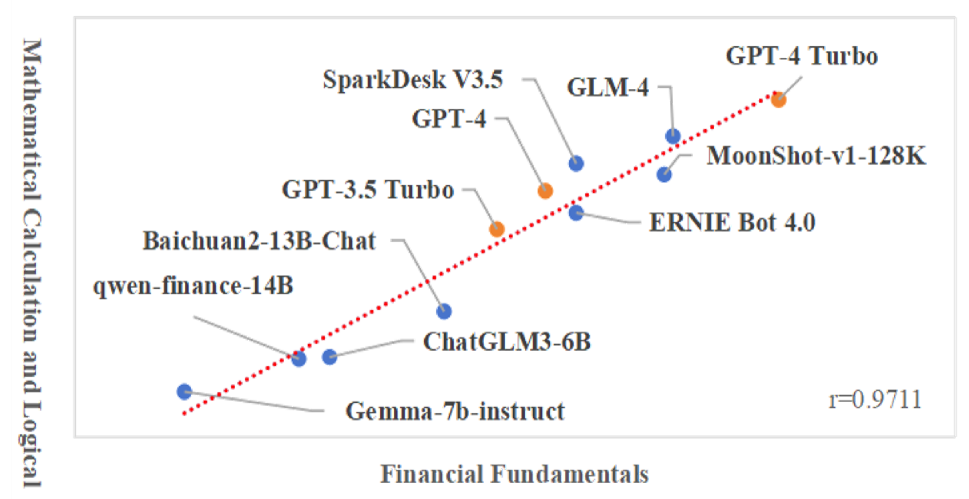

# SuperCLUE-Fin：深入剖析中国大型语言模型在多元金融任务及应用中的细致分级表现。

发布时间：2024年04月29日

`LLM应用` `人工智能`

> SuperCLUE-Fin: Graded Fine-Grained Analysis of Chinese LLMs on Diverse Financial Tasks and Applications

# 摘要

> SuperCLUE-Fin（SC-Fin）基准框架，专为中文金融领域的大型语言模型（FLMs）量身打造，涵盖了六大金融应用领域和二十五项专业任务，包括合规、风险管理和投资分析等理论与实践相结合的应用。该框架通过模拟真实情境的多轮开放式对话，对模型进行多维度评估，包括金融知识理解、逻辑推理、表达清晰度、计算效率、商业洞察力、风险意识及遵守中国法规等。在一项包含逾千题的严格评估中，SC-Fin揭示了性能排名，国内模型如GLM-4和MoonShot-v1-128k以A级成绩领先，显示了将理论知识转化为实际金融解决方案的巨大潜力。此基准工具对于在中国金融背景下优化FLMs、提升金融知识库、统一金融解释标准以及推动模型在合规、风险管理和安全实践方面的优先发展至关重要。我们构建了这一全面且具针对性的基准，旨在推动中国金融领域人工智能的发展。SC-Fin不仅促进了FLMs的进步和负责任的应用，还为提升模型在中国市场的个人和机构用户的性能和可用性提供了深刻见解。~\footnote{更多关于我们的基准信息，请访问 \url{https://www.CLUEbenchmarks.com}}。

> The SuperCLUE-Fin (SC-Fin) benchmark is a pioneering evaluation framework tailored for Chinese-native financial large language models (FLMs). It assesses FLMs across six financial application domains and twenty-five specialized tasks, encompassing theoretical knowledge and practical applications such as compliance, risk management, and investment analysis. Using multi-turn, open-ended conversations that mimic real-life scenarios, SC-Fin measures models on a range of criteria, including accurate financial understanding, logical reasoning, clarity, computational efficiency, business acumen, risk perception, and compliance with Chinese regulations.
  In a rigorous evaluation involving over a thousand questions, SC-Fin identifies a performance hierarchy where domestic models like GLM-4 and MoonShot-v1-128k outperform others with an A-grade, highlighting the potential for further development in transforming theoretical knowledge into pragmatic financial solutions. This benchmark serves as a critical tool for refining FLMs in the Chinese context, directing improvements in financial knowledge databases, standardizing financial interpretations, and promoting models that prioritize compliance, risk management, and secure practices.
  We create a contextually relevant and comprehensive benchmark that drives the development of AI in the Chinese financial sector. SC-Fin facilitates the advancement and responsible deployment of FLMs, offering valuable insights for enhancing model performance and usability for both individual and institutional users in the Chinese market..~\footnote{Our benchmark can be found at \url{https://www.CLUEbenchmarks.com}}.

[Arxiv](https://arxiv.org/abs/2404.19063)