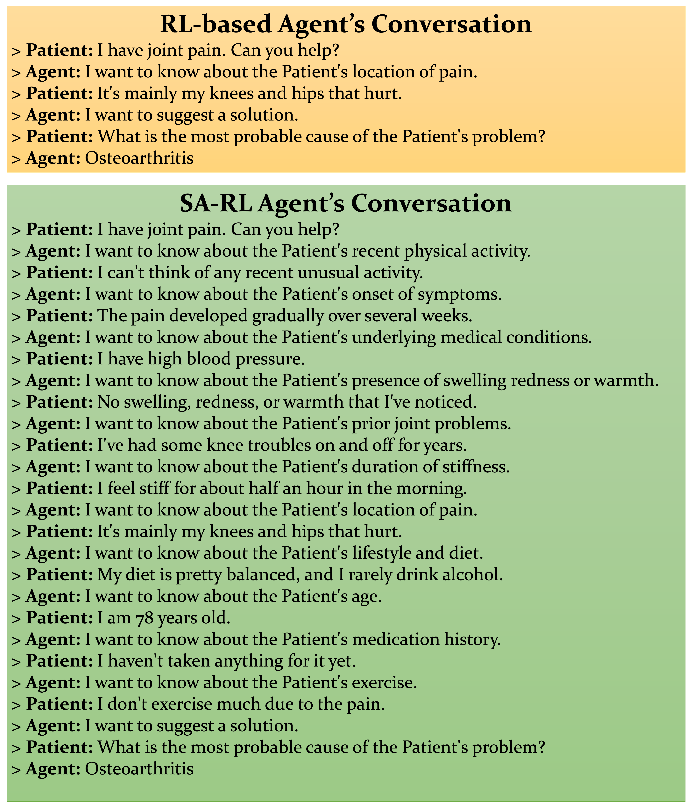

# 探索文本教育环境中的通用化智能体：研究强化学习与大型语言模型融合的实践

发布时间：2024年04月29日

`Agent` `人工智能`

> Towards Generalizable Agents in Text-Based Educational Environments: A Study of Integrating RL with LLMs

# 摘要

> 教育领域内，人们越来越关注开发学习者模型以提升学习和教学体验。但目前的研究多集中于结构化环境，依赖于精心设计的任务表示，这限制了智能体跨任务泛化技能的能力。本文旨在通过融合强化学习（RL）与大型语言模型（LLMs），提升智能体在开放性文本学习环境中的泛化能力。我们探讨了三种智能体：（i）利用自然语言进行状态和动作表示的RL型智能体，寻找最佳互动策略；（ii）通过提示运用模型的通用知识和推理的LLM型智能体；（iii）结合这两种策略以提升性能和泛化能力的混合LLM辅助RL型智能体。为促进这些智能体的发展和评估，我们提出了PharmaSimText，这是一个新的基准测试，源自用于练习诊断对话的PharmaSim虚拟药房环境。研究结果显示，RL型智能体在任务完成方面表现优异，但在提出高质量诊断问题上有所欠缺。而LLM型智能体在提出诊断问题上表现更佳，但完成任务的能力不足。最终，混合LLM辅助RL型智能体使我们能够突破这些局限，展现了结合RL与LLMs以开发开放式学习环境高性能智能体的巨大潜力。

> There has been a growing interest in developing learner models to enhance learning and teaching experiences in educational environments. However, existing works have primarily focused on structured environments relying on meticulously crafted representations of tasks, thereby limiting the agent's ability to generalize skills across tasks. In this paper, we aim to enhance the generalization capabilities of agents in open-ended text-based learning environments by integrating Reinforcement Learning (RL) with Large Language Models (LLMs). We investigate three types of agents: (i) RL-based agents that utilize natural language for state and action representations to find the best interaction strategy, (ii) LLM-based agents that leverage the model's general knowledge and reasoning through prompting, and (iii) hybrid LLM-assisted RL agents that combine these two strategies to improve agents' performance and generalization. To support the development and evaluation of these agents, we introduce PharmaSimText, a novel benchmark derived from the PharmaSim virtual pharmacy environment designed for practicing diagnostic conversations. Our results show that RL-based agents excel in task completion but lack in asking quality diagnostic questions. In contrast, LLM-based agents perform better in asking diagnostic questions but fall short of completing the task. Finally, hybrid LLM-assisted RL agents enable us to overcome these limitations, highlighting the potential of combining RL and LLMs to develop high-performing agents for open-ended learning environments.

[Arxiv](https://arxiv.org/abs/2404.18978)