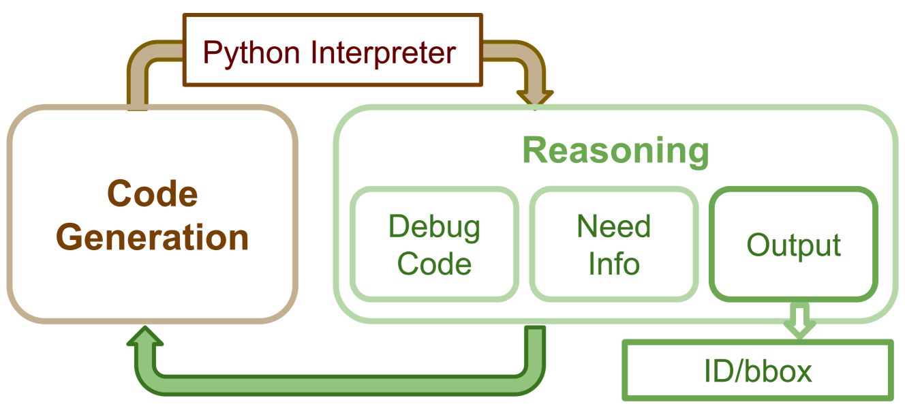
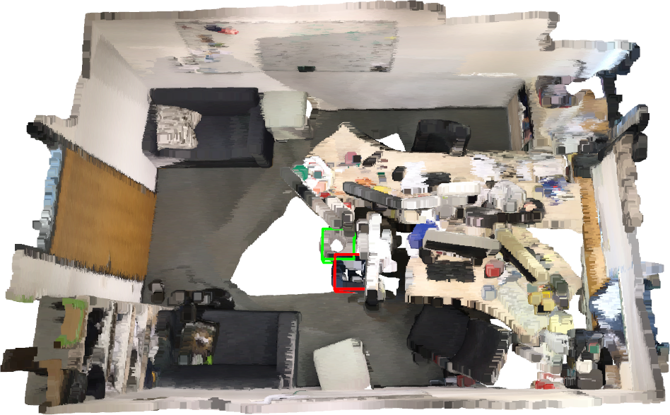

# Transcrib3D：借助大型语言模型，实现三维引用表达的精准解析。

发布时间：2024年04月29日

`分类：Agent` `机器人技术`

> Transcrib3D: 3D Referring Expression Resolution through Large Language Models

# 摘要

> 为了让机器人与人类协同高效工作，它们必须能够理解其三维环境中物体的自然语言指引。解析三维指示性表达是一项挑战性任务，它不仅需要解析场景的三维结构，还需要在干扰和杂乱的环境中准确理解自由形式的语言。我们推出了Transcrib3D，这是一种融合了三维检测技术和大型语言模型（LLMs）的新兴推理能力的方法。Transcrib3D采用文本作为统一的交互媒介，巧妙地规避了学习多模态输入之间共享表示的需求，这通常需要大量的标注三维数据。在实际效果展示上，Transcrib3D在三维参考解析基准测试中取得了行业领先的成绩，与以往的多模态基准相比，性能有了显著提升。为了进一步提升零样本性能并实现在边缘计算设备和机器人上的本地部署，我们提出了一种自我校正的微调方法，用于训练更小型的模型，使得性能接近大型模型的水平。我们证明了该方法能够使真实机器人在面对包含复杂指示性表达的查询时，成功执行拣选和放置任务。项目详情请访问 https://ripl.github.io/Transcrib3D。

> If robots are to work effectively alongside people, they must be able to interpret natural language references to objects in their 3D environment. Understanding 3D referring expressions is challenging -- it requires the ability to both parse the 3D structure of the scene and correctly ground free-form language in the presence of distraction and clutter. We introduce Transcrib3D, an approach that brings together 3D detection methods and the emergent reasoning capabilities of large language models (LLMs). Transcrib3D uses text as the unifying medium, which allows us to sidestep the need to learn shared representations connecting multi-modal inputs, which would require massive amounts of annotated 3D data. As a demonstration of its effectiveness, Transcrib3D achieves state-of-the-art results on 3D reference resolution benchmarks, with a great leap in performance from previous multi-modality baselines. To improve upon zero-shot performance and facilitate local deployment on edge computers and robots, we propose self-correction for fine-tuning that trains smaller models, resulting in performance close to that of large models. We show that our method enables a real robot to perform pick-and-place tasks given queries that contain challenging referring expressions. Project site is at https://ripl.github.io/Transcrib3D.

[Arxiv](https://arxiv.org/abs/2404.19221)