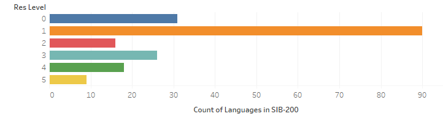
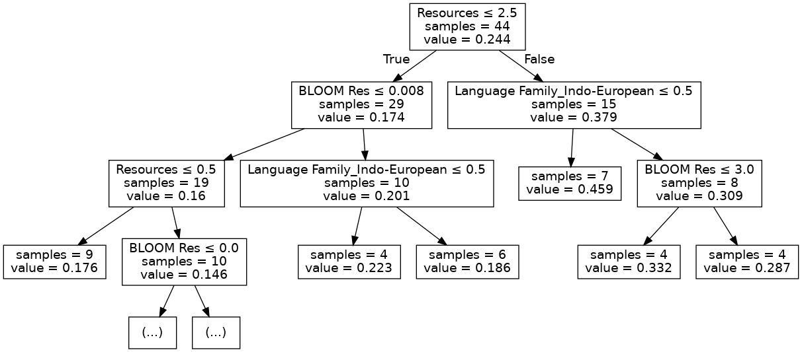
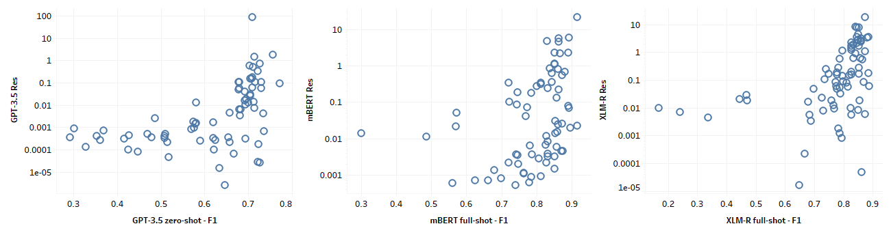
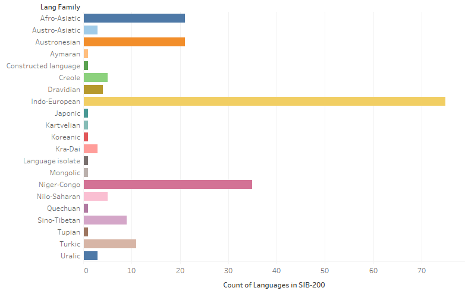
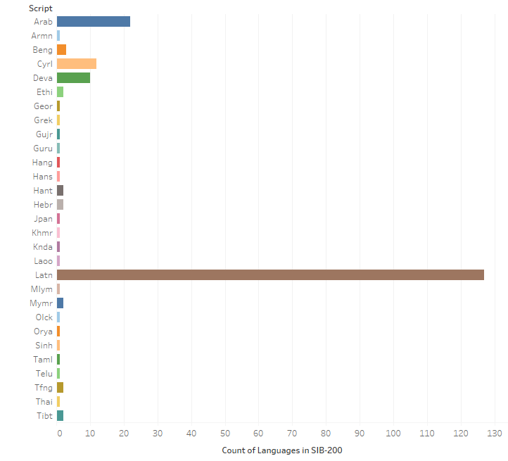

# 驱动多语言语言模型性能的因素是什么？

发布时间：2024年04月29日

`分类：LLM理论` `机器学习`

> What Drives Performance in Multilingual Language Models?

# 摘要

> 本研究深入探讨了影响多语言大型语言模型（MLLMs）在多种语言中表现的各种因素。通过对六种不同的MLLMs进行分析，包括掩蔽语言模型、自回归模型和经过指令调整的LLMs，我们利用涵盖204种语言的SIB-200主题分类数据集进行了研究。研究区分了三种不同的语言场景：所有语言、预训练数据中出现过的“已见语言”，以及从未出现或未被记录的“未见语言”。我们评估了预训练数据规模、资源普遍可用性、语言系属和文字类型等因素对模型效能的影响。决策树分析显示，对于“已见语言”，预训练数据的规模是最关键的影响因素。然而，对于“未见语言”，文字类型和语言系属显得尤为重要，这强调了跨语言迁移学习的关键作用。值得注意的一点是，模型的大小和架构并不显著影响识别出的主要特征。这些发现不仅揭示了当前MLLMs的优势和局限，而且为未来更高效、更公平的多语言自然语言处理系统的发展提供了指导。

> This study investigates the factors influencing the performance of multilingual large language models (MLLMs) across diverse languages. We study 6 MLLMs, including masked language models, autoregressive models, and instruction-tuned LLMs, on the SIB-200 dataset, a topic classification dataset encompassing 204 languages. Our analysis considers three scenarios: ALL languages, SEEN languages (present in the model's pretraining data), and UNSEEN languages (not present or documented in the model's pretraining data in any meaningful way). We examine the impact of factors such as pretraining data size, general resource availability, language family, and script type on model performance. Decision tree analysis reveals that pretraining data size is the most influential factor for SEEN languages. However, interestingly, script type and language family are crucial for UNSEEN languages, highlighting the importance of cross-lingual transfer learning. Notably, model size and architecture do not significantly alter the most important features identified. Our findings provide valuable insights into the strengths and limitations of current MLLMs and hope to guide the development of more effective and equitable multilingual NLP systems.

[Arxiv](https://arxiv.org/abs/2404.19159)