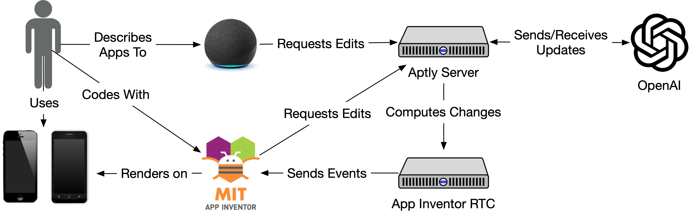
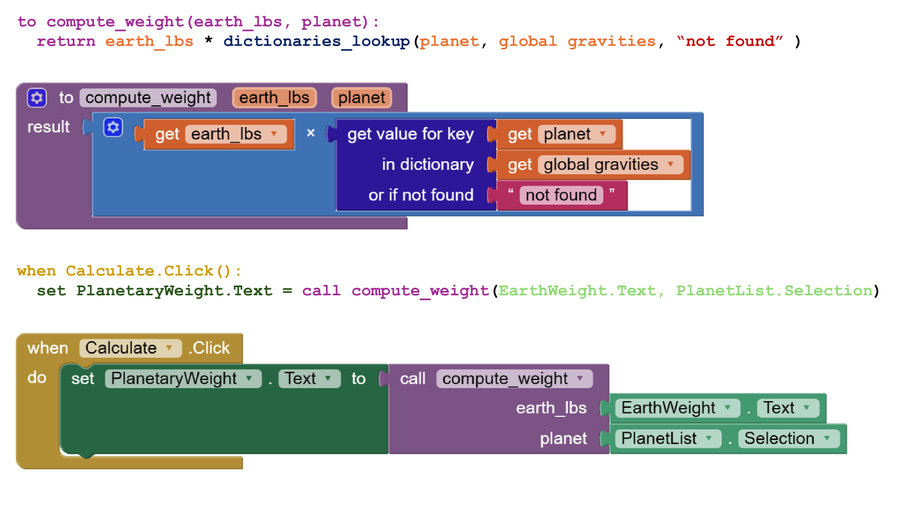
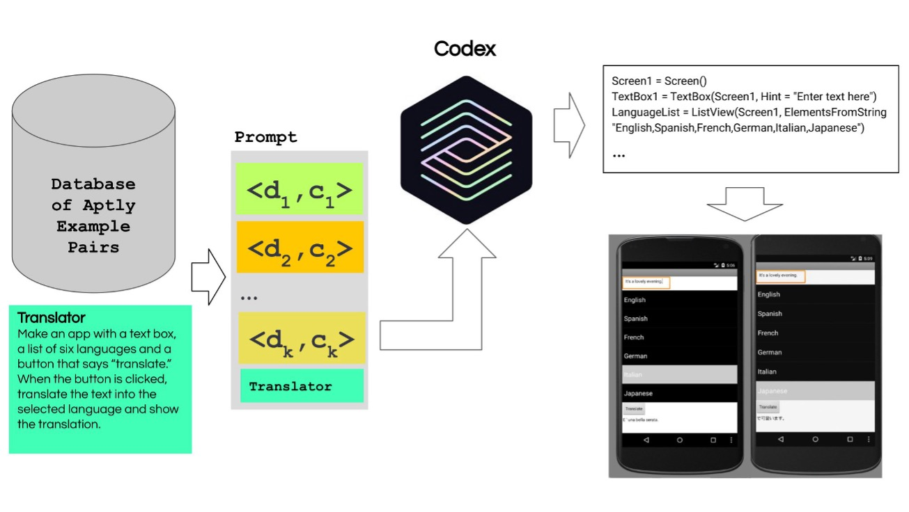
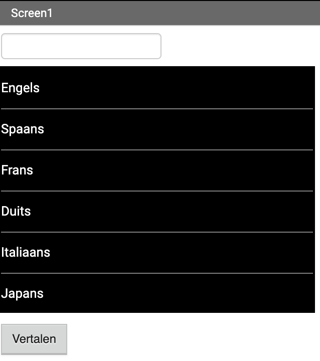
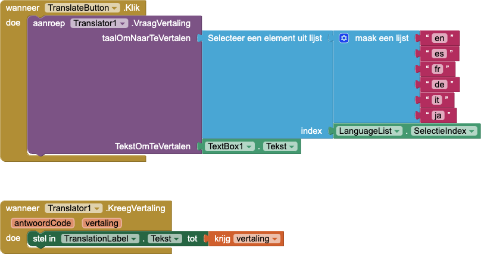
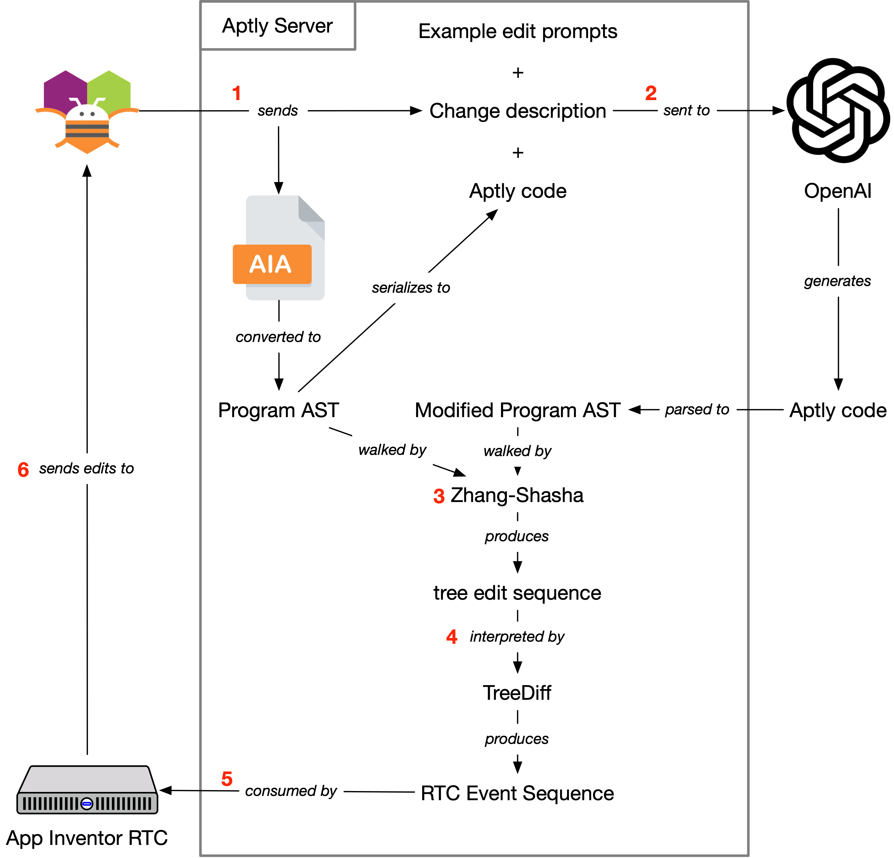
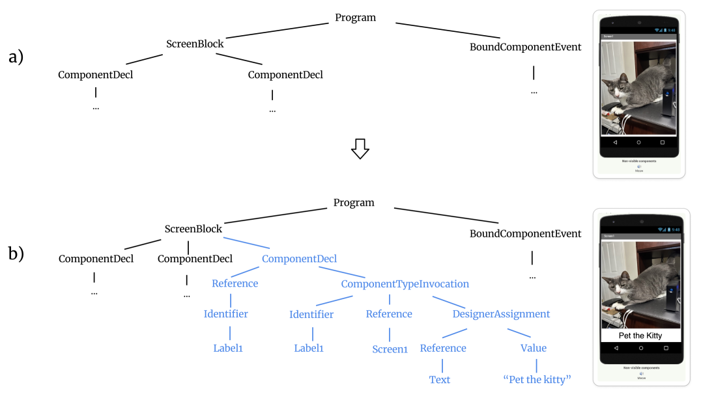
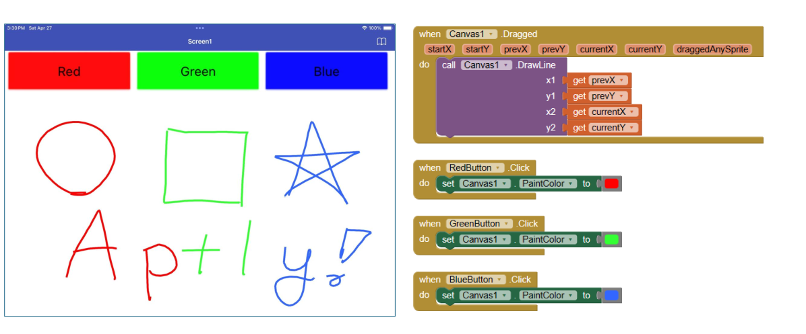

# Aptly：将自然语言转化为移动应用的利器

发布时间：2024年04月30日

`分类：LLM应用` `移动应用开发`

> Aptly: Making Mobile Apps from Natural Language

# 摘要

> 我们推出了 Aptly，这是 MIT App Inventor 平台的扩展，它利用支持自然语言的大型语言模型（LLMs）来简化移动应用的开发。Aptly 为 App Inventor 的图形化编程语言增添了一种文本语言，旨在通过文本驱动的 LLMs 实现视觉代码的生成。我们深入探讨了 Aptly 服务器如何整合 LLMs 并引入实时协作功能，以便用户能够根据指令自动创建和编辑移动应用。文章最后，通过一项针对高中学生的试点项目研究，我们分享了关于 Aptly 实用性和用户体验的洞见。研究结果突显了 Aptly 在推动应用开发的普及化和技术创造力方面的潜力。

> We present Aptly, an extension of the MIT App Inventor platform enabling mobile app development via natural language powered by code-generating large language models (LLMs). Aptly complements App Inventor's block language with a text language designed to allow visual code generation via text-based LLMs. We detail the technical aspects of how the Aptly server integrates LLMs with a realtime collaboration function to facilitate the automated creation and editing of mobile apps given user instructions. The paper concludes with insights from a study of a pilot implementation involving high school students, which examines Aptly's practicality and user experience. The findings underscore Aptly's potential as a tool that democratizes app development and fosters technological creativity.

[Arxiv](https://arxiv.org/abs/2405.00229)