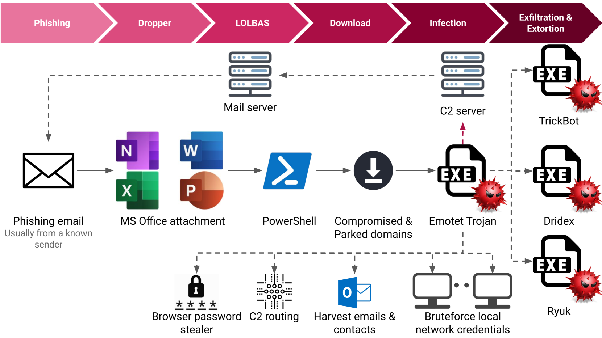
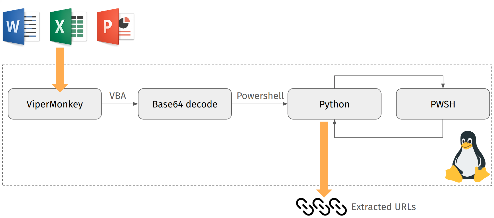
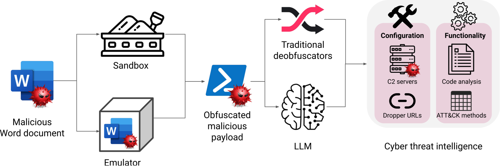

# 本文旨在探讨大型语言模型在解析现实世界恶意软件活动中的恶意代码去混淆能力。

发布时间：2024年04月30日

`LLM应用` `网络安全` `人工智能`

> Assessing LLMs in Malicious Code Deobfuscation of Real-world Malware Campaigns

# 摘要

> 大型语言模型（LLMs）正被越来越多地融入多样化的工作流程，它们不仅大幅提高了自动化水平，而且在很多情况下超越了人类的处理能力。网络安全领域的专家已经意识到了这一点，并开始积极探索其在处理大量复杂数据中的应用，这些数据的处理对于识别异常行为、潜在的安全漏洞、攻击行为以及欺诈事件至关重要。更进一步，LLMs 在代码生成、上下文理解以及操作总结方面的高级功能，也为逆向工程和恶意软件的去混淆提供了新的可能性。本研究不仅停留在理论层面，而是通过分析 Emotet 恶意软件活动中使用的现实世界恶意脚本，对四种顶尖的 LLMs 进行了实际测试。测试结果显示，尽管结果尚未达到完全精确，但某些 LLMs 已经能够有效地对这些恶意负载进行去混淆处理。这表明，对 LLMs 进行针对性的训练，未来可能成为 AI 驱动的威胁情报流程中，对抗混淆恶意软件的一个有效手段。

> The integration of large language models (LLMs) into various pipelines is increasingly widespread, effectively automating many manual tasks and often surpassing human capabilities. Cybersecurity researchers and practitioners have recognised this potential. Thus, they are actively exploring its applications, given the vast volume of heterogeneous data that requires processing to identify anomalies, potential bypasses, attacks, and fraudulent incidents. On top of this, LLMs' advanced capabilities in generating functional code, comprehending code context, and summarising its operations can also be leveraged for reverse engineering and malware deobfuscation. To this end, we delve into the deobfuscation capabilities of state-of-the-art LLMs. Beyond merely discussing a hypothetical scenario, we evaluate four LLMs with real-world malicious scripts used in the notorious Emotet malware campaign. Our results indicate that while not absolutely accurate yet, some LLMs can efficiently deobfuscate such payloads. Thus, fine-tuning LLMs for this task can be a viable potential for future AI-powered threat intelligence pipelines in the fight against obfuscated malware.

[Arxiv](https://arxiv.org/abs/2404.19715)