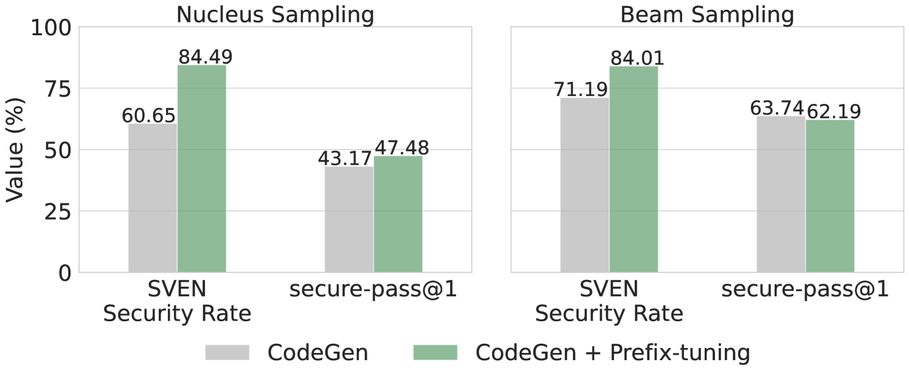
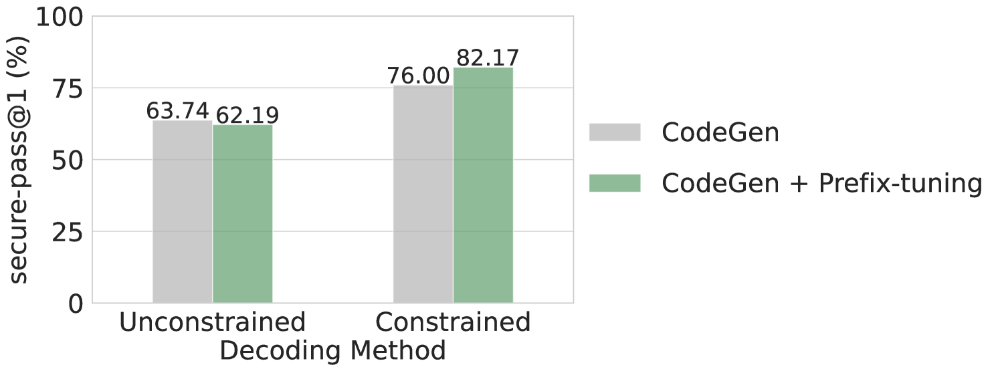
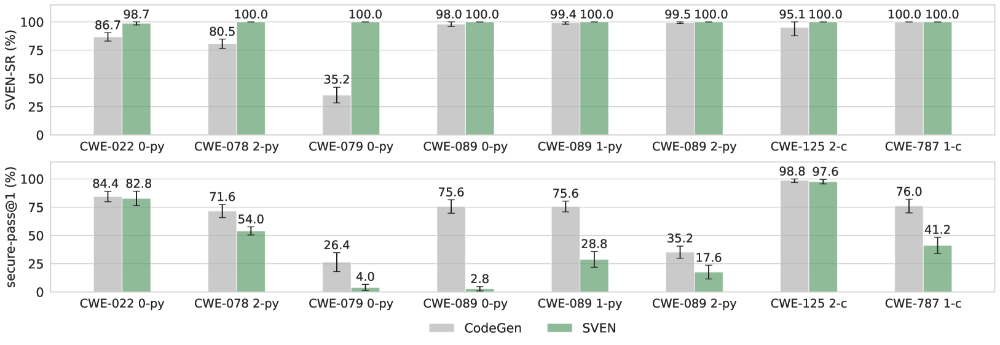

# 采用受限解码技术，致力于生成安全的代码。

发布时间：2024年04月30日

`LLM应用` `编程语言` `软件工程`

> Constrained Decoding for Secure Code Generation

# 摘要

> 开发者日益青睐大型编程语言模型（Code LLMs）以提升工作效率，但这些模型产出的代码往往存在安全隐患。确保Code LLMs产出的代码既正确又安全，成为了一个迫切的议题。过往研究多聚焦于代码的安全性，却忽视了正确性同等重要，这种偏颇可能引发虚假的安全感。目前，业界还缺少一种评估标准来衡量这一领域的实际进步，亟需能够同时保障代码安全性与正确性的解决方案。本论文提出了一个新的基准测试CodeGuard+，以及两项新的评估指标：secure-pass@k和secure@$k_{\text{pass}}$，用以衡量编程语言模型在生成既安全又准确的代码方面的能力。通过这些新的评估方法，我们发现，尽管目前领先的防御技术——前缀调整能够生成安全的代码，却在功能性正确性上有所妥协，其效力并非先前所认为的那样强大。我们还指出，不同的解码方法对Code LLMs的安全性有着显著的影响。此外，本文还探讨了一个新的防御策略：用于安全代码生成的约束解码。我们提出了新的约束解码技术，能够在不依赖特定训练数据集的情况下，同时满足安全性和正确性的要求。实验结果表明，约束解码在提升Code LLMs安全性方面比前缀调整更为有效。并且，约束解码可以与前缀调整结合使用，进一步提升Code LLMs的安全性。

> Code Large Language Models (Code LLMs) have been increasingly used by developers to boost productivity, but they often generate vulnerable code. Thus, there is an urgent need to ensure that code generated by Code LLMs is correct and secure. Previous research has primarily focused on generating secure code, overlooking the fact that secure code also needs to be correct. This oversight can lead to a false sense of security. Currently, the community lacks a method to measure actual progress in this area, and we need solutions that address both security and correctness of code generation.
  This paper introduces a new benchmark, CodeGuard+, along with two new metrics, secure-pass@k and secure@$k_{\text{pass}}$, to measure Code LLMs' ability to generate both secure and correct code. Using our new evaluation methods, we show that the state-of-the-art defense technique, prefix tuning, may not be as strong as previously believed, since it generates secure code but sacrifices functional correctness. We also demonstrate that different decoding methods significantly affect the security of Code LLMs.
  Furthermore, we explore a new defense direction: constrained decoding for secure code generation. We propose new constrained decoding techniques to generate code that satisfies security and correctness constraints simultaneously. Our results reveal that constrained decoding is more effective than prefix tuning to improve the security of Code LLMs, without requiring a specialized training dataset. Moreover, constrained decoding can be used together with prefix tuning to further improve the security of Code LLMs.

[Arxiv](https://arxiv.org/abs/2405.00218)