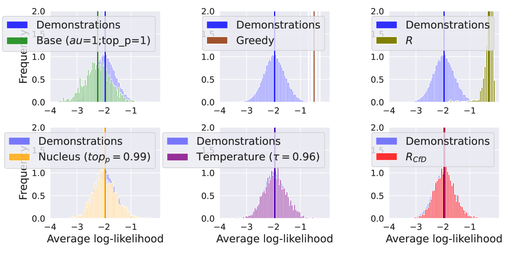

# 通过示范引导的强化学习方法，我们可以有效应对大型语言模型（LLM）中的奖励过度优化问题。

发布时间：2024年04月30日

`分类：LLM应用`

> Countering Reward Over-optimization in LLM with Demonstration-Guided Reinforcement Learning

# 摘要

> 强化学习在优化大型语言模型方面发挥着关键作用，但过度追求奖励可能导致问题。目前的做法通过KL正则化来应对这一挑战，但这需要进行昂贵的超参数调整，并且只关注于语言策略的规范化，忽略了奖励函数这一潜在的规范化因素。本研究受示范引导的RL启发，提出了一种新的奖励校准方法（RCfD），该方法结合人类示范和奖励模型来重新定义奖励目标。具体来说，RCfD在给定提示的情况下，旨在缩小示范奖励与LLM奖励之间的差异，而不是单纯追求最大化奖励函数。这种方法避免了LLM对奖励模型的过度利用，鼓励了更自然和多样化的语言生成。我们在三项语言任务中验证了RCfD的有效性，其性能可与精细调整的基线相媲美，同时有效缓解了奖励过度优化的问题。

> While Reinforcement Learning (RL) has been proven essential for tuning large language models (LLMs), it can lead to reward over-optimization (ROO). Existing approaches address ROO by adding KL regularization, requiring computationally expensive hyperparameter tuning. Additionally, KL regularization focuses solely on regularizing the language policy, neglecting a potential source of regularization: the reward function itself. Inspired by demonstration-guided RL, we here introduce the Reward Calibration from Demonstration (RCfD), which leverages human demonstrations and a reward model to recalibrate the reward objective. Formally, given a prompt, the RCfD objective minimizes the distance between the demonstrations' and LLM's rewards rather than directly maximizing the reward function. This objective shift avoids incentivizing the LLM to exploit the reward model and promotes more natural and diverse language generation. We show the effectiveness of RCfD on three language tasks, which achieves comparable performance to carefully tuned baselines while mitigating ROO.

[Arxiv](https://arxiv.org/abs/2404.19409)