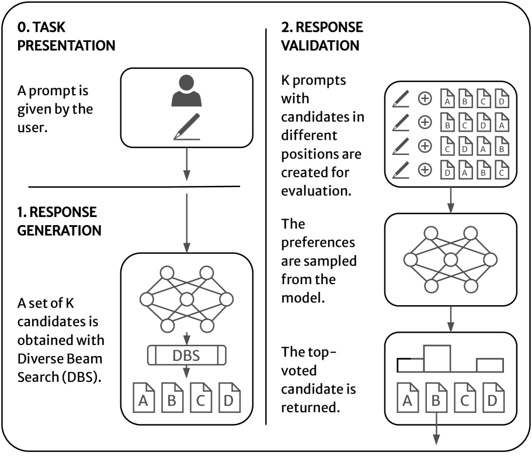
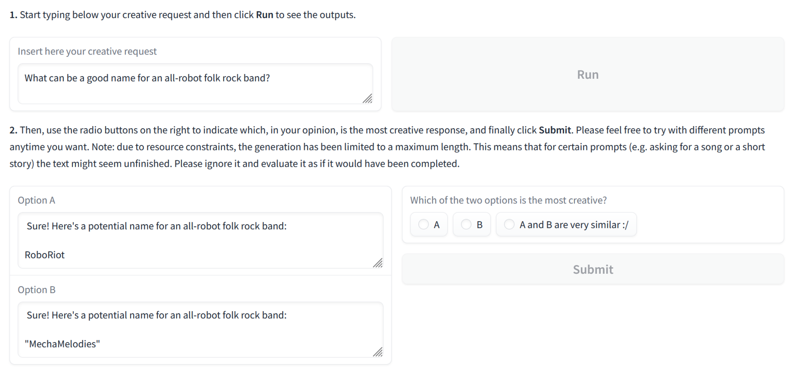
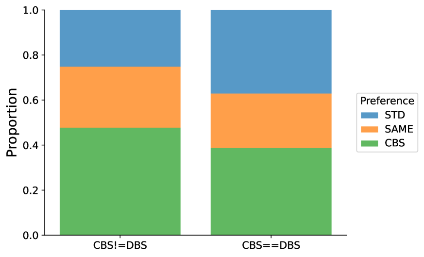

# 创意束搜索是一种新颖的搜索策略，它在保持搜索效率的同时，增加了结果的多样性和创新性。

发布时间：2024年04月30日

`LLM应用` `人工智能` `创意生成`

> Creative Beam Search

# 摘要

> 大型语言模型正引领着包括人工智能创造力在内的多个领域的革新。不过，机器的生成机制与人类的创造性过程截然不同，主要表现在缺乏目的性和深层次的创造过程。我们提出了一种名为“创意束搜索”的新方法，它结合了多样化束搜索和“语言模型评委”机制，用于执行生成和验证响应。一项定性实验的结果显示，这种方法相比传统的抽样技术能够产生更优质的输出。我们还证实了响应验证环节对于响应生成环节是不可或缺的补充。

> Large language models are revolutionizing several areas, including artificial creativity. However, the process of generation in machines profoundly diverges from that observed in humans. In particular, machine generation is characterized by a lack of intentionality and an underlying creative process. We propose a method called Creative Beam Search that uses Diverse Beam Search and LLM-as-a-Judge to perform response generation and response validation. The results of a qualitative experiment show how our approach can provide better output than standard sampling techniques. We also show that the response validation step is a necessary complement to the response generation step.

[Arxiv](https://arxiv.org/abs/2405.00099)