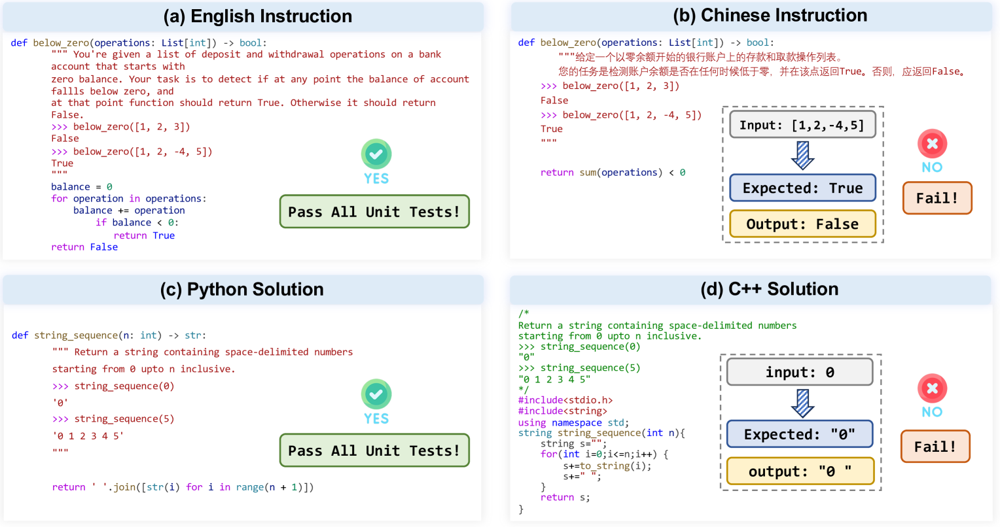

# 本文旨在探讨大型代码生成模型中存在的多语言偏见问题。

发布时间：2024年04月30日

`LLM应用`

> Exploring Multi-Lingual Bias of Large Code Models in Code Generation

# 摘要

> 代码生成的目的是依据自然语言规范合成代码，满足功能需求，显著提升开发效率。随着大型语言模型（LLMs）的发展，大型代码模型（LCMs）应运而生，用以生成源代码。这些模型能够针对自然语言描述的编程问题提供高度实用的解决方案。尽管成效显著，我们发现LCMs在生成性能上存在显著的多语言偏差。尤其是在接收到英文指令时，LCMs能够熟练生成解决方案，但面对其他自然语言的等效指令时，如中文，它们的表现可能会不尽人意。此外，LCMs在不同编程语言之间的代码生成能力也存在差异，例如Python与C++之间的性能差异可达20.9%。这一现象揭示了LCMs在生成能力上的多语言偏见，而这一点尚未得到充分研究。在本文中，我们旨在探究当前LCMs中的多语言偏见。我们首先通过构建首个多语言评估基准X-HumanEval-X来启动研究，以便系统评估现有LCMs中的多语言偏见程度。在对九种流行LCMs进行的大规模实验中，我们发现LCMs在代码生成任务中存在显著的多语言偏见，包括对多种自然语言和多种编程语言的偏见。具体而言，当使用中文指令时，LCMs的代码生成能力在Pass@1指标上至少下降了13%。此外，不同编程语言之间的LCMs性能也表现出差异，Python与C++之间的性能差距尤为显著。

> Code generation aims to synthesize code and fulfill functional requirements based on natural language (NL) specifications, which can greatly improve development efficiency. In the era of large language models (LLMs), large code models (LCMs) have been recently proposed to generate source code. LCMs can generate highly feasible solutions for programming problems described in natural language. Despite the effectiveness, we observe a noticeable multilingual bias in the generation performance of LCMs. Specifically, LCMs demonstrate proficiency in generating solutions when provided with instructions in English, yet may falter when faced with semantically equivalent instructions in other NLs such as Chinese. Moreover, the ability of LCMs to generate code exhibits variety across different programming languages (PLs), such as Python and C++. The observed phenomenon indicates the presence of multi-lingual bias within the generative capabilities of LCMs, which has remained unexplored.
  In this paper, we aim to investigate the multi-lingual bias that exists in current LCMs. First, we initiate our investigation by constructing the first multi-lingual evaluation benchmark X-HumanEval-X, enabling us to systematically evaluate the extent of multi-lingual bias that exists in current LCMs. In our large-scale experiments on nine popular LCMs, we observe a pronounced multi-lingual bias of LCMs in code generation, including multi-NL and multi-PL bias. Specifically, when using Chinese instructions, the code generation capabilities of LCMs decrease by at least 13% in terms of the Pass@1 metric. Furthermore, LCMs perform variously across different programming languages, e.g., the performance gap between Python and C++ reaches as high as 20.9%. ...

[Arxiv](https://arxiv.org/abs/2404.19368)