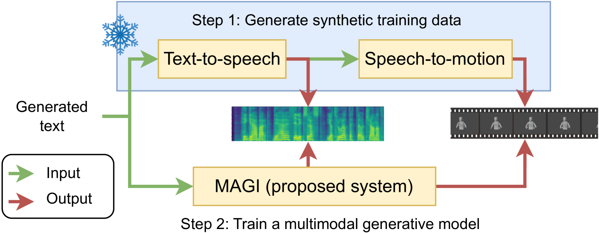
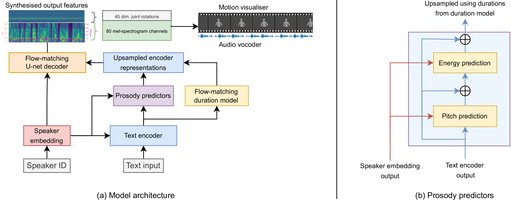

# 以假乱真：借助合成数据填补联合多模态语音及手势合成的数据缺口。

发布时间：2024年04月30日

`分类：Agent` `人机交互` `人工智能`

> Fake it to make it: Using synthetic data to remedy the data shortage in joint multimodal speech-and-gesture synthesis

# 摘要

> 人类在面对面交流时，不仅通过言语，还通过非言语方式进行沟通。然而，将文本同步转换成语音和伴随的3D手势动作的技术仍处于起步阶段。尽管这类技术有望实现更自然、高效、富有表现力且稳健的人工合成交流，但目前由于缺乏大规模数据集而受限。现有的技术需要依赖所有相关模态的并行数据进行训练。借鉴师生学习方法，我们提出了一种简单有效的解决方案：通过合成额外的训练材料来扩充数据。具体而言，我们利用在大型数据集上训练的单模态合成模型生成多模态但合成的并行训练数据，并在此基础之上预训练一个联合合成模型。此外，我们还提出了一种新的合成架构，它在现有最先进方法的基础上增强了韵律建模的能力，使其更加精准和可控。实验结果表明，利用大量合成数据进行预训练能够显著提升多模态模型合成语音和动作的质量，而新架构在预训练过程中进一步优化了合成效果。更多示例成果，可访问 https://shivammehta25.github.io/MAGI/ 查看。

> Although humans engaged in face-to-face conversation simultaneously communicate both verbally and non-verbally, methods for joint and unified synthesis of speech audio and co-speech 3D gesture motion from text are a new and emerging field. These technologies hold great promise for more human-like, efficient, expressive, and robust synthetic communication, but are currently held back by the lack of suitably large datasets, as existing methods are trained on parallel data from all constituent modalities. Inspired by student-teacher methods, we propose a straightforward solution to the data shortage, by simply synthesising additional training material. Specifically, we use unimodal synthesis models trained on large datasets to create multimodal (but synthetic) parallel training data, and then pre-train a joint synthesis model on that material. In addition, we propose a new synthesis architecture that adds better and more controllable prosody modelling to the state-of-the-art method in the field. Our results confirm that pre-training on large amounts of synthetic data improves the quality of both the speech and the motion synthesised by the multimodal model, with the proposed architecture yielding further benefits when pre-trained on the synthetic data. See https://shivammehta25.github.io/MAGI/ for example output.

[Arxiv](https://arxiv.org/abs/2404.19622)