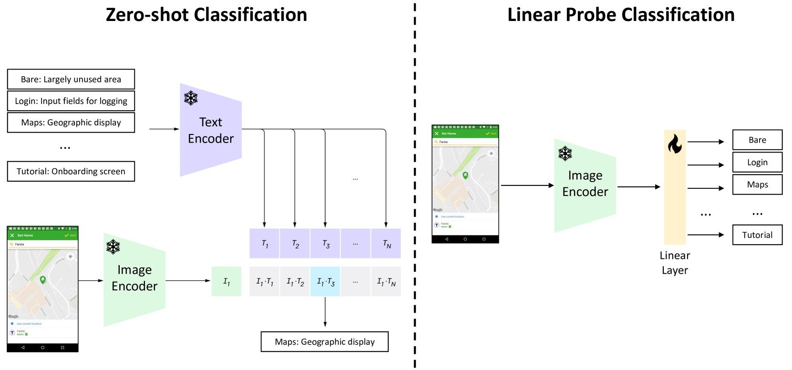

# GUing：一款运用视觉-语言模型的移动界面图形搜索引擎。

发布时间：2024年04月30日

`分类：LLM应用

这篇论文的摘要描述了一个基于视觉-语言模型的GUI搜索引擎，该模型专门针对应用GUI领域进行了训练。它从Google Play获取应用介绍图，并使用自动化流程对这些图片进行分类、裁剪并提取标注，从而创建了一个大型数据集。这个数据集被用来训练新的视觉-语言模型，该模型在文本到GUI检索任务上超越了先前的方法。这篇论文的重点是将大型语言模型（LLM）应用于GUI检索任务，因此它属于LLM应用类别。` `应用开发` `视觉搜索引擎`

> GUing: A Mobile GUI Search Engine using a Vision-Language Model

# 摘要

> 应用开发者常以他人应用的图形用户界面（GUI）为灵感，来设计和优化自己的应用。近期研究提出了多种方法，从自动化获取的截图数据库中检索出与特定文本查询相匹配的GUI设计。但这些方法往往只关注GUI元素的文本信息，而忽略了图标、背景图等视觉信息。此外，检索出的截图往往缺乏关键应用特性，如用户认证所需的UI页面。为解决这些问题，本文介绍了GUing，这是一款基于专为应用GUI领域训练的视觉-语言模型UIClip的GUI搜索引擎。我们首先从Google Play获取了应用介绍图，这些图通常包含由开发者精选并标注的代表性截图。接着，我们建立了一个自动化流程，对这些图片进行分类、裁剪并提取标注。这一过程产生了一个包含303k应用截图的大型数据集，其中135k张附有标注，我们在此文中公开了这一数据集。利用该数据集，我们训练了一种新的视觉-语言模型，据我们所知，这是GUI检索领域的首创。我们在相关研究的数据集上进行了评估，并进行了手动实验，结果表明我们的模型在文本到GUI检索任务上超越了先前方法，Recall@10达到了0.69，HIT@10达到了0.91。此外，我们还探索了UIClip在GUI分类和草图到GUI检索等其他GUI任务上的表现，结果同样令人振奋。

> App developers use the Graphical User Interface (GUI) of other apps as an important source of inspiration to design and improve their own apps. In recent years, research suggested various approaches to retrieve GUI designs that fit a certain text query from screenshot datasets acquired through automated GUI exploration. However, such text-to-GUI retrieval approaches only leverage the textual information of the GUI elements in the screenshots, neglecting visual information such as icons or background images. In addition, the retrieved screenshots are not steered by app developers and often lack important app features, e.g. whose UI pages require user authentication. To overcome these limitations, this paper proposes GUing, a GUI search engine based on a vision-language model called UIClip, which we trained specifically for the app GUI domain. For this, we first collected app introduction images from Google Play, which usually display the most representative screenshots selected and often captioned (i.e. labeled) by app vendors. Then, we developed an automated pipeline to classify, crop, and extract the captions from these images. This finally results in a large dataset which we share with this paper: including 303k app screenshots, out of which 135k have captions. We used this dataset to train a novel vision-language model, which is, to the best of our knowledge, the first of its kind in GUI retrieval. We evaluated our approach on various datasets from related work and in manual experiment. The results demonstrate that our model outperforms previous approaches in text-to-GUI retrieval achieving a Recall@10 of up to 0.69 and a HIT@10 of 0.91. We also explored the performance of UIClip for other GUI tasks including GUI classification and Sketch-to-GUI retrieval with encouraging results.

[Arxiv](https://arxiv.org/abs/2405.00145)