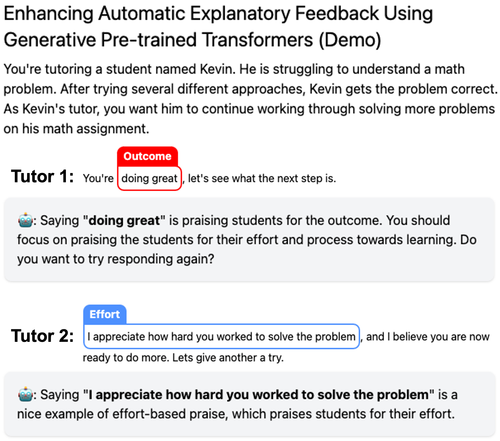
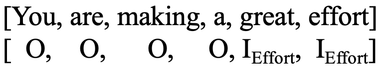
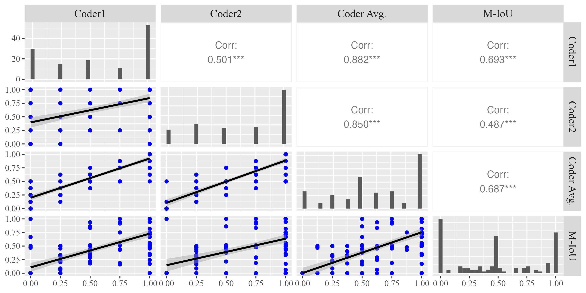
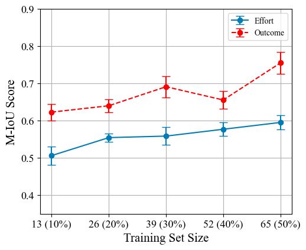
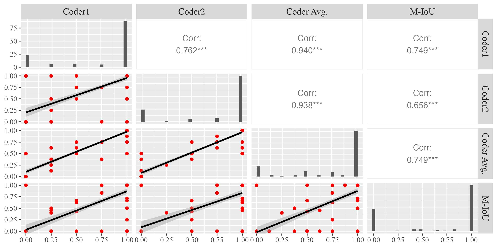

# 如何提升自我？利用 GPT 技术凸显开放式回答中的期望与非期望要素。

发布时间：2024年04月30日

`LLM应用` `教育技术`

> How Can I Improve? Using GPT to Highlight the Desired and Undesired Parts of Open-ended Responses

# 摘要

> 自动化解释性反馈系统对于提升大规模学习者的学习效果至关重要，它通过融入解释的反馈显著提升了学习体验。然而，实时提供此类反馈面临诸多挑战，尤其是在必须确保对特定领域内微妙反应的高分类准确性时。本研究借助大型语言模型，尤其是生成预训练变换器（GPT），采用序列标注方法，旨在从导师培训数据集中辨识出所需和非理想赞扬的要素，以便提供解释性反馈。我们旨在为在线培训课程中的导师提供实用的、有解释性的反馈。为了探究GPT模型在提供解释性反馈方面的潜力，我们采用了两种常用策略：提示和微调。我们还引入了一种改进的交集比对并集（M-IoU）分数，用以量化GPT模型识别出的赞扬要素的质量。研究发现：（1）M-IoU分数与人工评估序列质量的结果高度相关；（2）在GPT-3.5上应用两次提示，对于识别基于努力的赞扬（M-IoU得分0.46）和基于成果的赞扬（M-IoU得分0.68）均表现出良好的性能；（3）我们经过最佳微调的GPT-3.5模型在基于努力的赞扬上达到了0.64的M-IoU得分，在基于成果的赞扬上达到了0.84的M-IoU得分，这与人工编码员评估的满意度水平相吻合。这些结果预示着GPT模型在提供专注于开放式反馈中特定元素的反馈方面具有潜力，这些元素可能是值得提倡的或者有改进空间的。

> Automated explanatory feedback systems play a crucial role in facilitating learning for a large cohort of learners by offering feedback that incorporates explanations, significantly enhancing the learning process. However, delivering such explanatory feedback in real-time poses challenges, particularly when high classification accuracy for domain-specific, nuanced responses is essential. Our study leverages the capabilities of large language models, specifically Generative Pre-Trained Transformers (GPT), to explore a sequence labeling approach focused on identifying components of desired and less desired praise for providing explanatory feedback within a tutor training dataset. Our aim is to equip tutors with actionable, explanatory feedback during online training lessons. To investigate the potential of GPT models for providing the explanatory feedback, we employed two commonly-used approaches: prompting and fine-tuning. To quantify the quality of highlighted praise components identified by GPT models, we introduced a Modified Intersection over Union (M-IoU) score. Our findings demonstrate that: (1) the M-IoU score effectively correlates with human judgment in evaluating sequence quality; (2) using two-shot prompting on GPT-3.5 resulted in decent performance in recognizing effort-based (M-IoU of 0.46) and outcome-based praise (M-IoU of 0.68); and (3) our optimally fine-tuned GPT-3.5 model achieved M-IoU scores of 0.64 for effort-based praise and 0.84 for outcome-based praise, aligning with the satisfaction levels evaluated by human coders. Our results show promise for using GPT models to provide feedback that focuses on specific elements in their open-ended responses that are desirable or could use improvement.

[Arxiv](https://arxiv.org/abs/2405.00291)